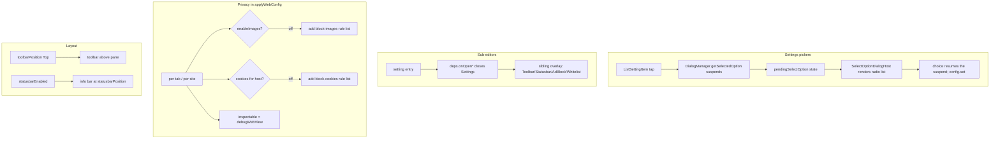

2026-07-17

# EinkBro iOS Parity Phase N — Settings pickers, sub-editors, privacy enforcement, toolbar layout

This is the last feature-parity phase for the Compose Multiplatform iOS port. Earlier phases built the subsystems; Phase N makes the settings facade real and enforces the privacy and layout preferences that were persisted but inert. It spans three loosely related workstreams.

## Settings pickers and sub-editors

Two gaps made much of the settings UI look complete but do nothing.

First, the enum and text pickers. `DialogManager.getSelectedOption` / `getSelectedOptionWithString` / `getTextInput` were hard-coded stubs that returned null, so every `ListSettingWithEnumItem` and `ValueSettingItem` tap resolved to a cancel and silently no-oped. They now suspend on an observable request channel (the same pattern the existing ok/cancel dialog already used) that is rendered by two new hosts, `SelectOptionDialogHost` and `TextInputDialogHost`, mounted beside `OkCancelDialogHost`. One fix unblocks every option/value setting across the whole app, not just one screen.

Second, four editor screens existed but were reachable only from the developer catalog — the settings entries that should open them just showed a "would open …" toast. Following the pattern already used for the userscript and GPT editors, `SettingScreenDeps` gained callbacks that close settings and flip a sibling overlay in the browser: `ToolbarConfigScreen`, `StatusbarConfigScreen`, `AdBlockSettingScreen`, and `DataListScreen` for the adblock / JavaScript / cookie whitelists.

## Privacy enforcement

`applyWebConfig` already applied the user agent, JavaScript, adblock, dark mode, and zoom per tab; Phase N adds the privacy prefs. Image blocking and cookie stripping reuse the existing WKContentRuleList mechanism: `ContentBlocker` was generalized to also compile a block-all-images rule (trigger resource-type image) and a block-cookies rule, which the engine adds or removes per web view based on `enableImages` and the per-site cookie setting. `debugWebView` maps directly to `WKWebView.inspectable`, and `webLoadCacheFirst` makes `loadUrl` issue the request with `NSURLRequestReturnCacheDataElseLoad`. Geolocation and form autofill stay system-managed on iOS (WKWebView offers no per-site JS geolocation prompt and iOS handles AutoFill natively), and the scroll-driven auto-hide toolbar is left as a follow-up.

## Toolbar and statusbar layout

The toolbar was hard-mounted at the bottom and the custom EinkBro info bar never rendered in the running browser. The toolbar and info bar are now reusable slots placed around the web pane: `toolbarPosition` Top renders the toolbar above the pane (Bottom unchanged; Left/Right fall back to bottom for now), and the info bar renders when `statusbarEnabled` is set, positioned by `statusbarPosition`.

## Verification

On the simulator: the "Info bar position" enum picker — previously a dead tap — opened a radio-list dialog and applied "Bottom", which persisted on the row. "Info bar items" opened `StatusbarConfigScreen`, which had been orphaned. With `toolbarPosition` set to Top and the info bar enabled, the toolbar rendered at the top of the screen with the info bar (time, battery, wifi, pagination) at the bottom. Image blocking was confirmed by an A/B: the same page showed only the image's alt text and an empty frame with images disabled, and the actual image once they were re-enabled — the content rule being the only change between the two.
