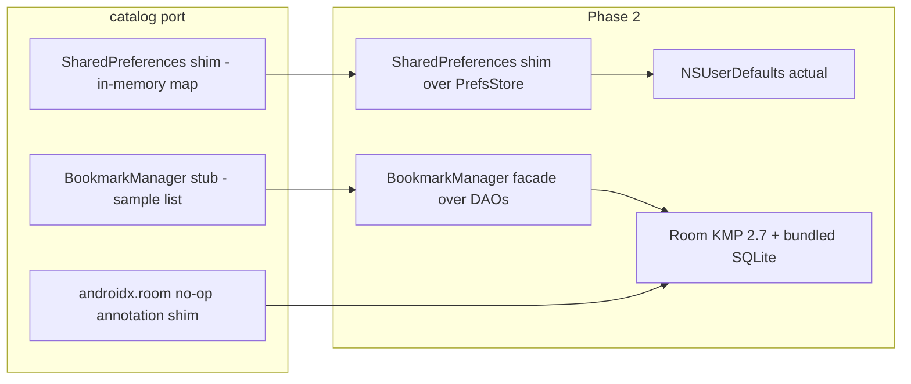

2026-07-16

# EinkBro iOS: persistence via NSUserDefaults + Room KMP (migration Phase 2)

The iOS browser now remembers things. Settings, bookmarks, browsing history and
the open-tab session all survive an app relaunch, verified on the simulator with
a kill-and-restart drill: the app reopened on the same page, the bookmark saved
before the kill was still there, and the history list showed the pages visited
before it.

## The two swaps

Phase 2 replaced both in-memory storage layers from the initial port, each
behind an API that the rest of the code already used — so the ported UI and
preference code didn't change:

**Preferences.** The `android.content.SharedPreferences` shim now delegates to a
small `PrefsStore` expect/actual; the iOS actual is NSUserDefaults. The entire
ported preference layer (ConfigManager and sub-configs, ~1,700 lines of real
EinkBro code) got durable storage without a single change to itself.

**Database.** The no-op `androidx.room` annotation shim — the trick that let
entity files port unchanged — was deleted and replaced by the real thing: Room
KMP 2.7.1 with KSP and the bundled SQLite driver. Because the entities had kept
their genuine Room annotations all along, they compiled against real Room
as-is; only a fresh `AppDatabase` (`@ConstructedBy`, schema v1: bookmarks,
history, favicons, domain configurations) and DAOs were new code. The KSP +
Kotlin/Native toolchain integration — flagged as a top-five risk in the
migration plan — worked on the first try with Kotlin 2.1.21 / KSP 2.1.21-2.0.1.

**Session restore.** Open tabs persist through the same `AlbumInfo` JSON
preference the Android app uses (`TabConfig.savedAlbumInfoList`), written on
every tab mutation and page load, restored at launch — honoring the user's
`shouldSaveTabs` setting, and skipping history writes in incognito mode or when
`SaveHistoryMode.DISABLED` is set, same as Android.

## Notes for later phases

- The `BookmarkViewModel` id-assignment hacks from the stub era (manual max-id,
  identity-based replace) are gone; Room's `autoGenerate` + `REPLACE` semantics
  restore the Android behavior.
- Favicon storage has a table and DAO but nothing writes to it yet — favicon
  capture belongs to the content pipeline work, and bookmark rows fall back to
  the globe icon until then.
- The remaining ten Android tables (highlights, saved pages, userscripts,
  translation cache, ...) join the schema with their features; adding entities
  bumps the schema version from a known-good v1 baseline.
