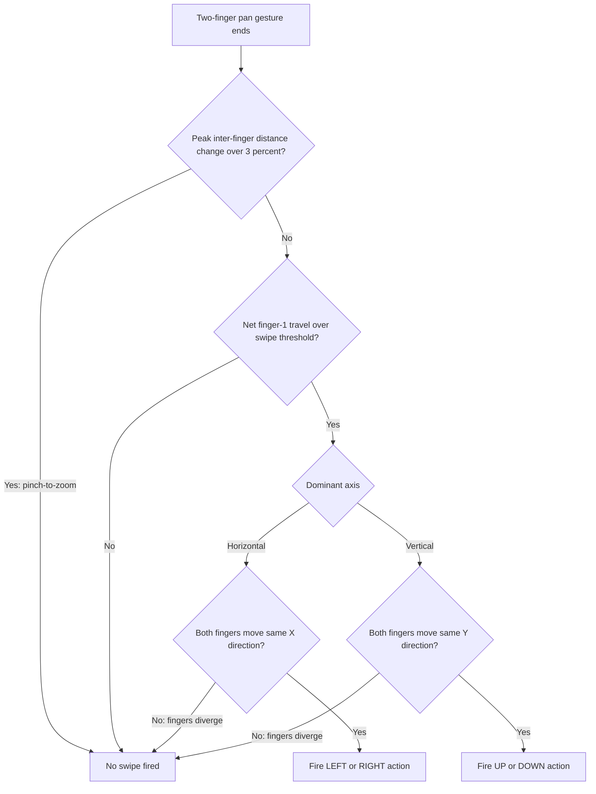

2026-07-24

# EinkBro iOS: reject pinch-to-zoom in the two-finger swipe recognizer

## What was broken

With the multi-touch gesture feature enabled, pinching a web page to zoom in or
out would often *also* fire a two-finger swipe action (page turn, back/forward,
whatever the user had bound to the multitouch directions). Zooming and paging at
the same time is jarring on an e-ink screen — the page turns out from under the
zoom.

## Root cause

The iOS port installs a `UIPanGestureRecognizer` limited to exactly two touches
(`TwoFingerPanTarget` in `WKWebViewEngine.kt`), running simultaneously with
WKWebView's own pinch recognizer. On gesture end it read only the recognizer's
**centroid translation** (`translationInView`) and reduced that to a dominant-axis
direction. But a pinch moves the centroid too: if the two fingers aren't perfectly
symmetric — which they never are — the midpoint drifts, and any drift past the
threshold was interpreted as a swipe. The centroid alone simply cannot tell a
drifting pinch from a swipe.

The Android original never had this problem because its `MultitouchListener`
tracks both fingers and a scale factor, and guards the swipe with two explicit
pinch rejections. The port had dropped both.

## The fix

Follow each finger across the whole gesture (`Began` -> `Changed` -> `Ended`)
instead of reading one number at the end, and port Android's two pinch checks:

- **Scale check** (`isScaling`): record the peak change in inter-finger distance
  relative to its start. If the fingers spread or closed by more than
  `SCALE_THRESHOLD` (0.03, straight from Android), it's a zoom — fire nothing.
- **Same-direction check** (`isSame{X,Y}Direction`): along the dominant axis, both
  fingers must travel the same way. A swipe moves them together; a pinch moves
  them oppositely, which now fails this test.

Only a gesture that clears both checks *and* the existing translation threshold
maps to a `MultitouchDirection` and dispatches the bound action. Single-finger
scrolling and a plain pinch-zoom are untouched.

## Notes

- The threshold constants (`SWIPE_THRESHOLD`, `SCALE_THRESHOLD`) had to live at
  file scope rather than in a companion object — Kotlin/Native forbids companion
  fields on an Objective-C subclass (`TwoFingerPanTarget : NSObject`).
- Positions are read at `Began`/`Changed` and cached; nothing is read at `Ended`,
  because by then one finger has usually lifted and `locationOfTouch` is
  unreliable. This mirrors Android using its last `ACTION_MOVE` sample when
  `ACTION_POINTER_UP` fires.
- Verified on-device (Release build on an iPhone 17 Pro): two-finger swipes still
  fire, pinch-to-zoom no longer leaks a swipe.
