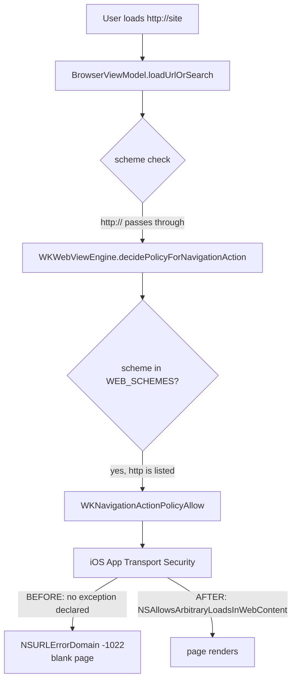
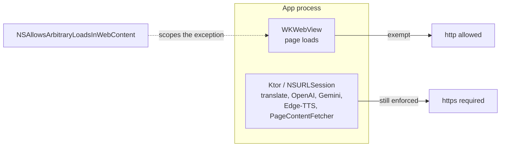

2026-08-01

# EinkBro iOS: plain-http sites would not load

Every `http://` site rendered as a blank page. `https://` was fine. For a browser
whose whole point is going wherever the user points it, this made a large slice of
the web — old blogs, LAN devices, captive portals — simply unreachable.

## What was actually wrong

Nothing in EinkBro's own code. That was the first thing checked, and it came back
clean twice over:

- `BrowserViewModel.loadUrlOrSearch` (`BrowserViewModel.kt:732`) treats a leading
  `http://` as an already-complete URL and passes it through untouched.
- `WKWebViewEngine`'s navigation policy has `http` in its `WEB_SCHEMES` allow-list
  (`WKWebViewEngine.kt:844`), so the load is permitted, not diverted to the OS.
- There is no https-upgrade or https-only logic anywhere in the tree.

The block was one layer lower, in iOS itself. `iosApp/iosApp/Info.plist` declared
no `NSAppTransportSecurity` dictionary, so **App Transport Security** applied its
default policy — which forbids cleartext HTTP — to the app's web content. The
device log named it precisely:

```
Error Domain=NSURLErrorDomain Code=-1022 "The resource could not be loaded because
the App Transport Security policy requires the use of a secure connection."
```

WKWebView reported this through `didFailProvisionalNavigation`, and because the
failure arrived before any content, the result on screen was simply nothing.



## Why it was missing

This is a porting omission with an exact Android counterpart. The Android app opts
into cleartext explicitly, in two places:

- `AndroidManifest.xml` — `android:usesCleartextTraffic="true"`
- `res/xml/network_security_config.xml` — `<base-config cleartextTrafficPermitted="true">`

Both are platform-configuration files, not Kotlin. The port moved code, and the
`Info.plist` was written from scratch for iOS needs (URL scheme, document types,
background audio, local-network usage string) — so the one Android setting with no
code to carry it across never made the trip.

## The fix

```xml
<key>NSAppTransportSecurity</key>
<dict>
    <key>NSAllowsArbitraryLoadsInWebContent</key>
    <true/>
</dict>
```

The scoping matters more than the exception. `NSAllowsArbitraryLoadsInWebContent`
exempts **only** WKWebView content. The app's own network layer — Ktor over
NSURLSession, used for translate, OpenAI, Gemini and Edge-TTS — keeps full ATS
enforcement. The blanket alternative, `NSAllowsArbitraryLoads`, would have opened
both, which is both broader than the problem and a harder App Review story.



The distinction is the right one for a browser: page loads are the user's choice of
destination, whereas the app's own API calls have fixed https endpoints that should
never silently downgrade.

## Known gap, accepted deliberately

Long-pressing a link and choosing *Summarize* or *TTS* does not go through the web
view. It calls `PageContentFetcher.fetchText` (`BrowserScreen.kt:878,895`), an
NSURLSession request — so on an `http://` link those two actions still fail with
"Could not fetch link content". Widening to `NSAllowsArbitraryLoads` would fix it;
that trade was considered and declined in favour of the narrower exception.
Ordinary browsing is unaffected.

## A verification trap worth recording

The first round of testing said the fix did not work — `http://neverssl.com` was
still blank after installing the new build. The fix was fine; the test was not.

A second, stale build was installed on the simulator under the bundle id
`info.plateaukao.einkbro.ios.demo` (CFBundleVersion 2, and confusingly also named
"EinkBro"). `xcrun simctl openurl` routes by LaunchServices scheme registration,
not by which bundle you launched — so the `einkbro://open?url=…` test navigations
were being handed to the *old* app, which of course still had no ATS exception.

The tell was in the log all along:

```
CoreSimulatorBridge: Opening URL (einkbro://open?url=…) with info.plateaukao.einkbro.ios.demo
```

Two habits come out of this. Before driving the simulator, confirm exactly one
bundle id is installed:

```bash
xcrun simctl listapps <udid> | grep "CFBundleIdentifier.*einkbro"
```

And when a navigation is issued within the first few seconds of `simctl launch`,
the still-pending home-page load can land afterwards and overwrite it. The
navigation *is* recorded in history even when its result never reaches the screen,
so a history entry is not evidence the page displayed. Let the app settle first.

The `.demo` bundle has never existed in this repo's git history, so no normal build
produces it; it has been removed from the simulator.

## Verification

Driving the correctly-installed build: `http://neverssl.com` renders, including
following its plain-http redirect to a random subdomain, and an http-only fc2 blog
loads in full. No `-1022` appears in the device log afterwards.

Since this changes the app bundle rather than Kotlin, a TestFlight or App Store
build needs a `CFBundleVersion` bump to pick it up.
