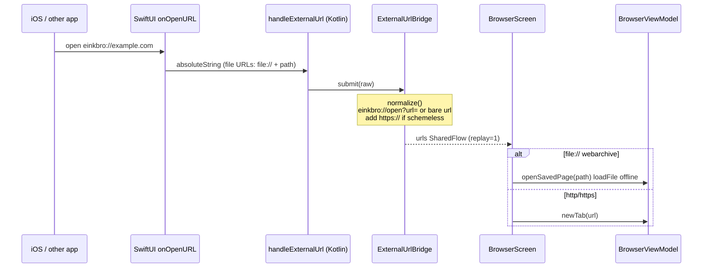

2026-07-16

# EinkBro iOS Port — Phase 8: Platform Integration & Polish

The final phase of the einkbro→iOS Compose Multiplatform port wires the app into
the OS: a custom URL scheme, a `.webarchive` file association, real iPad layout
detection, and an app icon. With this phase the eight-phase migration is
functionally complete.

## What it does

- **`einkbro://` URL scheme** — other apps (and shortcuts) can hand a URL to
  EinkBro. `einkbro://open?url=<encoded>` and the shorthand `einkbro://<bare-url>`
  both open in a new tab; a schemeless target gets `https://` prepended.
- **`.webarchive` file association** — "Open in EinkBro" from Files or another app
  opens a saved archive offline in a tab.
- **iPad layout** — the two-column bookmarks, settings, and URL-autocomplete
  layouts (already in the ported UI, gated on `isWideLayout`) now actually light up
  on iPad.
- **App icon** — the EinkBro globe on the home screen.

## How it was built

External URLs cross the Swift↔Kotlin boundary through a small bridge. SwiftUI's
`onOpenURL` forwards the URL string to a Kotlin `handleExternalUrl` entry point,
which pushes it onto `ExternalUrlBridge` — a `SharedFlow` with `replay = 1` so a
URL that arrives during cold launch, before the UI subscribes, is not lost.
`BrowserScreen` collects the flow and routes each URL: a `file://` webarchive
reuses the Phase 7 offline `loadFile` path, everything else opens a normal tab.

The scheme and file type are declared in `Info.plist` (`CFBundleURLTypes`,
`CFBundleDocumentTypes` with the `com.apple.webarchive` UTI, and
`LSSupportsOpeningDocumentsInPlace`).

iPad detection replaced a hardcoded `false`. `ViewUnit.isWideLayout` /
`isLandscape` / `isTablet` now delegate to a `PlatformScreen` expect/actual whose
iOS actual reads `UIScreen.mainScreen.bounds`; a device is "wide" when its shorter
side is at least 600 pt — true for every iPad, false for every iPhone.

The app icon is the project's globe logo. iOS forbids alpha in app icons, so the
source PNG (which has a transparent background) was flattened onto white at
1024×1024 with a small inset margin, via a one-off CoreGraphics script, and placed
in an `Assets.xcassets` icon set referenced by `ASSETCATALOG_COMPILER_APPICON_NAME`.

## Verification

- iPhone 16 simulator: the globe icon appears on the home screen;
  `einkbro://example.com` cold-launches the app (through the system's
  "Open in EinkBro?" confirmation) and opens Example Domain in a fresh tab.
- iPad mini simulator: the bookmarks list renders in two columns, confirming the
  wide-layout branch is active.
- Both the Debug and the unsigned Release configurations build successfully.

## Deferred (needs the user's Apple account)

A share extension (the equivalent of Android's `ACTION_SEND` receiver) and
TestFlight / App Store packaging both require a provisioning profile and signing
identity from the developer's Apple account, so they are left for the user to set
up. Android-only integrations (dictionary apps, Pocket, per-site home-screen
icons) remain out of scope by design.
