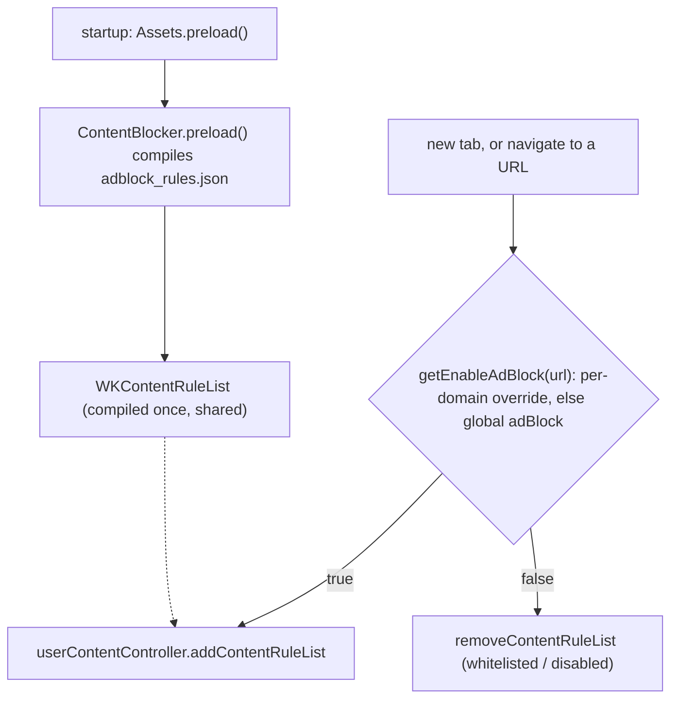

2026-07-16

# EinkBro iOS: privacy & blocking — adblock, incognito, per-site, UA, clear-data (migration Phase 4)

Phase 4 makes the iOS port's privacy features real. Ad and tracker blocking,
private browsing, per-site overrides, user-agent switching, and clear-on-exit
now take effect on the WKWebView. The interesting part of this phase was that
almost none of it needed new model or UI code: the preference flags
(`adBlock`, `cookies`, `enableJavascript`, `desktop`, `customUserAgent`, the
`clear*` flags, `isIncognitoMode`) and the settings/dialog shells were already
ported and persisted from earlier phases. What was entirely missing was the
enforcement layer — the WKWebView had no user agent, no JavaScript gating, no
content blocking, and no private data store. This phase adds exactly that, as a
handful of new methods on the engine seam.

## Ad blocking with content rules

Android matches every subresource through a native C++ ABP engine hung off
`shouldInterceptRequest`. WKWebView has no request-interception hook, so the
iOS port uses the platform's declarative path instead: a `WKContentRuleList`.
A bundled JSON file of 66 EasyList/EasyPrivacy-style network rules (the major ad
and tracker domains, matched as third-party resources) is compiled once at
startup and shared by every tab. Each web view adds or removes the compiled list
based on the per-domain adblock flag:

`getEnableAdBlock(url)` / `getEnableCookies(url)` were added to
`DomainConfigManager` to mirror the existing `getEnableJavascript(url)` — each
returns the per-host `DomainConfiguration` override or falls back to the global
flag. Content rules cover network blocking and `css-display-none` cosmetic
hiding; ExtendedCss selectors and scriptlets (which Android injects via JS) are
out of scope for this phase.

## Incognito, done better than Android

Android's incognito is cookie suppression plus a no-history flag on a shared
profile. iOS can do it properly: an incognito tab gets a **non-persistent**
`WKWebsiteDataStore`, so its cookies, cache, and local storage live only in
memory and vanish when the tab closes — nothing touches disk. Incognito tabs
also skip history writes and are filtered out of the saved-tab session, so they
never reappear after a relaunch. The toolbar renders its incognito border from
the current tab's flag.

## The rest of the enforcement layer

- **User agent** rides on `WKWebView.customUserAgent`: a desktop Safari string
  when desktop mode is on (globally or per-domain), the user's custom string
  when configured, otherwise the platform default.
- **Per-site JavaScript** is enforced through
  `WKWebpagePreferences.allowsContentJavaScript` for future navigations.
- **Clear-data** goes through `WKWebsiteDataStore.removeData` (plus a Room
  history wipe), wired both to the settings "delete" action and to a
  clear-on-exit observer. Because iOS backgrounds apps rather than quitting
  them, the observer fires on entering the background — the practical
  "leaving the app" moment — and is opt-in via the clear-on-quit flag.

These are applied together by a small `applyWebConfig(engine, url)` in the tab
view model, called on tab creation and on navigation, and re-applied to every
open tab when a fast-toggle or site-settings dialog closes.

## A multi-tab display bug surfaced along the way

Testing incognito needed a second tab, which exposed a pre-existing bug:
`WebViewHost` embeds the WKWebView through a Compose `UIKitView` whose `factory`
runs only once, so switching the active tab never swapped the shown web view —
the URL bar updated but the page underneath did not. Keying the `UIKitView` by
tab id makes Compose re-embed the active tab's web view on every switch.

## Verification

On the simulator: a probe page that requests scripts from known ad/tracker
domains showed them blocked while a control script from an unlisted domain
loaded; a page opened in an incognito tab was absent from history while a
normal-tab page was recorded; tab switching showed the correct page; and the
Site Settings dialog opened scoped to the current domain.

## Notes for later phases

- The content-rule list is a curated subset, not a live EasyList subscription.
  A downloader that fetches and ABP-to-JSON-converts a full list (respecting the
  ~150k-rule content-blocker cap) is a later refinement; the compile-and-apply
  plumbing is already in place.
- The in-memory `AdBlock`/`Javascript`/`Cookie` whitelist stubs still need a
  Room-backed store to match Android; per-domain overrides via
  `DomainConfiguration` already cover the common case.
