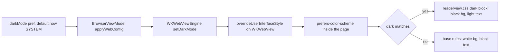

2026-07-18

# EinkBro iOS: dark mode in reader mode

Reader mode always showed a white page even when the app was in dark mode: a
black toolbar and status bar framing a glaring white article. The white was
not an omission in the reader styling — it was hard-coded. `readerview.css`
and `verticalReaderview.css` (inherited from Mozilla's mozac reader view)
force `background-color: #ffffff !important` on the reader body *and on every
element inside it*.

## Root cause: Android darkens this white for free, iOS doesn't

On Android the same stylesheets produce a dark reader because EinkBro enables
WebView's FORCE_DARK (algorithmic darkening) when the dark-mode pref calls
for it — the renderer itself inverts the white page. WKWebView has no
FORCE_DARK equivalent, so on iOS the forced-white CSS was the final word.
The stylesheets do contain `.dark` class variants (a leftover mozac color
scheme selector), but nothing on either platform ever puts that class on the
body — Android never needed it, and iOS silently inherited the gap.

## Fix: let the reader style itself with a media query

The port already had the right seam: `WKWebViewEngine.setDarkMode` maps the
`darkMode` pref (SYSTEM / FORCE_ON / DISABLED) onto the web view's
`overrideUserInterfaceStyle`, and that is exactly what drives
`prefers-color-scheme` inside the page. So both reader stylesheets now end
with a `@media (prefers-color-scheme: dark)` block that overrides the forced
white: pure black background (matching the app's black Compose dark theme),
light text, and the accent colors lifted from the dormant `.dark` class rules
(orange domain link, `#eeeeee` headings, `#aaaaaa` captions and blockquotes).

Because the CSS lands in a real `<style>` element in `<head>` (the per-slot
injection survives the reader's body swap), the media query re-evaluates
live: toggling the system appearance flips the reader between black and white
instantly, no reload. A blanket `color: #dddddd !important` on descendants
guards against leftover site styles painting dark-gray text on the now-black
background; links and accents win by specificity.

## Default pref change (iOS-only divergence)

Testing exposed a second blocker: the `darkMode` pref defaulted to DISABLED
(`"2"`), which pins the web view light regardless of system appearance — so
out of the box the fix never activated. That default is right for Android
(e-ink panels), but the iOS Compose chrome already follows the system
appearance unconditionally, so a dark system gave a dark app with a
permanently-white reader — precisely the reported bug. The iOS default is
now SYSTEM, with DISABLED and FORCE_ON still selectable in Settings. This is
a deliberate divergence from the Android reference, in the same spirit as the
already-dropped e-ink image settings ("no iOS device has an e-ink display").

## Verification

On the iPhone Air simulator: fresh install (no saved prefs) with the system
in dark appearance → reader mode renders black with readable light text,
styled title/credits, untouched images; switching the simulator to light
appearance flips the reader back to white live. A false start worth
remembering: the first build appeared to ignore the CSS edits because
Gradle's resource-prepare task had stale outputs — re-running
`prepareComposeResourcesTaskForCommonMain` picked the files up, and checking
`compose-resources/` inside the built `.app` is the quick way to confirm
what actually shipped.
