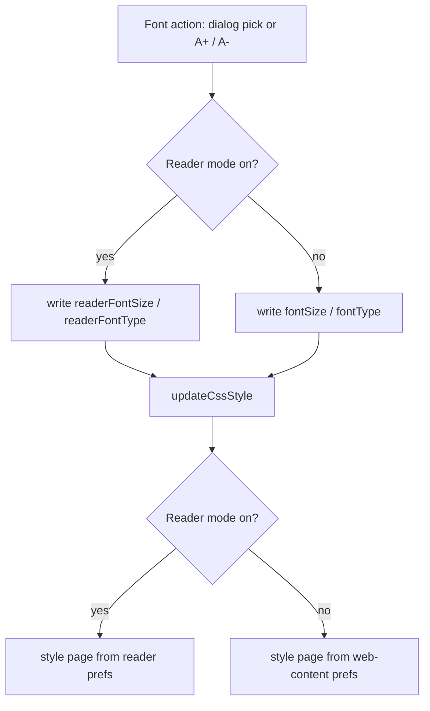

2026-07-19

# EinkBro iOS: reader mode edits its own font prefs again

Changing the font size or font type while in reader mode did nothing on iOS.
On Android these are deliberately two independent pref sets — `fontSize`/`fontType`
for normal web content and `readerFontSize`/`readerFontType` for reader mode —
and the iOS port already had both halves of the storage: `DisplayConfig` carries
the reader keys, `ReaderFontDialogContent` edits them, and
`WebContentHelper.updateCssStyle()` reads the reader pair whenever
`isReaderModeOn` is true.

What was missing was the switch on the *write* side. `BrowserScreen` always
opened the normal `FontDialogContent` and always mutated
`config.display.fontSize` for the A+/A− actions, regardless of reader state. So
in reader mode the user edited the web-content prefs while the page was styled
from the untouched reader prefs — the classic "settings change and nothing
happens" symptom. (`ReaderFontDialogContent` existed but was only reachable
from the UI catalog.)

The fix mirrors Android's `DisplayConfigDelegate` in
`BrowserScreen.kt`:

- `ShowFontSizeChangeDialog` captures `isReaderModeOn` at open time
  (`fontDialogForReader`) and renders `ReaderFontDialogContent` instead of
  `FontDialogContent` when it's set.
- `IncreaseFontSize`/`DecreaseFontSize` adjust `readerFontSize` in reader mode,
  `fontSize` otherwise (same ±20 steps, clamped to 50–300).
- The reader-settings dialog's font shortcut always opens the reader font
  dialog, as on Android.

One rendering question came up during review: `readerview.css` has
`.mozac-readerview-body.serif * { font-family: ... !important }` rules that
would outrank the main CSS slot's `* { font-family ... !important }` by
specificity. They turn out to be inert — the injected reader body only ever
gets the bare `mozac-readerview-body` class — so the font-type CSS from
`updateCssStyle()` wins as intended.

Verified in the simulator: entering reader mode on a Wikipedia article,
picking 175% and Serif visibly restyles the reader page; the app container
plist shows only `sp_reader_fontSize`/`sp_reader_font_type` written; leaving
reader mode restores the page at the untouched web-content defaults.
