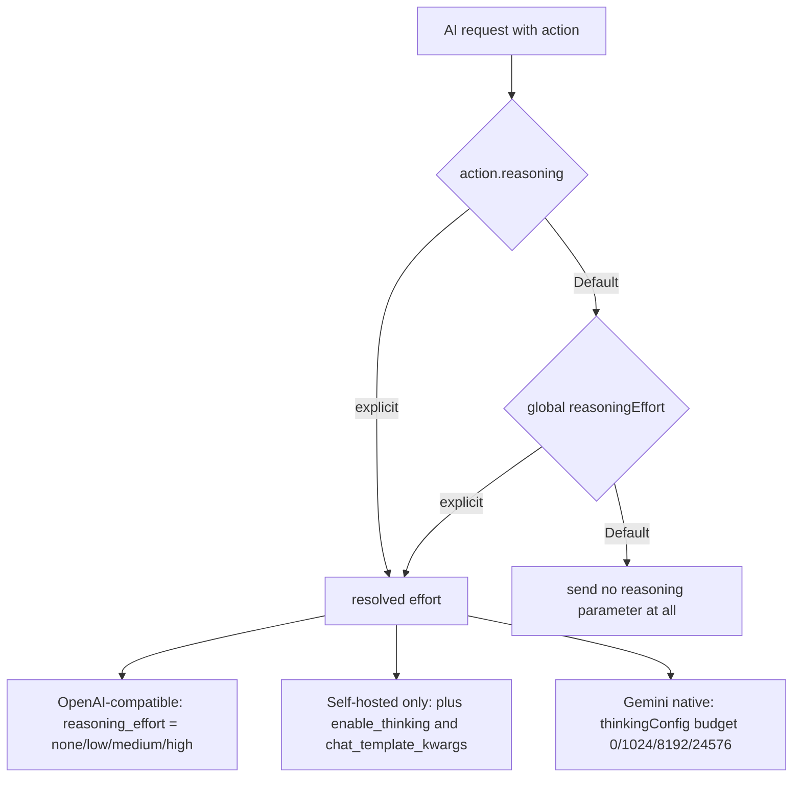

2026-08-06

# EinkBro iOS: reasoning-effort setting for AI requests (Android parity)

Commit `851d420`. Ports Android's reasoning/thinking-effort control to the iOS
app: a global "Reasoning effort" setting on the Gen AI screen and a per-action
override in the AI-action editor, wired into every request path. Also closes
the `imageApiKey` parity-audit entry the other way — documented as deliberately
dropped, since it is the key for Android's Papago image translation and the
Papago provider was removed from iOS in July.

## What it does

Every AI request resolves an effort: the action's own setting wins, falling
back to the global one when the action says Default. A resolved Default means
"model default" — no reasoning parameter is sent at all, which keeps the wire
format byte-identical to what the app sent before this feature existed. Each
backend then gets the parameter it understands:

The `enable_thinking` + `chat_template_kwargs` pair is self-hosted-only —
api.openai.com rejects parameters it doesn't know; the duplicated switch covers
both vLLM/SGLang/llama.cpp (kwargs) and DashScope-style (top-level) servers.
Gemini's budgets are Android's token tiers, with `includeThoughts` on so
thought parts arrive — the existing reply path already filters them out.

## How it was built

A direct port of Android's implementation across the same seams:

- `ReasoningEffort` enum + `reasoning` field on `ChatGPTActionInfo` (a
  defaulted `@Serializable` field, so previously persisted action JSON still
  decodes), `AiConfig.reasoningEffort` under the same `sp_reasoning_effort`
  key so backup/restore round-trips between platforms, and
  `resolveReasoningEffort` for the fallback.
- One `buildChatRequest` helper in `OpenAiRepository` (Android's
  `createCompletionRequest`) feeding the blocking, streaming, and
  test-connection calls; the tool-calling agent path (`chatWithTools`) wires
  the same fields separately, minus Android's Gemini-via-OpenAI-compat quirk —
  iOS routes Gemini natively so that caveat has no counterpart.
- Settings item right under "Default AI engine" and the effort picker row in
  the per-action editor dialog, mirroring Android's layouts. The seven
  reasoning strings were copied from Android's translations into the base
  `strings.xml` and all seven shipped locale packs.

## Verification

Beyond compile + UI drive (setting persists as the right ordinal; both pickers
render), the wire format was verified against a local capture server standing
in as a self-hosted endpoint via the settings Test-connection button:

- Effort Low → `…"reasoning_effort":"low","enable_thinking":true,
  "chat_template_kwargs":{"enable_thinking":true}}`
- Model default → the exact pre-feature request body, no reasoning keys.

One sim-driving lesson reconfirmed the hard way: the injected server-URL pref
only sticks when the container plist is edited with the simulator device shut
down (cfprefsd serves file edits stale on a running device), and the app
container UUID had rotated after reinstall, so the plist path must be re-globbed
rather than cached.
