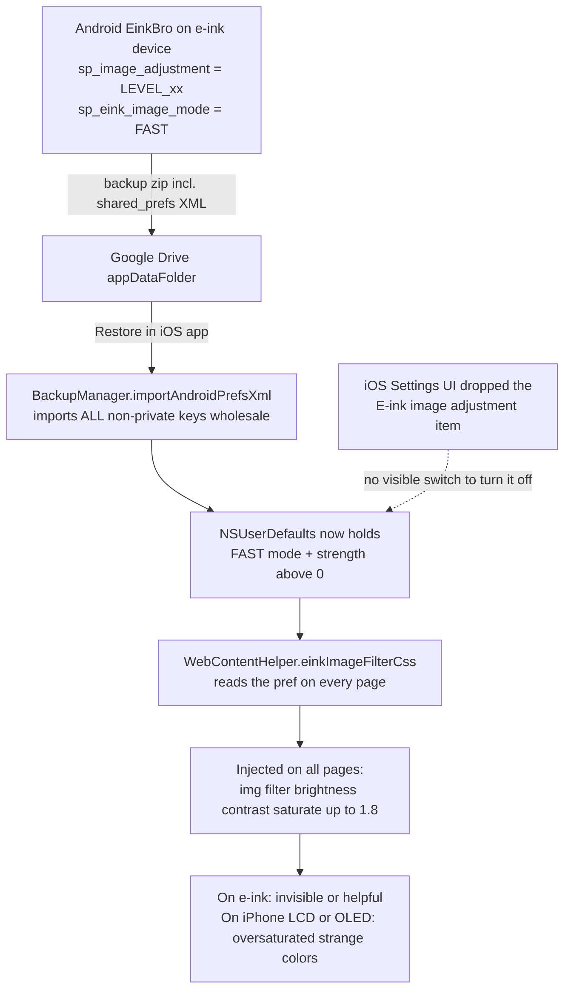

2026-07-22

# EinkBro iOS: remove the e-ink image filter and keep its prefs out of Drive restores

Images in the iOS app suddenly rendered with garish, oversaturated colors on every
page. Nothing in the app's UI explained it: there is no image-related setting
visible anywhere on iOS.

## Root cause

The Android original has an "E-ink image adjustment" feature with two modes:
DEEP re-encodes images at the network layer (grayscale + dithering), FAST injects
a CSS filter — `img { filter: brightness(≤1.15) contrast(≤1.2) saturate(≤1.8) }` —
that compensates for washed-out **color e-ink panels**. On a normal iPhone/iPad
display the same filter just distorts colors.

Three iOS decisions, each fine in isolation, combined into a trap:

1. The filter port in `WebContentHelper.einkImageFilterCss()` still honored the
   prefs (`sp_eink_image_mode` = FAST and `sp_image_adjustment` > 0) on every
   `updateCssStyle()`.
2. The settings item was deliberately dropped from the iOS UI ("no iOS device
   has an e-ink display") — so there was no visible switch and no way to turn
   the filter off.
3. The new Google Drive backup sync restores Android `shared_prefs` XML
   **wholesale** — every non-private key, including the two e-ink image prefs.

Restoring an Android backup (where the adjustment is invisible or beneficial on
an e-ink screen) therefore silently enabled hidden image processing on iOS.

## Fix

Two changes (commit `6ce6903`):

- **Remove the filter entirely.** `einkImageFilterCss()` and its injection into
  the main CSS slot are gone from `WebContentHelper`, along with the now-unused
  `formatThreeDecimals` helper. iOS never injects an `img` filter now. DEEP mode
  was never implemented on iOS (no scheme handler), so this removes the only
  code path that read these prefs.
- **Keep the prefs out of future restores.** `BackupManager.isPrivateKey()` now
  also excludes `sp_image_adjustment` and `sp_eink_image_mode`; all three import
  paths (prefs XML, flat JSON, string sets) share that filter, so a later Drive
  sync cannot reintroduce the setting.

Devices that already imported the prefs need no cleanup — the values become
inert once nothing reads them.

The `EinkImageSettingItem` composable infrastructure (data class, dialog,
dispatch branches) stays: no iOS screen instantiates it, and keeping it
preserves diffability against the Android tree.

## Verification

Kotlin type-check, full simulator and device builds. On the simulator, the
worst-case pref combination (FAST + level 100) was seeded via `defaults write`
before the fix build was driven — pages render images untouched.
