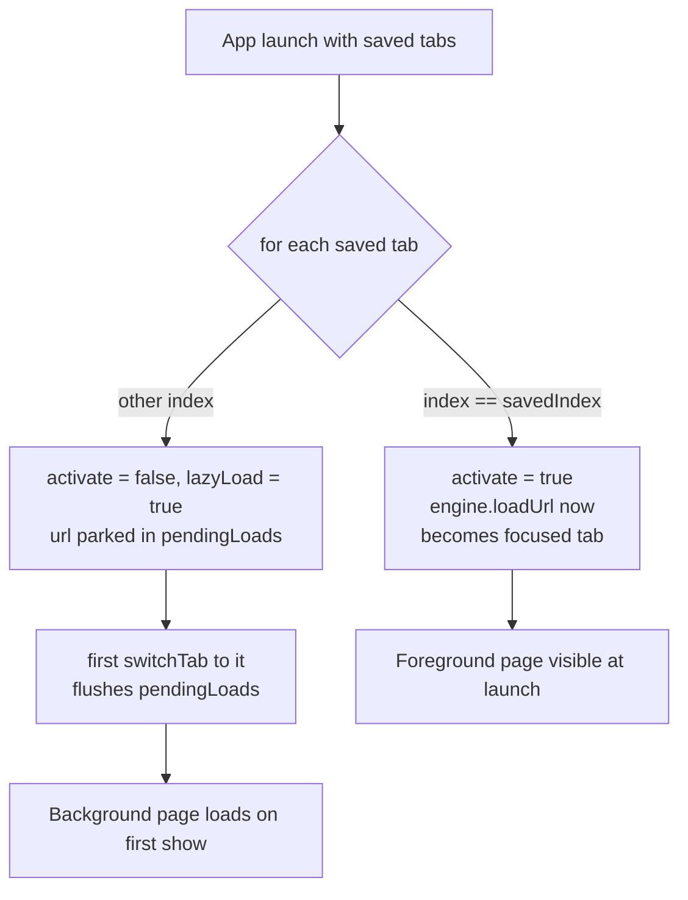

2026-07-19

# EinkBro iOS: load the foreground tab when restoring saved tabs at launch

## What was broken

With "save tabs" enabled, relaunching the app restored the tab strip (all
titles present, correct count) but showed a **blank foreground page**. The
previously-current tab only rendered after manually switching away and back.

## Root cause

`BrowserViewModel.ensureFirstTab` restored every saved tab with
`activate = false`:

```kotlin
saved.forEach { info -> newTab(info.url, activate = false, title = info.title) }
focusIndex.value = config.tab.currentAlbumIndex.coerceIn(0, albums.value.lastIndex)
```

Two things compounded:

1. In `newTab`, a non-activated tab defers its URL into `pendingLoads`
   (unless background loading is on). So *every* restored tab — including the
   one about to become current — was created without loading anything.
2. `focusIndex` was then assigned directly. But the only place a pending load
   is flushed is `switchTab`. Setting the index by hand skipped that flush,
   leaving the focused tab's WKWebView empty.

There was also a latent index bug: `config.tab.currentAlbumIndex` was read
*after* the restore loop, but each `newTab` call ends in `persistTabs()`,
which rewrites `currentAlbumIndex` from the live `focusIndex` — so by the
time it was read, the saved value had already been clobbered (typically to 0).

## How Android does it

`IntentDispatchDelegate.initSavedTabs` iterates the saved list with the saved
current index in hand and treats the current tab specially:

```kotlin
albumList.forEachIndexed { index, albumInfo ->
    addAlbum(albumInfo.title, albumInfo.url,
        index == savedIndex,          // foreground
        lazyLoad = index != savedIndex)
}
```

The foreground tab is shown *and loaded immediately*
(`TabManager.loadUrlInWebView` calls `loadUrl` on the foreground path).
Background tabs are restored lazily — `lazyLoad = true` defers the load until
first activation **even when `enableWebBkgndLoad` is on**, so a 10-tab
session doesn't fire 9 page loads at startup.

## The fix

Mirror Android in `ensureFirstTab`:

- Capture `savedIndex` from `config.tab.currentAlbumIndex` **before** the
  loop (fixes the clobbering), clamped into the saved list's indices.
- Create each tab with `activate = index == savedIndex` and a new
  `lazyLoad = index != savedIndex` parameter. Activation makes `newTab` load
  the URL immediately and sync the URL bar, so the manual
  `focusIndex`/`syncCurrentState` lines are gone.
- `newTab`'s load decision becomes
  `if (activate || (config.tab.enableWebBkgndLoad && !lazyLoad))` — restored
  background tabs always defer, matching Android's `lazyLoad` semantics.



## Verification

Simulator with a 10-tab saved session: two kill/relaunch cycles both came up
with the foreground page fully rendered (no blank screen); the tab list
showed all 10 saved titles with the correct tab highlighted as current; and
tapping a background tab loaded it on first show (lazy path still intact).
