2026-07-16

# EinkBro iOS Port — Phase 7: Save-as-PDF & Offline Web Archives

Phase 7 of the einkbro→iOS Compose Multiplatform port adds the "files & export"
layer: rendering the current page to a PDF, snapshotting it to a self-contained
web archive for offline reading, and reopening those archives later — plus a fix
for a translation-teardown bug uncovered while wiring the menu.

## What it does

Three user-facing capabilities, all reachable from the browser menu:

- **Save as PDF** renders the live page to a PDF and hands it to the iOS share
  sheet, so the user can save it to Files, mail it, or send it on.
- **Save for later / Save as MHT** snapshots the page — HTML plus every embedded
  resource — into a `.webarchive` file and records it in the database.
- **Downloads** opens the saved-pages list; tapping an entry reopens the archive
  in a new tab, fully offline.

## How it was built

The seam is a small `FileStore` expect/actual and three new methods on the
`WebViewEngine` interface, backed by first-class WKWebView APIs on iOS:

- `createPdf` → `WKWebView.createPDFWithConfiguration`
- `createWebArchive` → `WKWebView.createWebArchiveDataWithCompletionHandler`
- `loadFile` → `WKWebView.loadFileURL(_:allowingReadAccessToURL:)`

`FileStore` writes bytes under the app's Documents directory (via
`NSFileManager`) and shares a file through `UIActivityViewController`. Saved-page
metadata (title, URL, file path, timestamp) lives in a new Room `saved_pages`
table; the schema bumps to v3 with a hand-written `MIGRATION_2_3` so existing
installs keep their bookmarks, history, and highlights.

Because a `.webarchive` embeds all page resources, reopening it via a `file://`
load needs no network at all — the archived page (including images) renders
straight from disk.

```mermaid
flowchart TD
    subgraph Save as PDF
        A1[Menu: Save as PDF] --> A2[BrowserViewModel.saveAsPdf]
        A2 --> A3[engine.createPdf]
        A3 --> A4[WKWebView.createPDFWithConfiguration]
        A4 --> A5[FileStore.writeBytes Documents/pdf]
        A5 --> A6[FileStore.share UIActivityViewController]
    end
    subgraph Save for offline
        B1[Menu: Save for later / MHT] --> B2[BrowserViewModel.saveWebArchive]
        B2 --> B3[engine.createWebArchive]
        B3 --> B4[WKWebView.createWebArchiveData]
        B4 --> B5[FileStore.writeBytes Documents/saved_pages]
        B5 --> B6[BookmarkManager.insertSavedPage]
        B6 --> B7[(Room saved_pages v3)]
    end
    subgraph Reopen offline
        C1[Menu: Downloads] --> C2[SavedPagesScreen]
        C2 --> C7[(Room saved_pages v3)]
        C2 --> C3[onOpenPage]
        C3 --> C4[BrowserViewModel.openSavedPage]
        C4 --> C5[newTab + engine.loadFile]
        C5 --> C6[WKWebView.loadFileURL renders offline]
    end
```

## A translation-teardown bug found on the way

Wiring the menu surfaced a latent defect in the "clear translation" path. The
translate-by-paragraph feature installs two long-lived observers — a
`MutationObserver` that marks new content as the page renders, and an
`IntersectionObserver` that requests and applies translations on scroll — both
backed by an in-page text cache. The clear script only restored the original
`innerHTML`. That left both observers alive: they immediately fired on the
freshly-restored nodes and re-applied the cached translations, so clearing
appeared to do nothing (the border styling vanished but the translated text came
back).

The fix makes teardown explicit: disconnect both observers, drop the rebind hook
and the node-tracking sets, and clear the text cache *before* restoring the DOM.

## Verification

Exercised end-to-end on the iPhone 16 simulator:

- Save-for-later wrote a ~1 MB `.webarchive` and inserted the matching
  `saved_pages` row (title, URL, path all correct).
- Reopening from the Downloads list loaded the archive in a new tab; the page
  rendered completely, including the embedded featured-article image served from
  the file rather than the network — confirming genuine offline reopen.
- Save-as-PDF produced a valid ~1.57 MB `%PDF-1.3` file under `Documents/pdf/`
  and presented the iOS share sheet.

## Deferred

Direct/blob download interception (Android's `blob_url_fetch.js` +
`DownloadHelper`) and EPUB export remain out of scope; both depend on subsystems
not yet ported. The Downloads menu currently maps to the saved-pages list, which
is the only on-device "downloaded content" the iOS build produces so far.
