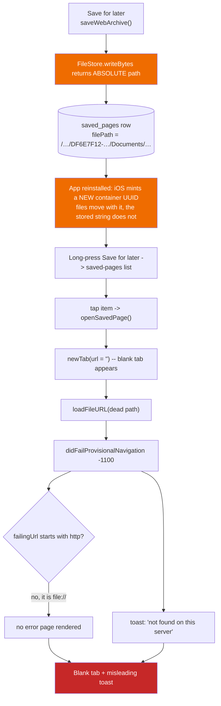

2026-07-26

# Saved pages opened a blank tab: absolute container paths do not survive a reinstall

## What was broken

Long-pressing **Save for later** brings up the saved-pages ("read later") list.
The list rendered correctly — titles, URLs, dates all there — but tapping an
entry opened a blank tab and never loaded the archived page. It had never once
worked on the device: the history table held 55 rows and not a single `file://`
entry, and `onPageFinished` records history unconditionally for any non-blank
URL.

## Root cause

`saved_pages.filePath` stored an **absolute** sandbox path. iOS mints a fresh
UUID for the app's data container on every (re)install; the files move with the
container, the string in the database does not.

Measured on the device over a single session, across three installs:

| | |
|---|---|
| stored in the rows (saved 2026-07-19) | `…/Application/DF6E7F12-ADA6-4BDE-89ED-22A02A348610/Documents/…` |
| live container when the bug was reported | `AF1694CB-4699-4B5F-A132-8CBA32801BDB` |
| live container after two more installs | `123EFDA1-E9F8-4E97-B0EC-D93ED77A6E84` |

Both archives (3.2 MB and 5.2 MB) were alive and well the whole time — just
under a different UUID than the one the rows named. On a developer device that
is reinstalled constantly, this rots almost immediately.

The failure was near-silent by an unlucky combination:

- `WKWebView.loadFileURL` on a missing file still returns a `WKNavigation`, then
  fails with `NSURLErrorFileDoesNotExist` (-1100), whose description is
  *"The requested URL was not found on this server."* — it reads like a network
  error.
- The error page is gated on `failingUrl.startsWith("http")`, so a `file://`
  failure renders nothing at all.
- The tab had already been created before the load was attempted, leaving a
  blank orphan behind.



## How the diagnosis was pinned down

Worth recording, because two plausible theories were wrong and one measurement
tool lied.

The obvious suspects were the archive format and WebKit itself — WKWebView is
widely believed to be unable to render `.webarchive`. Both were **ruled out
empirically**: a real archive was pulled off the device and loaded in a
standalone macOS WKWebView harness with the exact call the app makes,
`loadFileURL(file, allowingReadAccessTo: parentDir)`. It rendered — correct
title, 1865 characters of body text, 23 subresources — and `canShowMIMEType`
returned `true` for `application/x-webarchive`, so the app's
download-diversion branch was never in play. The CJK filename the app generates
was fine too.

That harness initially reported the opposite. `loadFileURL` returned `nil` with
no delegate callback whatsoever, which looked like a spectacular finding. It was
an artifact: `devicectl` stamps `com.apple.quarantine` on anything it copies off
a phone, and Gatekeeper makes WebKit reject the load synchronously and silently.
`xattr -c` and it loaded perfectly. A useful reminder that a file copied off a
device is not the same object as the file on the device.

Confirming the container UUID needed a trick. `devicectl` has no `rootVFS`
domain, so containers cannot be enumerated, and neither `device info apps` nor
the JSON file listing prints an absolute path. But asking it to copy a path
containing `..` fails with an error whose `NSFilePath` field leaks the **live**
container path:

```
xcrun devicectl device copy from --device <id> \
  --domain-type appDataContainer --domain-identifier <bundle> --source ".."
# Error … NSFilePath = /private/var/mobile/Containers/Data/Application/<LIVE-UUID>/…
```

## The fix

`util/FileStore.kt` gains `documentsPath()` plus two pure helpers, and the rule
that anything outliving the process persists the first and reads back the
second:

- **`storedPathFor(absolute)`** — the Documents-relative form, safe to persist.
- **`resolveStoredPath(stored)`** — back to a path valid for *this* install. A
  relative path re-roots at the current Documents directory; an absolute path
  left by a dead container re-roots by its Documents-relative tail.

That last clause is what makes it self-healing: the existing rows still carry
`DF6E7F12-…` and are never rewritten, yet they resolve against whatever
container is live today and will keep resolving through every future reinstall.
No Room migration was needed. Paths outside the container (a Files-app hand-off)
and opaque URIs (the Android `content://` entries a restored backup carries)
pass through untouched.

Applied at every site that persists a path: `saved_pages.filePath`, the saved
EPUB/PDF preference lists, and the EPUB append target. `openSavedPage` now
checks the file *before* creating the tab, so a genuinely missing file toasts
instead of leaving a blank orphan, and `loadFile` reports the missing filename
rather than WebKit's server-sounding error.

## Drive sync: if the bytes are not in the zip, the list does not go either

Investigating the same class of defect surfaced a second one. The backup zip
carries no file payloads at all, yet file *lists* were crossing devices:

- Android's `database_data.json` **does** include a `saved_pages` array
  (`BackupUnit.kt`). The iOS importer skipped it only by omission — one future
  "import everything" pass away from silently restoring rows that name `.mht`
  files sitting on an Android phone. Now an explicit, documented skip.
- The saved EPUB/PDF lists were round-tripping through `prefs.json` in both
  directions. That is exactly how the device ended up holding ten dead Android
  `content://` URIs in `sp_saved_epubs` — files nothing on iOS can open. Both
  keys joined `NON_PORTABLE_KEYS` alongside the Drive OAuth session and the
  e-ink image prefs, filtered on export *and* import.

Since the filter only stops *new* pollution, a startup prune in
`BrowserViewModel.init` drops saved EPUB/PDF entries whose file no longer
resolves, clearing what earlier imports already left behind. It resolves before
testing existence, so a valid file whose container merely moved is never
mistaken for a missing one — the two fixes have to compose in that order.

## What is verified, and what is not

The Kotlin type-check passes and the build is signed and installed on the
device. The resolution logic was replayed against the real values pulled off the
phone: the two stale rows land on the actual files, and the preference filter
drops exactly the four polluted keys. The archives survived all three installs.

Not exercised at runtime — the simulator was in use by another session
throughout, and the Drive round-trip needs the sign-in flow. The maintainer will
verify both.
