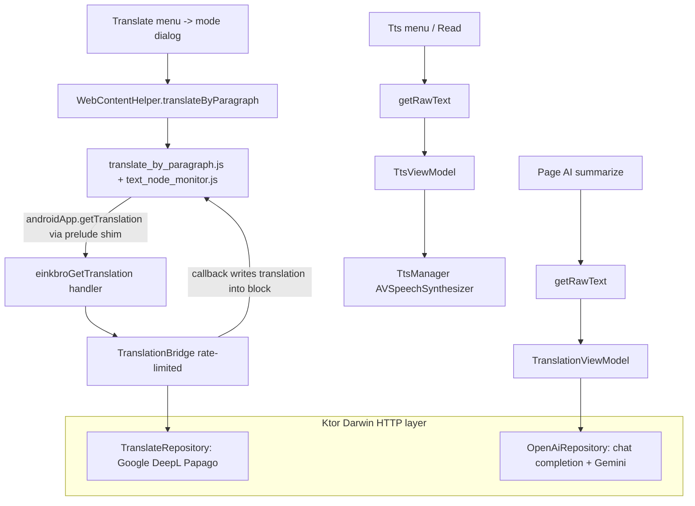

2026-07-16

# EinkBro iOS Phase 6 — translation, read-aloud, and GPT on a Ktor layer

Phase 6 is the "services" phase: the features that reach the network. On
Android these ran on OkHttp + Jsoup with a system `TextToSpeech`; on iOS they
move to Ktor (Darwin engine) and `AVSpeechSynthesizer`. The exit bar was
narrow and concrete — translate-by-paragraph, read-aloud, and GPT summarize
working end-to-end — so the phase ports exactly the paths those three need and
leaves the long tail (image OCR translate, Edge/OpenAI TTS voices, the
tool-calling agent) documented for later.

## The HTTP layer

Everything here needs an HTTP client, and the port keeps the repositories in
common code with a one-line platform seam: `HttpClientProvider` is an
expect/actual returning a shared Ktor client (Darwin on iOS). Two repositories
sit on top:

- `TranslateRepository` — Google's unofficial `gtx` endpoint, DeepL's free
  jsonrpc, and Papago. Papago is the interesting one: it signs each request
  with an HMAC-MD5 token over a key scraped from its web bundle, so a small
  `Crypto` expect/actual wraps CommonCrypto (HMAC-MD5/SHA1) on the iOS side.
- `OpenAiRepository` — OpenAI-compatible chat completion and Gemini
  `generateContent`. Ktor has no `EventSource`, so streaming reads the raw body
  channel line by line and parses the `data:` SSE frames by hand; the
  `ApiResult` failure taxonomy (missing key, rate-limited, network, …) is
  carried over unchanged so the UI's error messages stay identical.

## Translate-by-paragraph, without touching the JS

The signature EinkBro feature is dual-language paragraph translation, and its
two JS assets (`translate_by_paragraph.js`, `text_node_monitor.js`) are gnarly,
stateful, and battle-tested against real sites. The whole point of the
migration plan's bridge design is to reuse them verbatim. They call
`androidApp.getTranslation(text, id, cb)` — an Android `@JavascriptInterface`
global. A tiny `android_interface_prelude.js` defines that global to post onto a
`WKScriptMessageHandler` channel, so the assets run unmodified. `TranslationBridge`
is the native half: it receives each block's text, translates it with the
selected provider under the same rate limits Android used (four concurrent for
the fast providers, strictly serial with 1500ms spacing for DeepL/Gemini), and
invokes the JS callback with the result — which the monitor writes into a styled
sibling paragraph or, in replace mode, over the block's own text nodes.

The Translate menu opens the already-ported mode dialog — Google / DeepL /
OpenAI / Gemini by-paragraph and in-place, plus Google whole-page which just
opens a `translate.google.com` tab — and picking a mode sets the bridge's
provider and starts the run. Tapping Translate again clears and restores the
original DOM. The text-selection menu also gained a Translate entry (opens the
translate popup) and a Read entry.

## Read-aloud and GPT

`TtsManager` becomes an `AVSpeechSynthesizer` actual. Text is sentence-chunked
with the ported `processedTextToChunks`, every chunk is queued up front (the
synthesizer keeps its own queue, like Android's `QUEUE_ADD`), and progress
advances on the `didFinishSpeechUtterance` delegate callback — only that one
callback is implemented because Kotlin/Native collapses the delegate's
same-signature methods into conflicting overloads, the same constraint the
navigation delegate hit in Phase 1. `TtsViewModel` drives the article queue
behind the ported TTS dialog with working pause/resume/stop. GPT and Edge-TTS
voices fall back to system TTS for now.

`TranslationViewModel` is now the real thing: Google/DeepL/Papago text
translation and OpenAI/Gemini LLM queries (streaming or blocking) feed the
translate popup, and Page-AI summarize reads the page text and runs the summary
GPT action against whichever engine is configured.

## Deferred, with reasons

- **Papago image OCR / screen translate** — needs bitmap capture + multipart
  upload plumbing that belongs with the Phase 7 file work.
- **Google in-place widget injection** — the `element.js` bootstrap is fiddly
  and the by-paragraph path already covers the use case.
- **Edge-TTS and OpenAI TTS voices + media controls** — Edge-TTS needs a Ktor
  WebSocket + audio playback; both need `MPNowPlayingInfoCenter`. System TTS is
  enough to satisfy read-aloud.
- **GPT query persistence and the tool-calling task agent** — data-layer and
  agent-loop work for a later phase.

Verified on the iPhone 16 simulator: translate-by-paragraph inserted Traditional
Chinese under each English paragraph on a test article and cleared cleanly;
read-aloud advanced through the article's sentence chunks with pause and stop
both working; a summarize request reached an OpenAI-compatible endpoint and the
returned summary rendered in the dialog; and the selection Translate popup
returned a Google text translation of the selected word.
