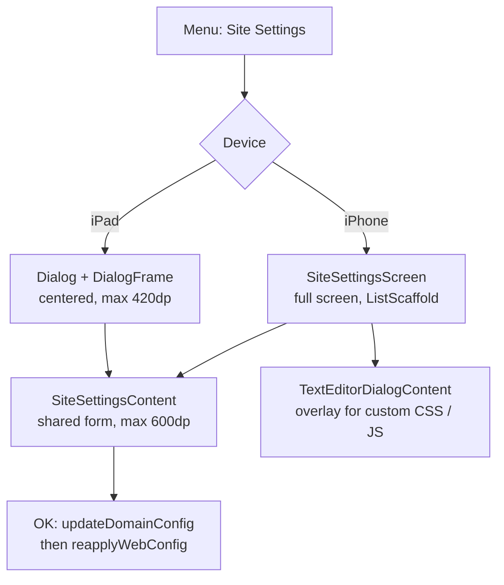

2026-08-08

# EinkBro iOS: full-screen Site Settings on phones

The per-site settings (font overrides, desktop mode, JavaScript/AdBlock/Cookies,
translation, custom CSS/JS) rendered in a centered dialog capped at 420dp wide
and 85% of screen height. On iPhone that was broken in practice: the desktop-mode
row nests a "Force viewport width" stepper under a left rail, and label + hint +
checkbox + [−] 1280 [+] simply don't fit the remaining width — rows wrapped and
clipped, and the whole form scrolled inside a small box.

Android already solved this exact problem: `SiteSettingsActivity` hosts the same
form full-screen on phones, while tablets keep `SiteSettingsDialogFragment`
("on phones the dialog is too cramped; use the whole screen" — its own comment).
This change mirrors that split on iOS.

## How it was built

- **New `activity/SiteSettingsScreen.kt`** — the CMP counterpart of Android's
  `SiteSettingsActivity` (`finish()` becomes `onClose`). It wraps the existing
  `SiteSettingsContent` form in the shared `ListScaffold` (top bar, back arrow,
  safe-area insets), centered with `widthIn(max = 600.dp)` and full height —
  the same modifiers Android uses.
- **`BrowserScreen.kt` dispatch** — `ShowSiteSettingsDialog` now branches on
  `ViewUnit.isTablet`: iPad keeps the existing `Dialog`/`DialogFrame` path,
  iPhone composes the new screen in a `fillMaxSize` Surface, the same pattern
  every other full-screen overlay (Settings, GPT actions, …) already uses.
  Both paths funnel into one `dismissSiteSettings` that persists and calls
  `reapplyWebConfig()` so per-site JS/adblock/UA overrides hit future loads.
- **Custom CSS / Post-Load JS editors now work** — the dialog wrapper had
  stubbed `onEditText` with a "would open text editor" toast (nowhere to open
  an editor from inside a dialog). The full-screen host stores the request in
  state and overlays the existing `TextEditorDialogContent` full-screen,
  matching Android's `TextEditorDialogFragment` flow.

Verified on the iPhone 16 simulator: all sections render with room to spare,
the viewport-width stepper is intact, an override round-trips (save → reopen
shows "1 override" → reset), and the CSS editor opens and cancels cleanly.
