2026-08-08

# einkbro-ios: start page title and background customization (Android parity)

Ports the day's Android feature to the CMP iOS app: tapping the start-page
wordmark opens a config dialog to rename the heading or set/remove a
background image, the page themes itself from the image's brightness (or the
app's dark mode when plain), and everything persists. The shared
`start_page.html` template is now byte-identical between the two repos again.

## How the port maps to the iOS architecture

```mermaid
flowchart TD
    A["Wordmark tap in WKWebView"] --> B["decidePolicyForNavigationAction intercepts einkbro config_start_page"]
    B --> C["WebViewEngineListener.onStartPageConfigRequested"]
    C --> D["BrowserViewModel.pendingStartPageConfig state"]
    D --> E["BrowserScreen LaunchedEffect runs StartPageConfigDialog"]
    E --> F["Edit title via DialogManager.getTextInput"]
    E --> G["Set background via FilePicker document picker"]
    E --> H["Remove background - FileStore.delete"]
    F --> R["StartPageRenderer.loadStartPage"]
    G --> I["ImageUtil.processBackgroundImage - UIImage scale plus re-encode"]
    I --> R
    H --> R
```

- The scheme link rides the exact channel the "+" tile already uses:
  navigation-policy interception, a listener seam, a `pending*` mutableStateOf
  on the view model, and a `LaunchedEffect` host in BrowserScreen.
- The dialog reuses the suspend `DialogManager` (plain list + text input
  hosts), so no new dialog plumbing was needed. iOS has no
  paused-WebView-timers trap, so the picker result applies immediately.
- Images go through a new `ImageUtil` expect/actual. The iOS actual decodes
  with UIImage — which transparently handles HEIC sources and EXIF rotation,
  both things the Android BitmapFactory path had to handle explicitly — then
  draws into a UIGraphics context for the downscale and re-encodes (PNG stays
  PNG, everything else JPEG). Edge colors and brightness come from a 32x32
  RGBA CGBitmapContext raster composited over white.
- `HostBridge` gained `isSystemDarkMode()` (trait collection) so
  `DarkMode.SYSTEM` resolves outside a composable.

## Divergence resolved: media query vs body.dark

The iOS start page previously themed itself with a
`@media (prefers-color-scheme: dark)` block, driven by the engine's
`overrideUserInterfaceStyle`. That can't express "the background image is
dark, go dark regardless of the system", so the page now uses the shared
Android approach: the renderer computes the theme and stamps a `body.dark`
class plus a fixed `color-scheme` meta, and the media query is gone. The
three new strings were added to all eight iOS locales with the same
translations as the Android repo.

Verified on the simulator end to end: rename via typed input, watercolor
background (whole image contained, cream edge-fill, light theme, halo),
dark background (dark theme, black halo), and removal restoring the plain
page.
