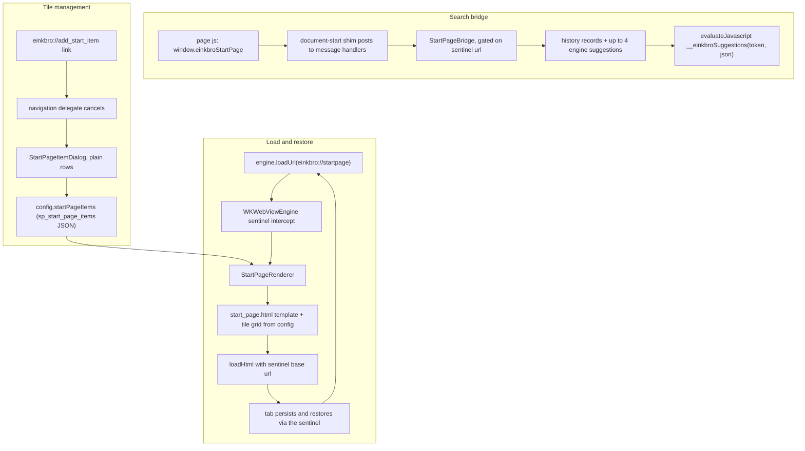

2026-08-08

# EinkBro iOS: built-in start page port

## What it does

Ports Android's new built-in start page (commits `bd1484682` + `5f2b50473`) to the iOS app, and makes it the default homepage in place of a real website. A new tab (with the new "Show start page" behavior), the home action, and fresh installs now land on a native page rendered inside the tab's WKWebView: an EinkBro wordmark, a Google-style search box with in-page autosuggestions, and a user-curated tile grid whose "+" tile adds sites picked from bookmarks or entered manually.

The page is the shared `assets/start_page.html` — synced verbatim from Android HEAD, which also picked up Android's later IME inset-bounce fix for the keyboard-dismiss viewport logic. Everything EinkBro-specific about it (e-ink static caret, focus mode that hides the grid so suggestions fit above the keyboard) came along for free.

## How it works

The sentinel URL `einkbro://startpage` is the load-bearing trick, same as on Android: the HTML is loaded *against it* as base URL, so the tab's URL **is** the sentinel — saved-tab persistence and restore work unchanged, and `WKWebViewEngine.loadUrl` re-renders whenever anything asks for that URL (mirroring Android `EBWebView.loadUrl`).

Android attaches the search bridge as a `@JavascriptInterface` object. WKWebView has no equivalent, so a document-start user script maps `window.einkbroStartPage` onto two `WKScriptMessageHandler` channels — the established `android_interface_prelude.js` pattern that keeps shared assets running unmodified. The shim is installed on every tab (as Android attaches its interface to every page), so each native entry point re-checks that the current URL really is the start page before serving history-derived suggestions or steering the tab. Suggestions reuse the URL-input overlay's exact recipe: local history filtered by the query, up to four search-engine suggestions ahead of it, capped at eight.

Tile icons prefer the favicon the browser already stored: iOS keeps the original fetched bytes in the favicons table, so they embed directly as a data URI with a sniffed mime — no bitmap re-encode like Android needs. Fallbacks are the site's `/favicon.ico`, then a capital-letter placeholder. Items persist under the same `sp_start_page_items` JSON key as Android, so backups round-trip across platforms.

## iOS-specific decisions

- **Dark mode** (not on Android yet): a `prefers-color-scheme: dark` block in the shared asset. The engine already forces the page's color scheme from Settings → Dark mode via `overrideUserInterfaceStyle`, so the page tracks Force On / Disabled / Follow system with no extra wiring. The CSS block is upstreamable to the Android asset verbatim.
- **Plain-row dialogs**: Android's add flow uses `AlertDialog.setItems` — no title, no radio buttons. `DialogManager` grew a `plain` mode on its select-option request (rows only, optional title, tap-outside cancels) instead of a one-off dialog. Manual entry asks title then URL in sequence, since the shared text-input dialog takes one field.
- **Recent-bookmarks retired from the picker** (diverges from Android, which still offers it): the new-tab-behavior setting now lists only Start input URL / Show homepage / Show start page. The `SHOW_RECENT_BOOKMARKS` enum entry stays so persisted ordinals keep matching Android for backup restore, and a legacy pref still dispatches. This required making the generic enum list-setting renderer map selection by the item's `values` list instead of assuming options align with enum ordinals.
- Side fixes carried from the Android commit: `einkbro://` pages never write history and never prefill the URL input bar.

## A bug the simulator caught

The first build's "+" tile did nothing: the Compose `LaunchedEffect` that runs the add dialog was keyed on the pending-request state and reset it to null *before* awaiting the dialog — the reset restarted the effect, cancelling the suspended dialog request before it ever rendered. The fix resets the state only after the dialog flow completes. Verified end-to-end in the simulator afterwards: settings option, render (light and dark), suggestion pipeline, submit navigation, tile add/delete, and restore-after-relaunch.
