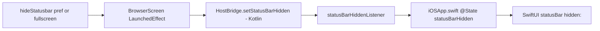

2026-07-18

# EinkBro iOS: hide-statusbar setting hides the real system status bar

The "Hide system status bar" setting (and fullscreen mode) previously only pushed the Compose root edge-to-edge; the actual system overlay — clock, signal, battery — stayed painted on top. Real hiding was deferred during parity Phase D because scene-based SwiftUI apps ignore the legacy `UIApplication.setStatusBarHidden` (Kotlin/Native doesn't even export it), so the lever had to live on the Swift side.

The fix is a small bridge: the pref lives in Kotlin, the lever in SwiftUI.

`HostBridge` (the existing expect/actual for host behaviors like keep-awake) gains `setStatusBarHidden`. The iOS actual doesn't touch UIKit — it holds the latest value and a `statusBarHiddenListener` that `iOSApp.swift` registers in `onAppear`; registration replays the current value so startup order doesn't matter. Swift applies it through SwiftUI's `statusBarHidden(_:)`, with the pre-iOS-16 `statusBar(hidden:)` spelling behind an availability check since the deployment target is 15.

Two supporting details: `UIViewControllerBasedStatusBarAppearance` had to flip to `true` in Info.plist (SwiftUI's modifier rides the view-controller-based appearance mechanism — a comment in the plist now guards it), and the `LaunchedEffect` in `BrowserScreen` is keyed on the settings tick rather than the derived flag, because `hideStatusbar` is a plain pref read and the tick is what actually recomposes that scope when the setting changes.
