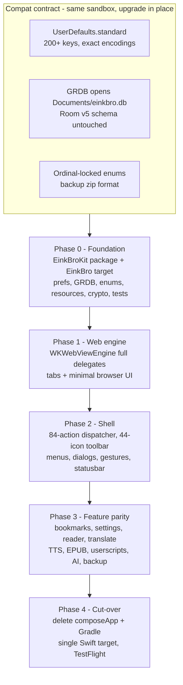

2026-07-22

# EinkBro iOS: plan for the native Swift/SwiftUI rewrite

The iOS port of EinkBro has so far been a Compose Multiplatform app: ~35k lines of Kotlin
(212 files, 292 composables) sharing package layout with the Android original, compiled by
Kotlin/Native into a static framework and hosted by a 54-line SwiftUI shell. That
architecture bought cheap porting from Android, but it has a ceiling: the long-term goal is
to run EinkBro natively on macOS too, and CMP cannot get there — its desktop target is
JVM+Skia (non-native, bundled runtime), Kotlin/Native has no Mac Catalyst target, and the
experimental native-macOS Compose backend was never productionized. The only Mac path today
is running the iOS binary in "Designed for iPad" compatibility mode. SwiftUI is the one
framework where iOS and macOS genuinely share a codebase, so the decision is a full rewrite:
remove Jetpack Compose and KMP entirely, iOS-first, with macOS as a later target the
architecture must not preclude.

This ADR records the plan committed as three documents on the `swift-rewrite` branch:
`docs/SWIFT_MIGRATION_PLAN.md` (phases, decisions, status tracking),
`docs/SWIFT_COMPAT_CONTRACT.md` (the byte-level persistence contract), and
`docs/SWIFT_PORTING.md` (Kotlin-to-Swift conventions).

## The load-bearing idea: replace in place

The Swift app keeps the same bundle id (`info.plateaukao.einkbro.ios`), so it inherits the
Compose app's sandbox. That turns "migration" into a compatibility problem rather than a
data-export problem — and the plan's foundation was mapping that surface exactly, via five
parallel subsystem surveys (preferences, database, web engine, UI inventory, networking/TTS):

- **Preferences**: `NSUserDefaults.standard`, 200+ keys with historically messy encodings
  that must be preserved bug-for-bug — ints stored as decimal strings (`sp_fontSize`), enum
  ordinals stored sometimes as Int and sometimes as String (`sp_dark_mode`,
  `SP_SEARCH_ENGINE_9`), delimiter formats (`::::`, `:$:`, `###`, comma-joined ordinals),
  gesture actions stored as Kotlin class simple-names with legacy 2-digit migration, and
  "key present" default semantics the Android SharedPreferences shim implemented.
- **Database**: Room schema v5 at `Documents/einkbro.db`. GRDB will open the same file;
  schema stays untouched (including Room's `room_master_table`), so rollback to the Compose
  build remains possible and no data migration exists at all.
- **Ordinal-locked enums**: 25 enums are persisted by declaration order (`ToolbarAction`
  with 44 entries, `SearchEngine`, `TRANSLATE_API`, ...). The Swift enums pin raw values and
  get a unit test per mapping.

## Architecture and phasing

Nearly all code lands in a local Swift package `EinkBroKit` (Core / Engine / Service /
ViewModel / UI), consumed by a thin `EinkBro` app target that coexists with the Compose
target in the same XcodeGen project until cut-over. Deployment target rises 15 → 17 for
`@Observable` (the app is effectively unreleased — TestFlight build 2). GRDB is the only
planned third-party dependency; Ktor becomes URLSession (Edge-TTS keeps its websocket
protocol via `URLSessionWebSocketTask`), crypto becomes CryptoKit, and the 49 JS/CSS assets
shared with Android are copied verbatim. The rewrite also introduces the project's first
unit tests, aimed exactly at the compat-contract parsers where silent regressions would eat
user data.

Each phase ends with a buildable, installable app; installing the Swift build over the
Compose build is the standing verification that settings, bookmarks, and tabs survive.

## Notable rationale

- **Port from the Kotlin tree, not from Android.** `composeApp/` already embodies every iOS
  behavioral decision (Safari-complete user agent, `x-safari-*` escape loop guard, favicon
  pull via injected JS, error-page retry scheme). It stays in-repo as the executable
  reference until Phase 4 deletes it.
- **Port intent, not Kotlin/Native scar tissue.** The survey separated real behaviors that
  look like hacks (keep: KVC on private WebKit prefs, DeepL fingerprint quirks, Edge-TTS
  token derivation) from shapes forced by K/N interop limits (drop: timer-polled progress
  instead of KVO, single-callback ObjC delegates, the CMP focus workaround). The porting doc
  encodes both lists so they don't get re-derived per file.
- **What is knowingly given up**: the mechanical Android→iOS porting pipeline
  (`tools/port.py`, package-parity diffing). Future Android features become manual
  re-implementations; keeping Kotlin-matching file and class names in Swift preserves at
  least greppability against upstream.
