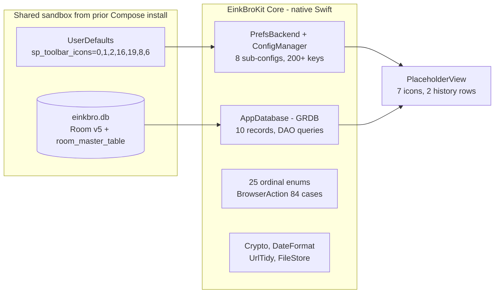

2026-07-22

# EinkBro iOS Swift rewrite — Phase 0 (foundation) complete

Phase 0 of the Compose→Swift rewrite is done: the entire non-UI foundation is
ported to native Swift in the `EinkBroKit` package, with the compatibility
contract verified against a real prior install in the simulator. No browser UI
yet — the deliverable is that every persistence and utility layer the rest of
the app stands on now exists in Swift and reads the exact bytes the Compose app
wrote.

## What landed

- **Preference layer** — `PrefsBackend` over `UserDefaults.standard` (key-present
  default semantics, per-key change notification on its own write path),
  `ConfigManager` + 8 sub-configs covering 200+ keys. Every messy Android
  encoding is reproduced exactly: ints stored as decimal strings, enum ordinals
  stored sometimes as Int and sometimes as decimal String, the `::::`/`:$:`/`###`
  /comma delimiter formats, JSON payloads, and gesture actions stored by class
  name with legacy 2-digit-code migration.
- **Database** — GRDB `AppDatabase` that opens the existing Room-created
  `Documents/einkbro.db` and leaves its schema (and `room_master_table`)
  untouched. Ten record types with exact column names (uppercase `HISTORY`,
  composite PK, `Long` vs `Int` ids, cascade FK), every DAO query, and
  `INSERT OR REPLACE` semantics preserved. Because every Room migration 1→5 is a
  pure table-add, `CREATE TABLE IF NOT EXISTS` for the v5 tables is equivalent to
  running all migrations — no Room version marker is read or written.
- **Enums + actions** — 25 ordinal-locked enums with explicit raw values, the
  84-case `BrowserAction` with its persisted string ids, `TranslationLanguage`
  (108), `ToolbarAction` (44), `VoiceItem` (PascalCase JSON),
  `ChatGPTActionInfo` (enum-by-name JSON).
- **Utilities** — `Crypto` (CryptoKit; HMAC-MD5/SHA1, MD5/SHA-256 hex with the
  exact casing Edge-TTS depends on, PKCE), `DateFormat`, `SystemTime`, `UrlTidy`,
  `FileStore`.
- **Resources** — the 49 JS/CSS assets bundled verbatim; the 8-locale Android
  strings (601 keys) converted to `.strings`.

## Two decisions worth recording

- **Legacy `.strings`, not a String Catalog.** Two real Android keys —
  `setting_title_searchEngine` ("Custom search engine") and
  `setting_title_search_engine` ("Search engine") — collide under Xcode 16's
  automatic String Catalog symbol generation, which cannot be disabled for a
  resource compiled inside an SPM package. Both keys carry distinct values and
  are used, so neither could be dropped. Classic `.lproj/Localizable.strings`
  files skip symbol generation entirely and keep every key, so the converter now
  emits those.
- **GRDB records omit a zero `id` on insert.** Room entities use a non-optional
  `id` defaulting to 0; encoding that literal 0 defeats SQLite AUTOINCREMENT
  (and collides on the second insert). Each autoincrement record overrides its
  GRDB persistence container to drop `id` when it is 0, so the rowid is assigned
  and captured back via `didInsert`.

## Verification

41 unit tests (the project's first) lock the contract-critical parsers:
on-disk representations of string-encoded ints/ordinals, every delimiter format,
one rawValue assertion per ordinal enum, BrowserAction id round-trips plus legacy
migration and corrupt-id reset, the schema shape, cascade delete, and opening a
hand-built old-version Room file with its `room_master_table` preserved.

The decisive check was in the simulator. Installed over a prior Compose EinkBro
(same bundle id, so same data container), the Swift foundation read that
install's `sp_toolbar_icons` = `0,1,2,16,19,8,6` — parsing to exactly 7
toolbar icons with the right ordinals — and opened its Room `einkbro.db` through
GRDB, seeing all ten v5 tables plus `room_master_table` intact and its 2 history
rows. Upgrade-in-place works.

Next: Phase 1 — the WKWebView engine and a minimal working browser.
