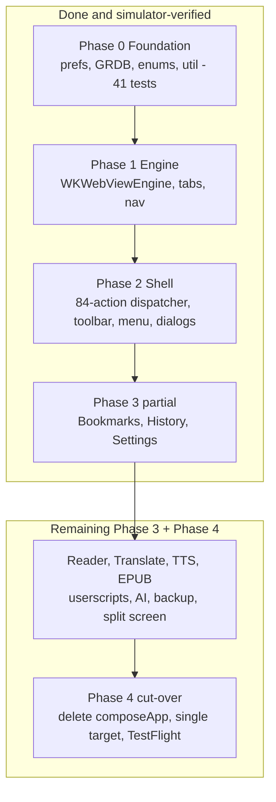

2026-07-22

# EinkBro iOS Swift rewrite — Phase 2 (browser shell) + Phase 3 start

With the foundation (Phase 0) and web engine (Phase 1) in place, this work builds
the browser shell — the toolbar, the action dispatcher every input surface
funnels through, the menu, and the dialog system — and then begins converting the
feature screens from placeholders into real, data-backed UI.

## Phase 2 — the shell

- **`BrowserCoordinator`** hosts `handle(_ action: BrowserAction)`, an 84-arm
  port of BrowserScreen.kt's `handleBrowserAction`. Every toolbar tap, menu
  entry, and gesture dispatches through this one place. Actions whose feature
  lands later surface an `EBToast` "coming soon" — the same stub-with-a-toast
  convention the Kotlin app uses.
- **Configurable toolbar** (`BrowserToolbar`) reads the persisted
  `sp_toolbar_icons` order and renders each `ToolbarAction`. The Kotlin enum used
  Material `imageVector`s, so each maps cleanly to an SF Symbol — which means the
  vector-drawable conversion isn't needed for the toolbar at all. Taps and
  long-presses route through a method-for-method `ToolbarActionHandler` port.
- **Overflow menu**, a **`DialogManager`** (pending ok/cancel plus async
  option-picker and text-input via continuations) with SwiftUI hosts, and the
  **`EBToast`** overlay.

Verified in the simulator: installed over the prior Compose install, the toolbar
rendered that install's exact stored icon order (`0,1,2,16,19,8,6` → Title, Back,
Refresh, Fullscreen, Translate, Settings, Tabs), tapping Settings opened the
menu, and tapping Incognito toggled the config and showed a toast.

## Phase 3 — first feature screens

Three placeholders became real UI, each backed by the layers built in Phase 0:

- **Bookmarks** — `BookmarkViewModel` (folder-navigation stack, sort, CRUD) +
  `BookmarksView` (folders, open-in-tab, rename/delete, new folder, favicon
  rows), backed by the GRDB DAO.
- **History** — grouped-by-day list (via `DateFormat`), open, delete, clear.
- **Settings** — a native SwiftUI form bound directly to `ConfigManager`
  (browsing, search, display, reader, interface, tabs/history, AI, data-clear).

All three were exercised in the simulator: a page was bookmarked and appeared in
the real Bookmarks list with its URL; History grouped the day's visits; and
toggling Ad blocking in Settings wrote `SP_AD_BLOCK_9 = false` to the app's
on-disk preferences under the exact Android-compatible key — end-to-end proof
that the settings UI round-trips through the byte-compatible pref layer.

One verification note worth recording: SwiftUI `Toggle` state is not reliably
reflected through the accessibility bridge the simulator driver reads (the switch
kept reporting "selected" after it had been turned off). The on-disk pref value
and the unit tests are the ground truth for these, not the AX snapshot.

## Where this leaves the migration

The app is a working, installable native-Swift browser with real tabs,
navigation, a configurable toolbar, a menu, and working Bookmarks/History/
Settings — all upgrading in place over the Compose build. The remaining Phase 3
surface is the feature long tail (reader mode, the translate/TTS/EPUB/AI/backup
engines, userscripts, split screen, highlights, saved pages, and the settings
sub-screens), after which Phase 4 removes `composeApp/` and the Kotlin toolchain
and collapses to a single Swift target for TestFlight. Those remain a
multi-session effort; the phased structure and the compatibility contract mean
each can land incrementally without regressing what already works.
