2026-08-03

# EinkBro iOS: tab revealed by closing the current one stayed blank

## What was broken

With multiple saved tabs, relaunching the app loads only the previously-current
tab; the others restore lazily (title in the tab list, page deferred until first
shown). The reported symptom: after finishing the active tab and moving on to the
other restored tabs, their content never started loading — a permanently blank
page that even Refresh couldn't revive.

Reproducing in the simulator showed the lazy restore itself was fine: tapping
another tab in the overview or tab bar loaded it on first show, exactly like
Android. The blank tab appeared on a different path — **closing** the tab you
just finished reading. Focus then lands on a neighboring restored tab, and that
tab never loads.

## Root cause

Lazily restored tabs park their URL in `pendingLoads`, flushed the first time
the tab is shown. On Android that flush lives inside `EBWebView.activate()`
(loading `initAlbumUrl`), so *every* foreground transition runs it. The iOS port
placed the flush only in `switchTab()` — but `closeTab()` moves `focusIndex`
directly, bypassing `switchTab`. The revealed tab's WKWebView had never been
given a URL, so the pane stayed blank and `reload()` had nothing to act on.

```mermaid
flowchart TD
    R[Relaunch: restore saved tabs] --> F[Previously-current tab loads right away]
    R --> L[Other tabs: URL parked in pendingLoads]
    L --> S[switchTab: user taps the tab in a list]
    L --> C[closeTab: closing the current tab reveals a neighbor]
    S -->|flushPendingLoad| OK[Page loads on first show]
    C -->|before: focusIndex set directly, no flush| BAD[Blank tab forever, Refresh has no URL]
    C -->|after: flushPendingLoad on the newly current tab| OK
```

## The fix

In `BrowserViewModel`:

- Extracted the flush into `flushPendingLoad(album)` and run it from both
  `switchTab()` and `closeTab()`'s refocus path — the iOS equivalent of
  Android's activate-time load.
- While there, mirrored `TabManager.removeAlbum` for closing a **background**
  tab: previously `closeTab` always recomputed focus from the closed tab's
  index, so closing another tab from the overview yanked you off the page you
  were reading (possibly onto a blank lazy tab). Now the current tab stays
  focused, with the index shifted down when a tab before it is removed.

Note the launch behavior itself is intended Android parity (`initSavedTabs`
restores background tabs lazily even with background loading enabled) — the bug
was only that one of the two paths revealing a tab skipped the deferred load.

Verified in the simulator: relaunch with three saved tabs, close the active tab
→ the revealed Hacker News tab loads; close a background tab → the current tab
stays put; closing the last tab still opens the home page.
