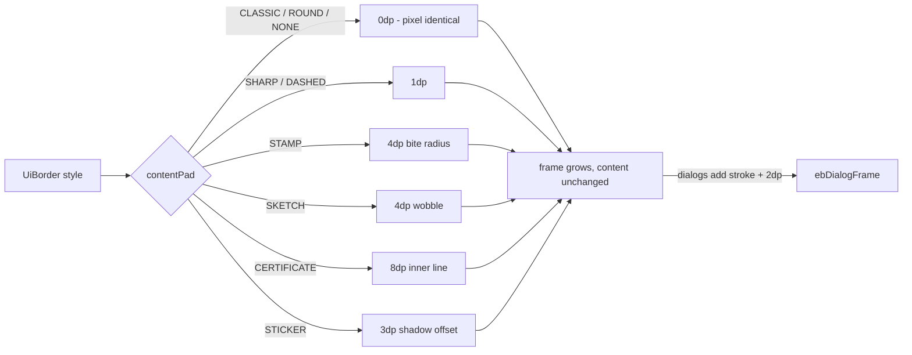

2026-08-31

# EinkBro iOS: frame content insets, true double borders, themed dividers

A revisit of the UI theming feature after using it: border styles crowded the
content they framed, the "double" borders did not render as doubles, and the
app's dividers stayed plain 1dp lines no matter how irregular the selected
border was — a sketch-framed dialog with a ruler-straight separator inside it
looked unbalanced.

## What was broken

- **No content inset.** Android's `ThemedBorders.contentPad` reports the
  border's thickness (plus a double-frame allowance) as drawable padding, so a
  dialog window *grows* instead of letting the frame overlap its content. The
  iOS port (`ebItemFrame`/`ebDialogFrame`) never picked this up: stamp bites,
  sketch wobble and the certificate's inner line were all drawn inside the
  same box the content used, so the border sat on top of text near the edges.
- **PAPER rendered a single line.** The enum documents it as a "print-like
  double frame" and the picker preview draws two concentric lines, but the
  actual frame modifier lumped PAPER in with the single-stroke styles. Picking
  it produced a plain border — "the double border is not working correctly".
- **CERTIFICATE degenerated on small boxes.** Its hairline inner rectangle is
  inset 7dp from each edge; on a small chip the computed size goes negative
  and the draw produced garbage.
- **Dividers ignored the theme.** All separators were straight solid lines.

## The fix

`MyTheme.kt` gains `UiBorder.contentPad(frame)`, the iOS counterpart of
Android's `contentPad`: a per-style inset appended inside the frame modifiers
so the framed box grows and content keeps clear of the border.

Two details matter:

- **Unframed items get the same inset.** List items pass a negative width to
  mean "no border right now" (unselected tab, unpressed bookmark). The early
  return now still applies `contentPad`, so selecting an item draws the frame
  without shifting layout by a few dp.
- **Dialogs additionally grow by `stroke + 2dp`** — the user-visible "enlarge
  a little bit" so even CLASSIC dialogs gain a small breathing ring.

PAPER now draws its double frame (outer line, 2dp gap, inner line with a
concentric-shrunk radius), and CERTIFICATE skips the inner hairline when the
box is too small to hold it.

## Themed dividers

New `ThemedDivider` composable renders the separator in the border's visual
language: dashed line for DASHED, dotted perforation for STAMP, a
deterministic wobbly polyline for SKETCH (seeded from the width, so it never
shimmers across recompositions), double rules for PAPER/CERTIFICATE, a bold
line for SHARP, a round-cap stroke for STICKER, and a plain line otherwise.

`HorizontalSeparator` — the app-wide separator used by the menu dialog,
settings screens and most dialogs (26 call sites) — now just delegates to
`ThemedDivider`, and the 17 remaining raw `Divider(...)` calls were swapped
individually, preserving their custom colors (split-screen bar, GPT list).

## Verification

Simulator walkthrough on iPhone 16 Pro Max: cycled CERTIFICATE, PAPER,
DASHED, STAMP and SKETCH in the theme picker and screenshotted the dialog
frame each time; opened the browser menu under PAPER and confirmed the double
frame is echoed by double-line section dividers. CLASSIC verified unchanged.
