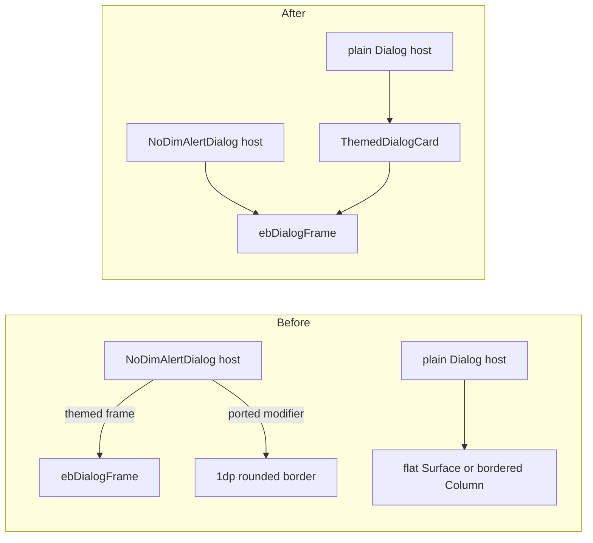

2026-09-03

# einkbro-ios: every dialog draws only the themed frame

## What was broken

With a non-classic border style selected in the theme dialog (Stamp, Sketch,
Certificate, Sticker…), some dialogs showed two outlines: the themed frame
plus a plain 1dp rounded rectangle. Others showed no themed frame at all,
just a flat white box or a hard-coded 1dp border that ignored the theme.

An audit of every `Dialog(` / `AlertDialog(` host in the iOS tree found
fourteen offenders in two groups:

| Group | Dialogs | Symptom |
|-------|---------|---------|
| Doubled | AI action editor (`GptActions.kt` and `ShowEditGptActionDialog.kt`), toolbar-position picker (`SettingComposeUi.kt`) | `NoDimAlertDialog` already paints the themed frame; each host also passed a `modifier = Modifier.padding(2.dp).border(1.dp, …, RoundedCornerShape(8.dp)).padding(2.dp)` ported verbatim from the Android AlertDialog call |
| Unthemed | e-ink image adjustment, user-script editor, Instapaper login, Save as EPUB, Edge-TTS voice picker, and in `BrowserScreen`: language config, table of contents, confirm-tab-close, HTTP auth, SSL error, JS alert/confirm/prompt | plain `Dialog { Surface(color = background) { … } }` or `Column(Modifier.background(...).border(1.dp, …))` |

The bookmark-edit dialog the report named had already been fixed the day
before (commit 997a6b0); the report came from a build that predated it.

## Root cause

The port has two dialog chromes. Anchored dialogs (`AnchoredDialogFrame`,
`PointAnchoredDialogFrame`, `DialogFrame`) and `NoDimAlertDialog` all draw
`ebDialogFrame()` on a transparent `Surface` clipped to `themedFrameShape()`,
which is the runtime stand-in for Android's `ThemedBorders.dialogFrame`
drawable. But nothing forced a plain centered `Dialog` to use that chrome,
so dialogs ported before the theme work kept whatever box they came with,
and dialogs whose Android original set a border on the AlertDialog kept
that border on top of the new frame.

## Fix

- The three hand-drawn `modifier` borders are deleted; the themed
  `NoDimAlertDialog` frame is the only chrome.
- A shared `ThemedDialogCard` composable in `DialogComposables.kt` wraps
  `Surface(Modifier.wrapContentSize().ebDialogFrame(), shape =
  themedFrameShape(frame = true), color = Color.Transparent)`, the exact
  chrome `AnchoredDialogFrame` uses, for dialogs that are centered rather
  than anchored to the toolbar. The eleven unthemed hosts now put their
  content inside it and drop their own background/border.

The transparent surface matters: `ebDialogFrame` paints the theme background
clipped to the border's real outline, so stamp bites and sketch wobble
show the page through them instead of a white rectangle.

## Verification

Built for the booted simulator, set `sp_ui_border` to Stamp in the app's
container plist, and screenshot three dialogs: bookmark edit (single stamp
frame, no inner rectangle), Save as EPUB (previously flat, now stamped),
and the AI action editor (previously doubled, now single). The remaining
eleven use the identical helper and compile.

Related: the earlier commits c8dc8fc and a6e0b95 that converted
`DialogFrame` and `NoDimAlertDialog` to the transparent themed surface.
