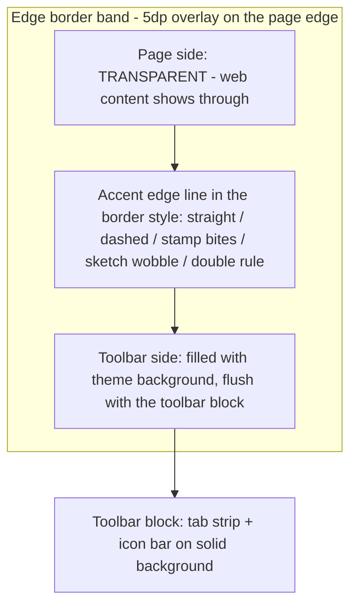

2026-09-01

# EinkBro iOS: the toolbar edge becomes a true themed border

With UI themes, the toolbar met the page with either nothing or a plain
hairline while every dialog wore the selected border style. This change makes
the toolbar's page-facing edge a real border in that same language — and it
took three iterations to land on what "border" actually means here.

## The three iterations

1. **A themed divider row inside the toolbar** — looked right for straight
   styles but the divider band sat on the toolbar's solid background, so
   irregular styles (stamp dots, sketch wobble) floated on an opaque strip.
2. **A transparent overlay pattern on the page edge** — the pattern's gaps now
   showed the page, but a see-through gap opened between the line and the
   toolbar background, and the line was just a floating pattern, not a border.
3. **A true border edge (`ThemedEdgeBorder`)** — the accent edge line drawn in
   the selected style, with the *theme background filled on the toolbar side*
   of the line and *full transparency on the page side*. Stamp bites and
   sketch wobble are die-cut: the page shows through them, exactly like the
   dialog frames' inside-opaque / outside-transparent semantics.

The band is a 5dp overlay aligned to the pane's toolbar-facing edge (a `Box`
wraps the pane in `BrowserScreen`), so the WKWebView actually extends behind
it — that is what makes the transparency show *page content* rather than a
window background. It hides with the toolbar (fullscreen, URL input,
hide-on-scroll) and flips orientation for top-positioned toolbars. The tab
strip is covered too, since it lives inside the toolbar block.

## Themed progress line

The page-load `LinearProgressIndicator` is replaced by `ThemedProgressBar`:
the themed divider pattern (dots for stamp, wobble for sketch, double rule
for paper...) drawn full-width and revealed by the load fraction via
`clipRect`, so dashes don't march as progress advances. It uses the border
accent color and sits just past the edge border, over the page.

## Dialog transparency fixes

Verifying the border semantics surfaced three dialog wrappers that painted an
opaque rectangle behind (or instead of) the themed frame, spilling white past
irregular outlines:

- `catalog/DialogFrame` — used by real browser dialogs (Site Settings,
  translate, task menu), had a plain 1dp rounded border + opaque Surface.
- `NoDimAlertDialog` — all OK/Cancel-style dialogs, same pattern.
- `ActionModeMenu` — the text-selection popup applied a raw rectangular
  `.background()` *before* its frame modifier.

All three now go through `ebDialogFrame` + `themedFrameShape` (background
clipped to the border's actual outline, transparent Surface). The
`AnchoredDialogFrame` family was already correct.

Android received the same edge-border and themed-progress treatment in its
own commit (see einkbro-themed-toolbar-edge-border.md).
