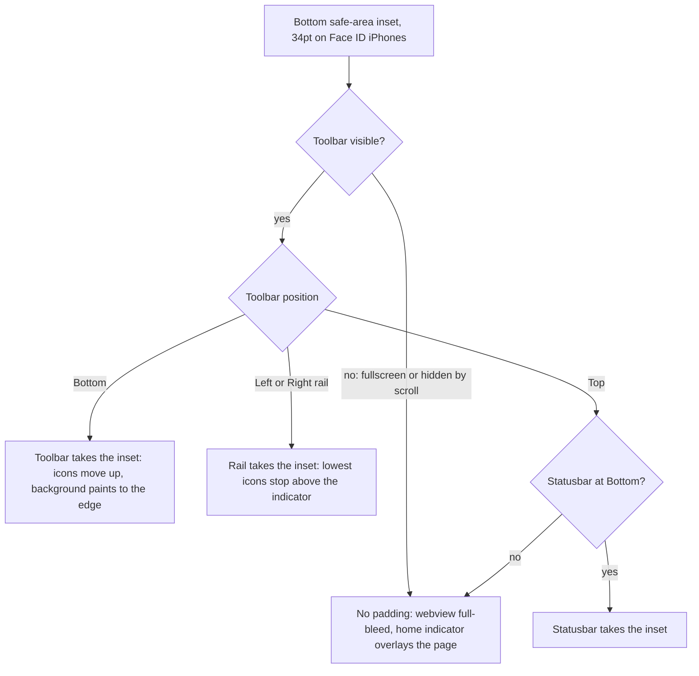

2026-07-19

# EinkBro iOS: keep the bottom toolbar out of the home-indicator gesture area

The bottom toolbar sat flush against the physical bottom edge of the screen, on top of the home-indicator band. Taps and drags on the toolbar icons kept getting intercepted by the iOS system gesture (swipe-up-to-home), making the toolbar unreliable to use.

## Why it happened

`BrowserScreen`'s root layout deliberately reserved only the top and horizontal safe-area insets (`WindowInsets.safeDrawing.only(Horizontal + Top)`), never the bottom — the original intent was Android-like full-bleed chrome, with the home indicator simply overlaying whatever is at the bottom. That is fine when the *webview* reaches the bottom (Safari does the same when its toolbar is hidden), but not when interactive chrome lives there: iOS gives the bottom ~34pt band to the system gesture, and there is no way to fully claim it back. `preferredScreenEdgesDeferringSystemGestures` only *defers* the gesture (first swipe goes to the app, second one still leaves it) and Apple discourages it outside immersive apps — so the correct fix is the one every browser uses: keep tappable content above the band.

## The fix

Safari-style insetting, applied to whichever element is the bottom-most visible chrome:

- The bar's **background still paints down to the physical edge** (no visual gap; the band under the icons is just background color with the home indicator over it).
- The bar's **content is padded up by `WindowInsets.navigationBars`** (the bottom safe-area inset — deliberately *not* `safeDrawing`, which unions in the keyboard inset and would bounce the toolbar when the IME opens).

Which element takes the inset follows the existing layout slots:

The padding lives in `BrowserScreen`'s `renderToolbar` slot (and the bottom statusbar call site), not inside `ComposedToolbar` itself — the toolbar composable is also rendered by the UI catalog/previews, which already sit inside safe-area padding and would double-pad.

Because the padding is attached to the toolbar rather than the root, the hide-on-scroll and fullscreen paths keep their existing behavior for free: when the toolbar is gone, nothing reserves the inset and the page runs full-bleed under the home indicator, exactly as before. On home-button devices the inset is 0 and the layout is unchanged.

Verified on an iPhone 16 Pro Max simulator: the icon row now sits above the home indicator with a seamless background strip below it.
