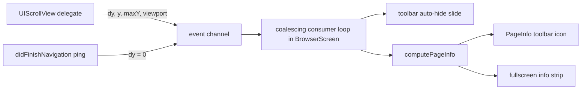

2026-08-05

# EinkBro iOS: live toolbar icon states, tab/page counters, richer long-presses

One commit (`801f5f7`) closing six toolbar-surface gaps that a full parity audit
of toolbar actions, menus, and settings flagged as half-done. The toolbar now
*shows* state instead of merely acting on it, and two long-presses gained their
Android behavior.

## What landed

- **RotateScreen and MoveToBackground retired from the toolbar.** Both were
  permanent stubs on iOS (the OS owns orientation; apps cannot background
  themselves), so offering them as toolbar icons only produced apology toasts.
  They are now `isAddable = false` — filtered from the config picker's
  "Available Actions" grid *and* from previously persisted icon configs at read
  time in `UiConfig.toolbarActions`. The enum entries stay because toolbar
  configs persist ordinals; deleting an entry would shift every saved config.
  Both actions remain reachable as gesture bindings, where the explanatory
  toast is still the right answer.
- **Toggle icons show their real active state.** The toolbar previously built
  every `ToolbarActionInfo` with `state = false`, so toggles worked but icons
  never flipped. The state map now mirrors Android's
  `ComposeToolbarViewController.toToolbarActionInfoList`: bold font, refresh
  (stop glyph while loading), desktop mode, touch paging, touch-area direction,
  TTS speaking, audio-only.
- **Tab counter renders `current/total`.** Ported `ViewUnit.createCountString`;
  `TabCountIcon`'s superscript/subscript fraction path — dead code until now —
  renders "1⁄3", collapsing to the plain total when you're on the last tab.
  The badge also reflects `config.isIncognitoMode`, so the TabCount long-press
  (incognito toggle) finally has visible feedback.
- **Page counter.** `PageInfo` rendered a hardcoded empty string; nothing on
  iOS computed a page count. Now the engine's scroll callback carries the
  viewport height and the counter is computed in the existing scroll-consumer
  loop (see below).
- **Back long-press** opens the history overview capped to the **6 most
  recent** records (`OpenHistoryPage(6)`, Android parity). The records list is
  `ORDER BY TIME DESC`, so the cap is a plain `take(6)`; opening history any
  other way resets to the full list.
- **Bookmark long-press** opens the existing `BookmarkEditContent` dialog
  (title, URL, folder picker) pre-filled with the current page before saving —
  Android's `BookmarkActionsDelegate.saveBookmark` flow — instead of silently
  inserting, including the wide-layout `order = 999` quirk.

## How the page counter works

Android computes page info natively from scroll geometry
(`WebViewNavigationHelper.updatePageInfo`), so the iOS port does the same
rather than adding a JS bridge. The existing `setScrollChangeHandler` seam —
built for the auto-hide toolbar — was extended from `(dy, y, maxY)` to also
report the inset-adjusted viewport height, and `didFinishNavigation` now emits
one synthetic `dy = 0` ping so the counter has a value before the first scroll.

`computePageInfo` ports Android's plain-scroll branch: the page unit is the
viewport minus the page-turn reserved overlap (the same stride the touch-paging
buttons scroll by), total is the content height in those units. The counter
feeds both the `PageInfo` toolbar icon and the fullscreen info strip, which had
also been passing `""` since it was built. A visible consequence of the shared
viewport basis: revealing the toolbar shrinks the viewport, so the total can
tick up slightly (55 → 59 pages on the user guide) — same as Android.

## Why icon state uses a tick, not observation

`ConfigManager` prefs are not observable state, so the icon list is a
`remember` keyed on the observable inputs (loading progress, TTS
`readingState`, the `touchPagingEnabled` state var) plus `toolbarRefreshTick`,
and each config-backed toggle branch in `handleBrowserAction` bumps the tick.
That is the same shape as Android, where every toggle path ends in an explicit
`updateIcons()` call — the dispatcher is the single choke point for toolbar,
menu, and gesture input alike, so one bump per branch covers every surface.

## Verification

Driven end-to-end in the simulator: bookmark long-press → edit dialog → saved
toast; Back long-press showed exactly the latest 6 records while the history
tab showed the full list; config picker no longer offers Rotate / Move to
background; page counter read 1/55 → 6/55 while scrolling and appears in the
info strip when the toolbar hides; tab badge rendered the 1⁄3 fraction; Touch
icon flipped outline → filled on toggle. Test artifacts (tab, bookmark,
toolbar config) were reverted afterwards — restoring the toolbar pref required
a simulator shutdown, since cfprefsd serves container-plist edits stale while
the device runs.
