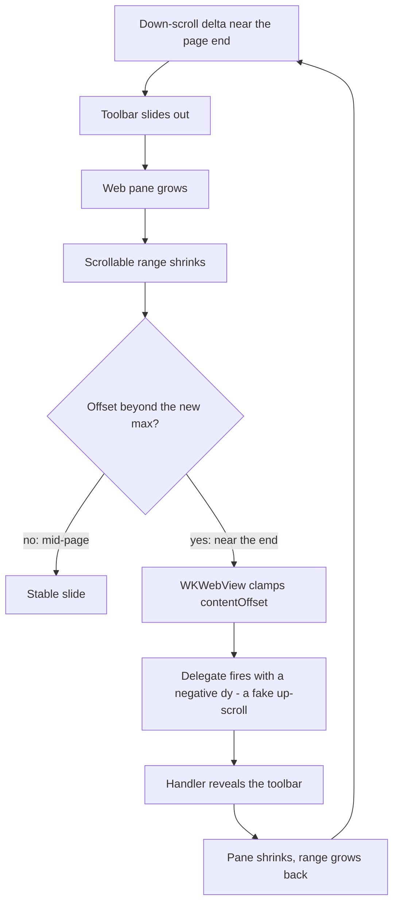

2026-08-04

# EinkBro iOS: toolbar auto-hide follows the scroll offset

The "hide toolbar when scrolling" setting used to remove the toolbar from
composition the instant a down-scroll crossed a threshold — it vanished in a
blink, and reappeared the same way. This change makes the toolbar track the
scroll Safari-style: every down-scroll pixel slides it further out, every
up-scroll pixel slides it back, and a half-slid bar settles to the nearest
edge once no scroll event arrives for 250ms. The statusbar info strip (shown
in place of a hidden toolbar) rides the same progress in reverse, sliding in
from its screen edge exactly as far as the toolbar has slid out, instead of
popping in when the toolbar finishes hiding.

This deliberately diverges from the Android original, which just calls
`toggleFullscreen()` when a down-scroll passes its cutoff — an instant
visibility flip that suits e-ink refresh but feels broken on an iPhone LCD.

## How the slide works

The old boolean `toolbarHiddenByScroll` became an `Animatable` pixel offset
(`toolbarHideOffset`, clamped to the toolbar's own extent) plus a derived
boolean for the consumers that only care about fully-hidden (statusbar
gating, nav-gesture FAB, bottom-gesture deferral, Back-key restore).

The rendering trick is a custom `layout` modifier rather than a translation:
it measures the toolbar at full size, then *reports* `extent - offset` as its
size and places the content shifted toward its own screen edge (top toolbar
up, bottom toolbar down, vertical rail sideways). Because the reported size
shrinks, the weighted web pane reclaims the freed space in the same layout
pass — the page grows as the bar slides, no blank strip behind it. The
offset is read inside the measure block, so scroll frames re-run layout
only, never recomposition.

Scroll deltas arrive from the WKWebView scroll-view delegate, are queued
into a channel, and are consumed by a loop in `BrowserScreen` that coalesces
whatever piled up per frame, applies the guards below, and `snapTo`s the
offset. The delegate also carries sub-point residuals forward — truncating
each per-frame fractional delta to Int would make slow drags move the bar
far less than the finger.

## The page-end shake, and why there is a 112pt bottom cutoff

First verification pass looked right until scrolling to the end of the
content, where the toolbar shook and blinked. The cause is a genuine
feedback loop, not jitter:

Android's `ChromeSetupDelegate.scrollChange` has a guard for exactly this —
it refuses to hide within 112dp of the content end — so the same cutoff is
ported: inside the last 112pt the toolbar only ever *reveals*. A reveal
shrinks the webview, which can never trigger the clamp, so the band is
stable by construction. The settle pass also always returns to fully-shown
inside the band, since settling to hidden would restart the loop.

The second stabilizer is in the scroll observer itself: the reported offset
is normalized (0 = resting top, insets folded in) and clamped to the
scrollable range, so rubber-band overshoot at either edge produces no
deltas at all. To carry the range, the `WebViewEngine` seam changed from
`(dy, y)` to `(dy, y, maxY)` — still one implementer (`WKWebViewEngine`)
and one consumer.

## Remaining guards, unchanged in spirit

- Down-scrolls only start hiding past y = 100 (Android's top guard); any
  position at or above y = 0 restores instantly (jump-to-top included).
- Scrolls while the keyboard is up are still ignored — they are WKWebView's
  caret-reveal, and reacting resizes the webview into the same kind of
  oscillation as the bottom clamp.
- Turning the setting off now restores a hidden toolbar immediately
  (`K_HIDE_TOOLBAR` joined the live-apply pref keys) instead of waiting for
  the next scroll.
