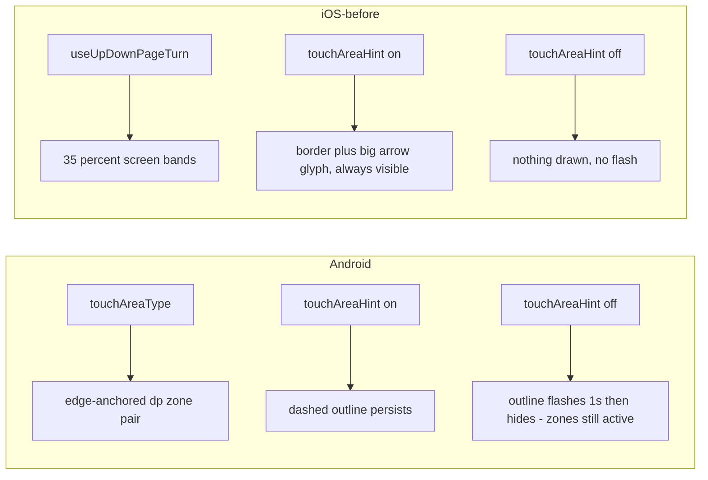

2026-07-19

# EinkBro iOS: align touch-area page-turn zones with Android

With touch turn-page enabled, the iOS port permanently displayed two huge bordered bands with big arrow glyphs over every page. On Android the same feature shows two compact dashed-outline boxes that can auto-hide, so iOS felt broken by comparison ("why does it always show the touch area?").

## What diverged

The iOS `TouchAreaZones` composable was a loose reimplementation rather than a port of Android's `TouchAreaViewController` + `MainContentLayout`:

- **Wrong layout driver.** iOS picked the zone layout from `useUpDownPageTurn` — but on Android that pref governs *arrow/volume-key* paging (`KeyHandler`), not touch zones. The actual zone-placement pref, `touchAreaType` (the six-way choice in the touch-area dialog: bottom corners, middle sides, stacked left, stacked right, full-height strips, ebook), was written by the iOS dialog but read by nothing.
- **Wrong zone geometry.** iOS drew full-length bands (35% of the screen height, or 18%-wide side bands), where Android uses compact edge-anchored boxes (150×250dp at the chosen corners/sides, 150×150dp stacked pairs, or 150dp full-height strips).
- **Wrong hint rendering.** iOS drew a border plus a large centered ▲▼◀▶ glyph whenever `touchAreaHint` was on. Android's hint is only `touch_area_border`: a dashed black outline with an inset dashed white outline (readable on light and dark pages), no glyph, no fill.
- **Missing auto-hide.** Android calls `showTouchAreaHint()` when zones are enabled or the type changes; if the `touchAreaHint` pref is *off* it hides the outline after one second — the zones keep working invisibly. iOS had no timer at all: hint on meant visible forever, hint off meant never visible (not even a flash).
- **Missing `longClickAsArrowKey`.** Android's long-press sends a left/right arrow key when that pref is set; iOS always played the bound long-click gesture.

## The fix

`TouchAreaZones` now mirrors the Android controller directly:

- `touchAreaType` drives placement with Android's dp geometry: `BottomLeftRight` (default) 150×250 at the bottom corners; `MiddleLeftRight` 150×250 vertically centered on both edges; `Left`/`Right` two stacked 150×150 boxes at the bottom of that edge (upper = page up); `Long` full-height 150dp strips; `Ebook` composes no overlay (Android drives that variant with JS inside the WebView).
- The hint is a `drawBehind` reproduction of `touch_area_border` — dashed black outline + inset dashed white outline, 2dp dash / 5dp gap — with no glyph and no fill.
- A `LaunchedEffect(type, hintPref)` reproduces Android's visibility rule: outline shown on enable/type change, then hidden after one second unless the `touchAreaHint` pref keeps it on. The tappable zones remain active either way.
- Long-press dispatches `SendLeftKey`/`SendRightKey` when `longClickAsArrowKey` is set (the iOS actions are still the Phase-F "coming soon" stubs, but the mapping now matches Android), else the bound long-click gesture; `switchTouchAreaAction` and `disableLongPressTouchArea` behave as before.

Not ported (left as known gaps): the draggable handle that moves zone pairs vertically (`touchAreaCustomizeY`), and hiding zones while a text field is focused (`hideTouchAreaWhenInput` currently only reacts to EinkBro's own URL input, as before).

## Verification (simulator, iPhone 16 Pro Max)

- Default settings: two subtle dashed boxes at the bottom corners — Android's default look; tapping the right box pages down.
- `sp_touch_area_hint` off: outline visible ~1s after launch, gone afterwards; tapping the now-invisible bottom-right zone still pages down.

Commit: einkbro-ios `e9b453c` (iOS only — Android is already the reference behavior).
