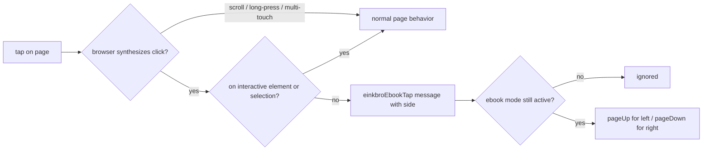

2026-07-19

# EinkBro iOS touch areas: apply setting changes live, make Ebook tap paging work

Field feedback on the touch-area parity fix surfaced two real gaps: changing the touch-area type only took effect after reloading the page, and the Ebook type (the last icon in the dialog — tap left/right half of the screen to page) did nothing at all.

## Why changes needed a reload

`TouchAreaZones` read `touchAreaType` / `touchAreaHint` as plain `NSUserDefaults` values during composition. Compose has no idea a pref changed, so closing the touch-area dialog after picking a new layout left the zones exactly where they were until some unrelated recomposition happened to re-run them — hence "reload to make it work". Android never had this problem because `TouchAreaViewController` registers an `OnSharedPreferenceChangeListener` and rebuilds its views on every relevant pref write.

The fix mirrors Android: the zones hold the type/hint/long-press prefs as Compose state and a `SharedPreferences` listener (registered in a `DisposableEffect`) refreshes that state on every pref change. Gesture bindings are read at tap time, so gesture-settings changes are live too. Verified in the simulator: picking Middle-Left/Right in the dialog moves the zones the moment the dialog closes.

## Why Ebook mode did nothing

On Android, `TouchAreaType.Ebook` isn't an overlay at all — `EBWebView.dispatchTouchEvent` natively intercepts qualifying taps (quick, single-finger, no movement): left half pages up, right half pages down, and scrolls, long-presses, and link taps pass through untouched. The iOS port composed no zones for Ebook and had no interception, so the mode was dead.

A Compose overlay can't replicate this (it would swallow link taps and scrolling wholesale), so the iOS port revives the approach Android itself used before going native: an injected script, `ebook_touch.js`. The browser only synthesizes a `click` for tap-like gestures, which gives the quick-tap qualification for free; the capture-phase listener skips interactive elements (`a`, `button`, inputs, iframes, `[onclick]`, …) and active text selections, and reports the tapped side over a `einkbroEbookTap` message. `BrowserViewModel` re-checks `isEbookModeActive` on every message (so a stale-armed tab can never page), applies `switchTouchAreaAction`, and drives the same `pageUp()`/`pageDown()` used by the overlay zones.

The reporter is armed on page load, re-armed on touch-pref changes (a listener in `BrowserViewModel.init` covers turning the mode on without a reload), and on tab switch (a tab loaded before the mode was enabled has no reporter yet). Known limitation vs Android's native interception: taps inside cross-origin iframes (embeds) don't page — the reason Android moved from `ebook_touch.js` to native in the first place.

## The launch crash along the way

The first cut crashed the app at startup whenever Ebook was the stored type: `Assets.get()` aborts with `IllegalStateException` for any file missing from its preload list (`Assets.NAMES`), and the new `ebook_touch.js` wasn't registered. Kotlin/Native treats the uncaught exception in the page-load coroutine as fatal (SIGABRT via `terminateWithUnhandledException`) — the app died on every launch while tabs restored. Registering the asset fixed it; the crash was found by relaunching with `simctl launch --console-pty`, which is the only place the Kotlin exception text actually appears (the `.ips` report only shows the abort machinery).

## Verification (simulator)

- Type changes apply on dialog close with no reload; all five overlay layouts render at their Android positions.
- Ebook mode: right-half tap pages down (twice in sequence), left-half tap pages back up, a tap on a link navigates normally, and no overlay boxes render.
- App launches cleanly with Ebook as the stored type; console log free of Kotlin exceptions through the whole drive.

Commit: einkbro-ios `a64e7a4`.
