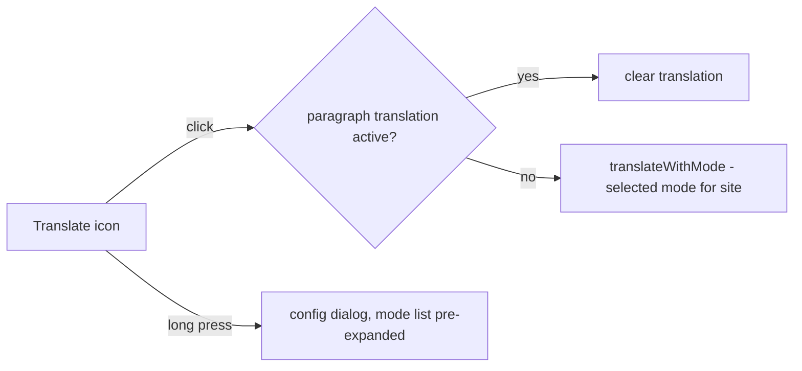

2026-07-22

# EinkBro iOS: translate button translates on click; nav FAB only while toolbar is hidden

Two toolbar behaviors diverged from the Android original (commit `9c069dc`).

## Translate button

Clicking the Translation toolbar icon opened the mode-config dialog — every
translation required two extra taps. Android's mapping
(`ToolbarActionHandler.handleClick` → `ShowTranslation`) translates
immediately with the mode already selected for the site; the config UI is a
long-press affordance.

The iOS `ToolbarActionHandler` mappings were already correct — the divergence
was in the `ShowTranslation` dispatch in `BrowserScreen`, which reopened the
config dialog instead of translating. It now calls
`translateWithMode(config.getTranslationMode(url))`; if a paragraph
translation is already on the page, click still clears it (toggle semantics,
unchanged).

The long-press dialog also opened with its mode dropdown collapsed — a
"Mode: …" button you had to tap again. `TranslationConfigScreen` gained a
`startExpanded` parameter and the browser passes `true`, so the nine modes
are visible the moment the dialog opens (the collapsed default remains for
the UI-catalog preview).

## Nav-gesture FAB

The floating nav button rendered whenever `enableNavButtonGesture` was on —
even with the toolbar visible, for every position (left/center/right). On
Android the FAB belongs to fullscreen: `FullscreenDelegate.toggleFullscreen`
shows it when the toolbar hides and `showToolbar` hides it again.

The iOS render condition now includes `isFullscreen || toolbarHiddenByScroll`,
so the button appears only while there is no toolbar to navigate with.

## Verification

Driven on the iPhone 16 simulator with a seeded toolbar (Translation +
FullScreen icons) and FAB prefs (center, gestures on): toolbar visible → no
FAB; translate tap → by-paragraph translation starts, no menu; long-press →
full mode list shown; fullscreen → FAB appears bottom-center.
