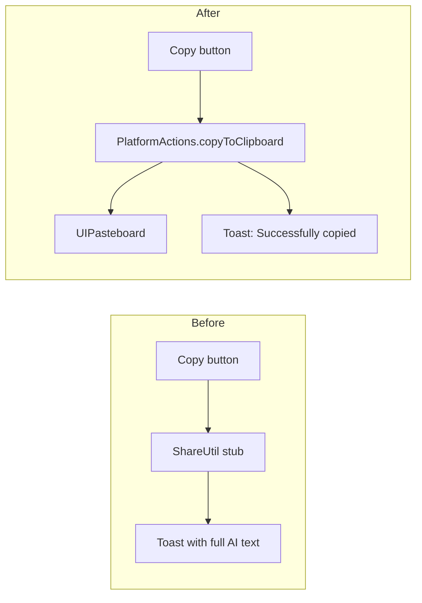

2026-08-09

# Translate dialog: real clipboard copy, capped toast, TTS settings link

## What was broken

Two symptoms that turned out to share one root cause:

1. Tapping the copy button on a gen-AI translation result did nothing — the
   text never reached the clipboard.
2. The toast that appeared afterwards ballooned to tens of lines, filling the
   screen with the whole AI response.

## Root cause

The translate dialog's copy button calls `ShareUtil.copyToClipboard`, which was
still the catalog-era stub in `UnitStubs.kt`. Stubs from the UI-catalog phase
follow the "show a toast instead of acting" convention, so this one never
touched the pasteboard at all — it only showed `"copied: $text"` as a toast.
With a full LLM translation as `$text`, that both explained the "copy does not
work" report and produced the giant toast: same line of code, both bugs.

## Fix

- `ShareUtil.copyToClipboard` now delegates to `PlatformActions.copyToClipboard`
  (the existing iosMain `UIPasteboard` actual) and shows Android's short
  `toast_copy_successful` string — matching the Android original's behavior
  (copy, then a fixed "Successfully copied" toast).
- Defense in depth for the second symptom: the `ToastOverlay` in `App.kt` is
  capped at `maxLines = 2` with ellipsis, so no future caller can balloon the
  toast regardless of message length.

## Stub audit and the TTS settings button

A follow-up audit of `UnitStubs.kt` traced every remaining stub to its call
sites. Only one reachable stub still did nothing: `IntentUnit.gotoSystemTtsSettings`,
behind the "System settings" button the TTS dialog shows when the TTS type is
SYSTEM. It is now wired to open `app-settings:` — iOS has no public deep link
to the system voice list (Settings > Accessibility > Spoken Content), and the
private `App-Prefs:` paths are rejected by App Store review, so the app's own
Settings page is the closest public destination.

The other stubs (`showFile`, LAN-share helpers, `BackupUnit`, `LocaleManager`,
`EinkImageProcessor`, …) have zero live callers — real implementations exist
elsewhere (`BackupManager`, `PlatformActions.setAppLocale`) or the feature is
blocked on entitlements. They were deliberately left in place rather than
pruned, since they may be useful for near-future porting work.
