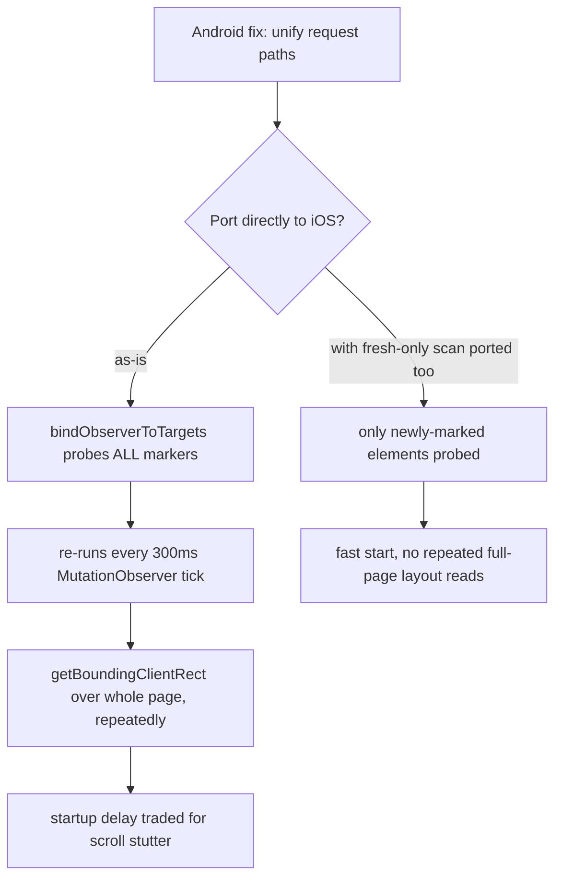

2026-08-18

# The iOS port had both paragraph-translation bugs too

Two bugs were fixed in the Android app on 2026-08-16: paragraph translation took
seconds to show anything, and starting it visibly shifted the page sideways. The iOS
port shares the same translation subsystem by copy, not by reference, so the obvious
question was whether it inherited them. It had both, verbatim.

## Why the copies drifted

`~/src/einkbro-ios` carries its own copies of `translate_by_paragraph.js` and
`text_node_monitor.js` under `composeResources/files/`, and its own
`TRANSLATED_P_CSS_*` constants in `WebContentHelper.kt`. They were forked from Android
at port time and have not tracked it since, so the iOS files are an older snapshot —
they predate not only the two fixes above but also Android's `86d72bd83` MutationObserver
work.

That meant the fix could not be a file copy. The iOS `text_node_monitor.js` has no
`sortOnTopFirst`, no `_translateRetryQueue`, and a different `bindObserverToTargets`;
dropping Android's version in would have imported unrelated behaviour. Each fix was
ported by hand into the iOS shape instead.

## The two defects

**Slow start.** The marking pass filtered junk labels with `child.innerText`.
`innerText` is defined on rendered text, so reading it flushes pending layout — and the
pass dirties layout on every marker, since each one inserts a placeholder `
`. Every
element visited forced a synchronous relayout of a growing document, and no translation
is requested until the whole scan completes.

**Page shift.** `translate_by_paragraph.js` sets a `translated` class on `<body>` as a
state flag. The style constants matched it with a bare `.translated` selector, so the
flag restyled the body itself — `inline-block`, padding, a hard `line-height` inherited
page-wide, `max-width: 100vw` — and with `content-box` plus horizontal padding the body
came out wider than the viewport, making the page scroll sideways.

## One iOS-specific hazard

The third change — routing by-paragraph mode through `maybeRequestTranslation` so the
first batch doesn't wait on the `IntersectionObserver`'s async delivery — is not safe to
port as-is.

On Android, `bindObserverToTargets` was already restricted to newly-marked elements. The
iOS version still probes *every* marker on the page, and it re-runs on every
MutationObserver rebind, which on iOS fires on a plain 300 ms timer with no
self-mutation filtering. Today that loop is cheap only because
`maybeRequestTranslation` returns immediately in by-paragraph mode. Making it do real
work without also making the scan fresh-only would have called
`getBoundingClientRect` across the whole page several times a second — trading a startup
delay for a permanent scroll stutter.

So the fresh-only restriction was ported alongside it. This is the general trap with
copied subsystems: a fix that is safe in the newer codebase can be unsafe in the older
one, because it silently depends on an optimization the older copy never received.

## Result

Measured on the same ~2500-marker article used for the Android fix:

| | before | after |
|---|---|---|
| marking pass | 2894 ms | 99 ms |
| first translation request | 3042 ms | 107 ms |
| markers / placeholders | 2563 / 2563 | 2563 / 2563 |

The bind-time batch fires for exactly the 117 markers in the viewport band, no
duplicates. With the state flag set, `<body>` now stays `block` / `padding: 0` /
`line-height: normal` / `max-width: none`, and `scrollWidth` equals `clientWidth`.
`:composeApp:compileKotlinIosSimulatorArm64` builds clean.

## Still divergent

Two Android improvements remain unported, both from `86d72bd83`, and both left alone
deliberately since they are outside what this fix was scoped to:

- iOS's MutationObserver re-scans `document.body` on a flat 300 ms timer with no
  self-mutation filter, no subtree scoping, and no backoff. Android found this
  self-feeding: each arriving translation is itself a mutation, so a page-full of them
  keeps the loop running with no help from the site.
- `_translateGetTextExcludingImages` still does `cloneNode(true)` plus an `img` sweep on
  every call. Android reduced it to `element.textContent` — `` is a void element
  and contributes nothing to `textContent`, so the deep clone was pure cost, paid per
  block candidate on every scan.

A parity pass that brings the iOS translation scripts back in line with Android is worth
scheduling; the longer these copies drift, the more each fix has to be hand-translated.
