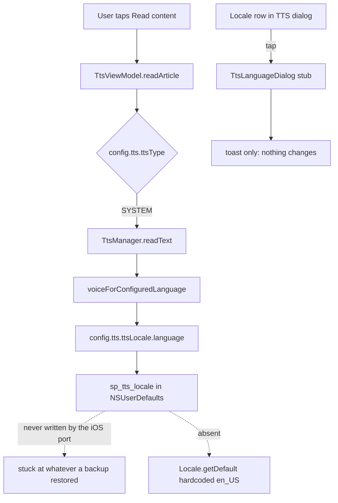
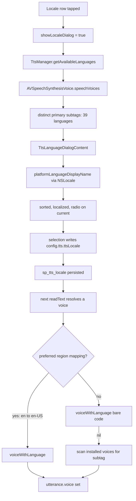

2026-08-01

# EinkBro iOS: making the system-TTS language selectable

## What was broken

Read-aloud on a physical iPhone spoke Korean. Every article, regardless of the
page's language, using the built-in (AVSpeechSynthesizer) engine — and nothing
in the app's UI could change it.

Pulling the app's preferences off the device settled the question immediately:

```
"sp_tts_locale" => "ko"
```

The value was really there. Which was surprising, because a search of the whole
iOS tree — and of the full git history — shows the port has **never written that
key**. `TtsConfig.ttsLocale` only ever reads it.

## Root cause: an imported value behind an inert control

Three separate facts had to line up, and they did:

1. **The key arrives from Android.** `BackupManager` restores prefs through
   `importPrefs`, which writes every `sp_`-prefixed key verbatim. On Android
   `TtsLanguageDialog` is a real single-choice dialog that *does* write
   `sp_tts_locale`. Set Korean there once, restore that backup on iOS, and iOS
   inherits it. Corroborating evidence sat in the same plist: an Android-style
   `sp_menu_item_order`, and a 韓文學習 GPT action.

2. **The iOS picker was a stub.** `view/dialog/TtsLanguageDialog.kt` was
   fourteen lines that showed a toast reading "would show TTS language picker
   (N locales available)" and did nothing else. Tapping the language row in the
   TTS dialog had no effect, so the imported value was a one-way trip.

3. **The default ignored the device.** `Locale.getDefault()` was hardcoded to
   `Locale("en", "US")`, so even a clean install would never follow the phone's
   language.



## The fix

`TtsLanguageDialogContent` replaces the stub: a single-choice list over the
languages the device actually ships voices for, sorted by display name with a
radio on the current selection — the same shape as Android's
`setSingleChoiceItems`. It opens as a nested Compose dialog from
`TtsSettingDialog`, mirroring how the ETTS voice picker already works, and its
card carries the `AnchoredDialogFrame` border and rounded corners because these
dialogs render over an *undimmed* page; without the outline the list appears to
float on the article text.

Two supporting changes turned out to be load-bearing rather than optional.

**Language names needed the OS.** `getAvailableLanguages()` returns bare primary
subtags, and the existing `DISPLAY_NAMES` map covered eight languages. The
device offers 39. Without a platform lookup the picker would have listed `ar`,
`nb`, `uk` as raw codes. A new `PlatformLocale` expect/actual wraps
`NSLocale.localizedStringForLanguageCode`, and `Locale.getDefault()` now reads
`NSLocale.preferredLanguages`. While there, `getDisplayName(inLocale)` was fixed
to honour its argument — it previously ignored the parameter entirely and
returned the device-language name, which matters because
`BrowserToolsImpl.defaultLanguageName()` calls it specifically asking for
English.

**The voice lookup only knew eight languages.** `voiceForConfiguredLanguage()`
mapped a subtag to BCP-47 through a hardcoded `when` (`en` to `en-US`, `zh` to
`zh-TW`, …) and fell through to the bare code otherwise. `voiceWithLanguage("ru")`
returns nil, so the utterance would keep the system default voice: the picker
would appear to work and change nothing. It now falls back to scanning installed
voices for a matching primary subtag, which always resolves — the picker's list
is derived from that same set. The preferred-region mappings still win first, so
"Chinese" continues to mean zh-TW rather than whichever zh voice iOS enumerates
first.



## A debugging detour worth recording

The picker looked broken during simulator verification: taps on the language row
did nothing, twice, while a tap on a read-speed button in the same dialog
registered fine. The instinct was to blame nested dialogs.

It was a measurement artifact. The TTS dialog is laid out with
`Modifier.width(IntrinsicSize.Max)` and positioned by `AnchoredDialogFrame`, so
as reading progresses — the progress counter changing, then the whole button bar
swapping when state reaches IDLE — the card's width changes and it re-anchors
horizontally. Between reading the accessibility tree and issuing the tap, the
dialog had shifted ~94pt. The tap landed on stale coordinates.

The lesson for driving this UI: only trust coordinates from a dialog that is not
mid-transition, or re-read immediately before each tap. A control that appears
dead in an automated pass deserves one manual confirmation before it becomes a
bug hypothesis.

## Verification

Simulator, end to end: the row opens a 39-language picker; selecting Chinese
updates the row and writes `sp_tts_locale => "zh"`; reopening preselects it;
selecting English writes back `"en"`. Both directions of the round trip
persisted through the real preference store, not just the composable's state.
