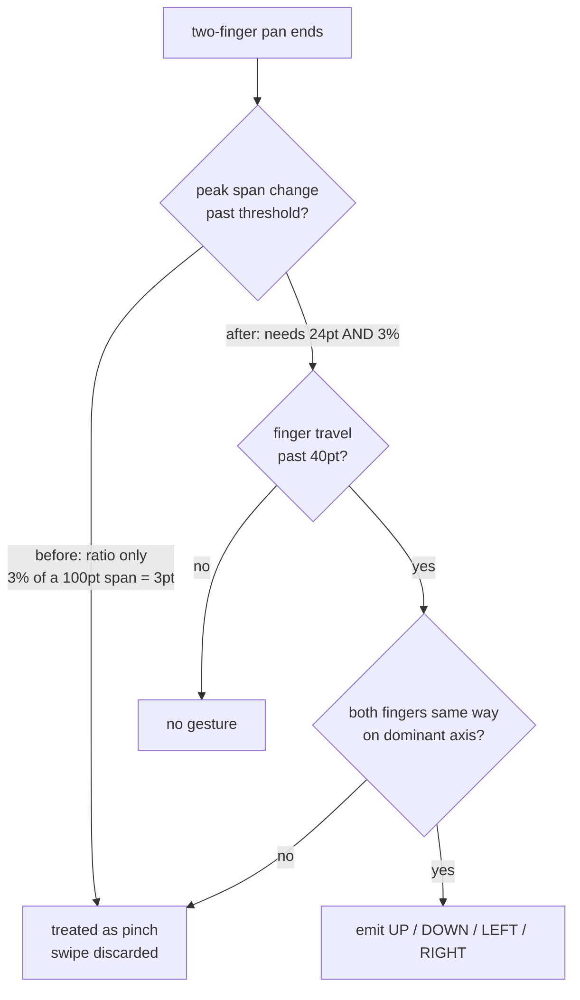

2026-07-26

# Two-finger swipe went insensitive: the pinch rejection had no dead zone

The multitouch two-finger swipe became almost unusable during the week of
2026-07-19. Swipes that should have turned a page or opened the overview simply
did nothing, most of the time.

## Root cause

Commit `bd983cb` (2026-07-24) fixed a real bug — a pinch-to-zoom with net drift
was firing a page turn — by porting Android `MultitouchListener`'s two pinch
rejections into `TwoFingerPanTarget`. The same-direction test came across
faithfully. The scale test did not.

The iOS version measured the inter-finger distance on every touch move, divided
by the distance at gesture start, and rejected the gesture if the peak deviation
passed `SCALE_THRESHOLD` (0.03), the constant lifted verbatim from Android.

Two fingers on a phone sit roughly 100pt apart. **3% of that is 3pt.** A hand
pivots at the wrist while it swipes, so the span between index and middle finger
drifts several points over any real 100pt+ swipe. Nearly every genuine swipe was
therefore classified as a pinch.

Android reads the same `0.03` but never sees small drift at all: its
`scaleFactor` only moves once `ScaleGestureDetector` calls `onScale`, and that
detector requires the span to change by more than its span slop
(`2 x` the 8dp touch slop) before a scale gesture even begins. The dead zone
Android gets for free from the framework was the missing piece.

## Measurement

Scripted two-finger pans in the simulator, with swipe-up bound to "Show
overview" as the success signal. Fingers 100pt apart, both travelling 120pt up;
the only variable is how much the span drifts by the end of the gesture.

| span drift | before | after |
|---|---|---|
| 0pt | fires | fires |
| 3pt | fires | fires |
| 6pt | **rejected** | fires |
| 10pt | **rejected** | fires |
| 20pt | **rejected** | fires |
| 24pt | **rejected** | fires |
| 30pt | rejected | rejected |
| 50 / 80pt | rejected | rejected |

## The fix

Track the peak *absolute* span change alongside the ratio, and require both
before calling the gesture a pinch:

```kotlin
if (maxSpanDelta > SCALE_SLOP && maxScaleDeviation > SCALE_THRESHOLD) return null
```

`SCALE_SLOP` is 24.0 — Android's 16dp span slop, rounded up for finger jitter
over a longer swipe. At typical finger spacings the slop is the binding test;
the ratio only starts to matter for very wide spans, where a 24pt change really
is negligible zoom.



A pinch that actually zooms moves the span far more than 24pt — you cannot get
a meaningful scale change out of less. Re-verified that all three pinch shapes
still fire nothing: symmetric pinch-in, symmetric pinch-out, and the drifting
pinch-out (both fingers up, span 100 to 180) that `bd983cb` was written to
reject in the first place.

`SWIPE_THRESHOLD` was deliberately left at 40pt. It was not part of the
regression, though it is worth noting that Android's is 50 *pixels* — about
17dp on a 3x phone — so on top of `UIPanGestureRecognizer`'s own ~10pt slop, iOS
still asks for noticeably more travel than Android does. That is the knob to
turn if the gesture still feels stiff in daily use.

## Note on verifying gestures

`sim-use multi-touch` dispatches a two-finger gesture with explicit start and
end positions per finger, which is what made the sensitivity curve above
measurable at all. Binding the swipe to a visually unmistakable action (Show
overview) and grepping the accessibility tree for a tab-list row turns "did the
gesture fire?" into a shell one-liner.
