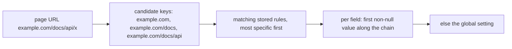

2026-08-30

# EinkBro iOS: UI themes, path-scoped site rules, and a restore category picker

One commit, three Android features ported. The middle one started as a bug
report — "site settings are not restored from Google Drive" — and turned out
to be a model mismatch rather than a restore bug.

## 1. UI theming (Android `feature/ui-color-themes`)

**What it does.** Settings → Appearance → Theme (placed right under App
language) opens a picker with three sections: eight color themes (Classic,
Light/Dark blue, Green, Sepia, Purple, Red, and Custom with an HSV wheel +
brightness slider) plus an invert chip; ten border styles (classic, round,
sharp, paper, dashed, stamp, sketch, certificate, sticker, none); eight fills
(none, tonal, gradient with an angle/level dial, stripes, dots, graph, ruled,
crosshatch). Every choice retints the whole app immediately.

**How it is built.** The Android files port almost line for line because
they are already Compose:

- `preference/PreferenceEnums.kt` — `UiTheme`, `UiBorder`, `UiFill`,
  `ThemePalette`, `deriveThemePalette`. The only Android dependency was
  `android.graphics.Color.colorToHSV/HSVToColor`, replaced by a small
  pure-Kotlin HSV round trip (`Color.toHsv()`, `hsvColor()`).
- `preference/DisplayConfig.kt` — the same pref keys as Android
  (`sp_ui_theme`, `sp_ui_border`, `sp_ui_fill`, `sp_ui_theme_inverted`,
  `sp_gradient_angle`, `sp_gradient_level`, `sp_custom_theme_color`) so a
  theme travels inside a backup in both directions, plus the legacy
  `sp_ui_style` migration in case an older Android backup carries it.
- `view/compose/MyTheme.kt` — `UiThemeState` (live Compose state, seeded in
  `AppServices`, re-synced after a backup restore), `isAppInDarkTheme()`,
  `AngleGradientBrush`, `stampShape`/`sketchShape`, the pattern fills,
  `Colors.onTopBar`, and `Modifier.ebItemFrame()` / `ebDialogFrame()`.
  Android's `ThemedBorders` (XML `Drawable`s for dialog windows) has no iOS
  counterpart; `ebDialogFrame` does the same job on the Compose `Surface`
  that frames every dialog here.
- `view/dialog/compose/ThemeColorDialog.kt` — the picker, hosted as a
  centered overlay drawn after the settings `Scaffold` (Android uses a
  `DialogFragment` window).
- The start page gets Android's `themeStyle` CSS through a new
  `{{THEME_STYLE}}` slot in `start_page.html`.

Two behaviour changes rode along: the Dark mode setting (Force on /
Disabled) now drives the app chrome as well as web content, and the accent
color lands on `MaterialTheme.colors.primary`, so every hardcoded
`onBackground` border, divider, switch and top-bar tint moved to `primary`
/ `onTopBar` — the same sweep Android's seed commit did.

Not ported: the themed Android 12 system splash (`SplashThemer`).

## 2. Path-scoped site rules

**What was broken.** Restoring the Android app's Drive backup on iOS left
site settings apparently untouched. Two things stacked up:

1. Android's `DomainConfigurationData` had become path-aware in
   `94c8194d3`: a rule key is `host` or `host/path/prefix`, every field is
   nullable (null = inherit from the next rule up), and there are
   `customCssEnabled` / `postLoadJavascriptEnabled` switches. The iOS copy
   still keyed by bare host with four non-null booleans and looked rules
   up as `map[Uri.parse(url).host]`. A restored `example.com/docs/api` row
   sat in the table but could never match a URL or show in the editor.
2. Android serialises its unset booleans as `null`; decoding `null` into
   the iOS `Boolean` fields threw, and the `runCatching` around it dropped
   every imported rule silently. (Fixed with `coerceInputValues` in the
   earlier backup commit; now moot because the fields are nullable.)

**The port.** `database/DomainConfiguration.kt` and
`preference/DomainConfigManager.kt` are now the Android versions: the
rule chain for a URL is every stored rule whose key matches, most specific
first, and each field takes the first non-null value along it
(`getEffectiveConfig`), with `getInheritedConfig(url, excludingKey)`
telling the editor where a value would come from without the rule being
edited. Quick toggles write into the most specific rule that already sets
the field, else the host rule. Empty rules are deleted instead of stored.
Same Room table, same JSON column — no migration; old iOS rows with
`false` flags are normalised to `null` on read.

The editor (`SiteSettingsDialog.kt`, hosted full-screen on phones by
`SiteSettingsScreen`) gained Android's "Apply to" scope picker over the
URL's path prefixes and any other rules stored for the host, an
"inherited from host" hint under each row, nullable rows for white
background / invert / auto-translate with the translation mode nested,
on-off switches next to the CSS and JS editors, and a Remove Rule button
for path rules. A new `SiteRuleListScreen` (Settings → Site Settings →
Configured sites) lists every rule grouped by host, with a summary of what
each overrides ("Custom CSS (off)" when switched off), per-row delete and
delete-all; tapping a row opens the editor on exactly that scope via a
synthetic `https://<key>` URL, and the list comes back when the editor
closes. `BrowserViewModel.onUrlChanged` re-applies the web config when a
same-document navigation crosses into a different rule chain (Android's
`applyPathRulesForNavigation`).

The backup merge now uses the data class's own `mergedWith` (local wins,
backup fills gaps) and drops rules that end up empty.

## 3. Restore category picker

Restoring — from a picked file, a LAN transfer, or the Google Drive file —
used to apply everything the zip held. It now does what Android's
`showRestoreCategoryDialog` does: `BackupManager.scanCategories` maps the
zip entries to `BackupCategory` values with their byte sizes, a new
multi-choice dialog (`DialogManager.getMultiSelection` +
`MultiSelectDialogHost`) shows them all pre-checked with "All Preferences"
locking "Gen AI" (whose keys it already contains), and
`importBackupZip(bytes, categories)` merges only the chosen ones. Categories
are derived from the entries rather than `_manifest.json`, so older iOS
zips without a manifest still restore.

## Verification

Simulator, driven with `sim-use`:

- Theme: green + stamp + stripes retinted the settings top bar, dialog
  frame, menu grid, toolbar tab chip and the start page live; prefs
  persisted and reset.
- Site rules: an Android-format zip with a host rule and a
  `rules.example.com/docs/api` path rule went through the new picker; both
  rows restored with Android's nulls and the CSS off-switch intact; the
  Configured-sites list showed "rules.example.com · 1 override" and
  "/docs/api · Desktop mode, Translation, Custom CSS (off) · 3 overrides";
  the editor opened on `/docs/api` with the scope dropdown listing the
  whole site, `/docs` and `/docs/api`, and the inherited font size labelled
  "繼承自 rules.example.com". Delete-all emptied the table.
- Picker: unchecking All Preferences re-enabled Gen AI; the GPT subset was
  skipped while All Preferences was selected, as on Android.
