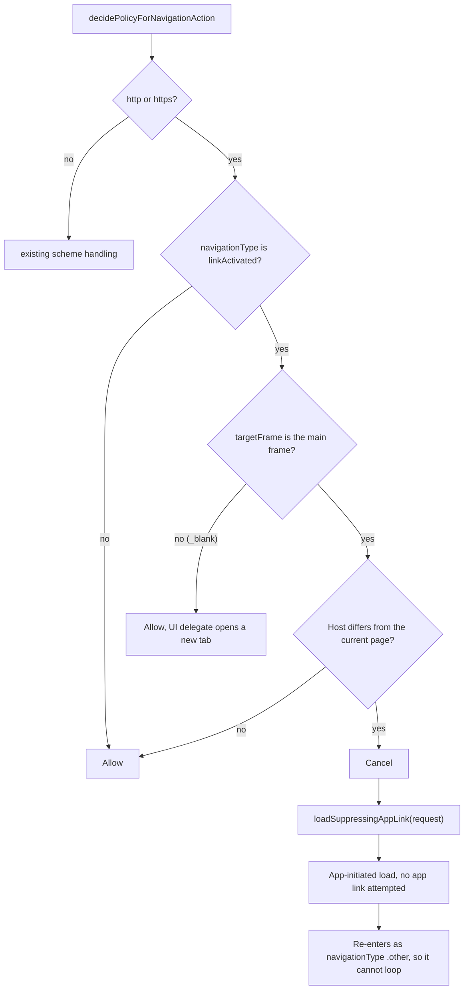

2026-08-01

# EinkBro iOS: keeping universal links inside the browser

## What was broken

Search for something in EinkBro, get a YouTube result, tap it — and the YouTube
app opens. The watch page never loads in the browser. No confirmation dialog,
no way back except the app switcher.

This is not EinkBro handing the URL away. The existing "leave the app?" prompt
only fires for non-web schemes (`mailto:`, `tel:`, custom app schemes), and this
URL is plain `https://`. What happens is that WebKit itself resolves the tap as a
**universal link** and hands it to the app that claims `youtube.com`.

## Why there is no clean opt-out

WebKit does expose a policy for exactly this —
`_WKNavigationActionPolicyAllowWithoutTryingAppLink`, which allows the navigation
without attempting the app hand-off. It is SPI, declared as
`WKNavigationActionPolicyAllow + 2`.

Returning it from Kotlin is not possible. Kotlin/Native maps the Objective-C
`NS_ENUM` to a closed Kotlin enum with exactly three entries (`Cancel`, `Allow`,
`Download`); the generated `byValue` throws for anything else, and the decision
handler's parameter type is that enum. There is no raw integer to smuggle
through.

## The fix: re-issue the navigation as our own

WebKit only attempts app links for navigations the *page* started. Anything
loaded through `-[WKWebView loadRequest:]` carries
`ShouldAllowExternalSchemesButNotAppLinks` and stays in the web view. So the tap
is cancelled and the identical request re-issued from the app side.

The original `NSURLRequest` is passed through untouched rather than rebuilt from
the URL string, so WebKit's own headers survive the round trip — `Referer` above
all, which some sites check.

## Why the conditions are this narrow

Each guard rules out a case where cancelling would do harm or nothing:

- **Cross-host only.** WebKit's own app-link check requires the destination host
  to differ from the main frame's. A same-host tap can never app-link, so
  intercepting it would be pure overhead.
- **`linkActivated` only.** Programmatic loads and redirects arrive as `.other`.
  Intercepting those would catch our own re-issued load and loop forever.
- **Main frame only.** A `_blank` tap has `targetFrame == nil` and belongs to the
  new-tab path in the UI delegate; cancelling it there would break opening links
  in new tabs.

## Verification

Simulator only — the YouTube app is not installed there, so the app hand-off
itself cannot be reproduced. What was verified is that the re-issue path does not
regress ordinary browsing: a cross-host tap (example.com to iana.org) navigates
normally, and Back still works afterwards, confirming the re-issued load creates
a proper history entry rather than replacing one.
