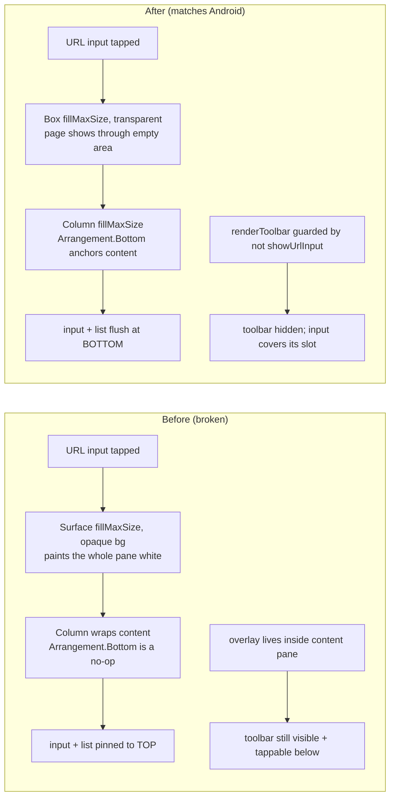

2026-07-25

# einkbro-ios: bottom-align the URL input over a transparent overlay

## What was broken

On the iOS port, tapping **Input URL** with the toolbar at the bottom produced two wrong behaviors:

1. **The overlay covered the whole screen with an opaque white sheet**, hiding the current web page entirely. The suggestion list and input field ended up pinned to the *top* of that sheet instead of the bottom.
2. **The bottom toolbar stayed visible and tappable below the input row**, so its buttons could be triggered while the address bar was open.

The Android original (`../einkbro`) does neither: the page stays visible behind the input, the suggestion list and field sit flush at the bottom edge, and the toolbar is gone while you type.

## Root cause

Three separate things conspired, all in `BrowserScreen.kt` / `AutoCompleteTextField.kt`:

- The overlay was hosted in a `Surface(Modifier.fillMaxSize(), color = MaterialTheme.colors.background)`. That opaque background painted the entire pane, which is what hid the page.
- The `Column` inside `AutoCompleteTextField` had **no height modifier**. It wrapped its content, so `verticalArrangement = Arrangement.Bottom` had nothing to push against — the content pinned to the top of the full-size Surface regardless of the toolbar position. (An earlier partial fix had already wired `shouldReverse = !isToolbarOnTop`, but without a filled Column the arrangement was inert.)
- The `showUrlInput` overlay lives **inside `renderMainPane`'s `BoxWithConstraints`**, which the outer Column places *above* the toolbar (the toolbar is a separate `weight`-sibling row). So even a correctly bottom-anchored overlay could only reach the bottom of the *pane*, never over the toolbar.

## How Android does it

`InputBarDelegate.focusOnInput()` sets `binding.appBar.visibility = INVISIBLE` — it **hides the toolbar** while the input is up. The `inputUrl` ComposeView is a root-level view constrained to all four parent edges (so it spans the whole screen, including over the toolbar), but its `AutoCompleteTextField` `Column` background is `Color.Transparent`. Only the input `Row` and the `BrowseHistoryList` paint `MaterialTheme.colors.background`. Net effect: page visible through the empty area, content bottom-anchored, toolbar gone.

## The fix

Mirror that behavior with three small changes:

- **`AutoCompleteTextField.kt`** — add `Modifier.fillMaxSize()` to the root `Column` so `Arrangement.Bottom` can actually anchor the input row + suggestion list to the bottom edge. (Android gets the equivalent "fill" for free from its fixed-size ComposeView constraints; Compose Multiplatform needs it stated.)
- **`BrowserScreen.kt`** — replace the opaque `Surface` host with a transparent `Box(Modifier.fillMaxSize().imePadding())`. Now only the input row and list are opaque; the page shows through, and a tap on the empty area still dismisses.
- **`BrowserScreen.kt`** — guard `renderToolbar` with `&& !showUrlInput`. With the toolbar not emitted, the `weight(1f)` pane fills the freed space, so the bottom-anchored input row lands flush at the physical edge — over where the toolbar was — and the full-size transparent tap layer blocks the buttons underneath.

## Verification

Type-check (`:composeApp:compileKotlinIosSimulatorArm64`) passes. Driven in the iPhone 16 simulator with a bottom toolbar: the current page stays visible, the suggestion list stacks upward from the input row (reverse layout), the field sits at the bottom over the hidden toolbar's slot, and tapping the empty area above dismisses. Also built for device and installed on a physical iPhone.
