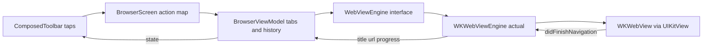

2026-07-16

# EinkBro iOS: WKWebView browser shell (migration Phase 1)

EinkBro on iOS now browses the real web. The app boots into a browser: a
WKWebView renders pages behind the ported EinkBro chrome — bottom toolbar, URL
input with history suggestions, tab overview, main menu, bookmarks — and the
e-ink interaction model works: tapping the screen edges turns pages in discrete
viewport-sized jumps instead of smooth scrolling. Verified end-to-end on an
iPhone simulator (page loads, URL entry, tap paging, multi-tab switching). The
UI catalog from the initial port remains reachable through the menu.

## Shape of the change

Phase 1 of the migration plan: a `WebViewEngine` interface in `commonMain` is
the only thing the shared code knows about; `iosMain` provides the WKWebView
actual, embedded into Compose via `UIKitView`. A new `BrowserViewModel` carries
tab orchestration (the common half of Android's TabManager), URL-vs-search
normalization against the user's configured search engine, and in-memory
history until Room lands in Phase 2. `BrowserScreen` wires the already-ported
toolbar/dialog composables to real engine calls; feature actions belonging to
later phases surface a toast instead of dying silently.

Page turning is plain `window.scrollBy` JavaScript for now; the Android app's
`fix_scrolling.js` (which handles inner scroll containers) replaces it in
Phase 3 together with the rest of the JS asset pipeline.

## Kotlin/Native WebKit lessons

Two interop dead-ends shaped the engine's design; both are worth remembering:

- **KVO is effectively unavailable.** `addObserver`/`observeValueForKeyPath`
  are Objective-C *category* methods on NSObject, which Kotlin/Native exposes
  as extension functions — they cannot be overridden in a subclass, so the
  usual `estimatedProgress`/`title` observation pattern doesn't compile.
  Title, URL and progress therefore come from navigation-delegate callbacks;
  progress is coarse (start → finish), which an e-ink UX doesn't miss.
- **`WKNavigationDelegate`'s overload family collides.** All the
  `webView(_:didStart/didCommit/didFinish...)` methods map to the same Kotlin
  name and clash as conflicting overloads; the annotations that supposedly
  disambiguate did not resolve in this toolchain. The pragmatic fix: implement
  only `didFinishNavigation` — the single overload compiles fine — and fire the
  "navigation started" signal from `loadUrl()`/`reload()` instead.

One product-level fix worth noting: the ported URL-input field never received
focus on iOS (on Android the host fragment focused it). The browser screen now
requests focus itself with the existing text pre-selected, so typing replaces
the current URL — matching the Android behavior.

## Where this leaves the port

Phases 2–8 of the plan are unstarted: persistence is still in-memory (settings
reset on relaunch), and reader mode, ad-blocking, translation, TTS and export
features still show their later-phase toasts. The next step is Phase 2 —
NSUserDefaults-backed preferences and Room KMP — which makes everything the
browser now does survive a restart.
