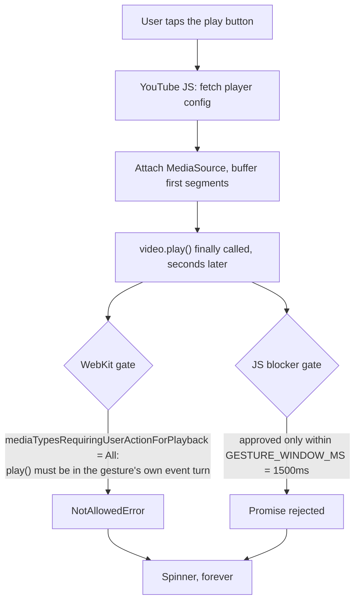

2026-08-01

# EinkBro iOS: YouTube's play button span forever

## What was broken

Tapping play on a YouTube watch page did nothing. The player swapped to its
loading spinner and stayed there indefinitely — no video, no error, no timeout.
The same page plays fine in Android EinkBro.

## Root cause: two independent gates, both rejecting the same tap

Playback on iOS had to pass a native gate and a JavaScript gate, and it was
failing both for the same underlying reason — YouTube does not call `play()`
in the click handler.

**The native gate.** `mediaTypesRequiringUserActionForPlayback` was never set, so
it sat at WebKit's default of `WKAudiovisualMediaTypeAll`. That requires `play()`
to be called synchronously inside the gesture's own event turn. YouTube fetches
the player config and wires up MSE first, so its `play()` lands well outside that
turn and comes back `NotAllowedError`.

This gate was pure downside here. Autoplay policy in EinkBro is enforced in
JavaScript, not by the engine — the native check only ever blocked playback the
user had explicitly asked for. Android never had the problem because Chromium's
WebView is far more forgiving about what counts as a gesture.

**The JS gate.** `disable_video_autoplay.js` had the same shape of bug from the
other direction. It approves `play()` only within `GESTURE_WINDOW_MS` (1.5s) of a
trusted click, which the async player startup also overruns.

## The fix

Set `mediaTypesRequiringUserActionForPlayback = WKAudiovisualMediaTypeNone` and
let the JS layer own the policy, as it effectively already did.

Then make the JS gate durable rather than time-boxed: a trusted click now
permanently approves the media element belonging to the player that was tapped,
found by walking up from the click target to the first ancestor containing a
`video` or `audio`. On YouTube the big play button sits inside the same container
as the video element, so the walk finds it. The walk stops below `body`, so a
stray tap on the page background cannot approve every video on the page — which
is what keeps the feature's actual purpose (blocking scroll-triggered autoplay on
feed sites) intact.

The 1.5s window stays as a secondary path for players that do call `play()`
promptly.

## A divergence to be aware of

`disable_video_autoplay.js` was byte-identical between this repo and
`app/src/main/assets/` in the Android tree. It has now diverged. The change is
plain JavaScript with no platform assumptions, and the same latent bug exists on
Android — it is simply masked there by Chromium's laxer gesture handling. Worth
mirroring back.

## Verification

Driven in the simulator: opened a watch page, tapped play, and confirmed the
video started and advanced through frames with captions rendering — rather than
sitting on the spinner.
