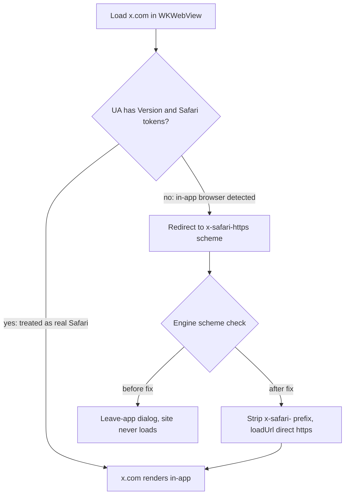

2026-07-18

# EinkBro iOS: x.com escaped to Safari via x-safari-https:// redirects

## What was broken

Opening any twitter.com / x.com page in EinkBro never showed the site. Instead the
browser surfaced a leave-the-app prompt for a URL like
`x-safari-https://redirect.x.com/...`, and accepting it bounced the user out to
Safari.

## Root cause

x.com fingerprints in-app browsers by user agent. Real mobile Safari sends

```
Mozilla/5.0 (iPhone; ...) AppleWebKit/605.1.15 (KHTML, like Gecko) Version/26.0 Mobile/15E148 Safari/604.1
```

but a WKWebView's default UA stops at `Mobile/15E148` — no `Version/x` and no
`Safari/x` token. When x.com sees that, it rewrites navigation to an
`x-safari-https://…` URL, a scheme registered by Safari specifically so web pages
can force links out of in-app web views. In EinkBro that scheme isn't in
`WEB_SCHEMES`, so the engine's navigation policy treated it as an external-app
link and showed the "leave EinkBro?" dialog — the site itself never loaded.



## The fix (WKWebViewEngine.kt)

Two layers, so the site loads normally and any residual redirect still lands
in-app:

1. **Safari-complete user agent** — set
   `applicationNameForUserAgent = "Version/<systemVersion> Mobile/15E148 Safari/604.1"`
   on the `WKWebViewConfiguration`. Only the application-name suffix of the UA is
   replaced, so the platform token (iPhone vs iPad/Macintosh) stays correct and
   sites keep serving the right layout. With the full suffix present, x.com treats
   EinkBro as Safari and never issues the escape redirect. This is the primary fix.
2. **Scheme fallback** — in `decidePolicyForNavigationAction`, any
   `x-safari-*` scheme is cancelled, the `x-safari-` prefix stripped, and the
   remaining https URL loaded in the same tab (guards against cached redirects or
   future sniff changes). The check runs before the generic
   external-scheme dialog branch.

The direct answer to "can I just ignore it and load the direct URL?" is yes — the
scheme is a plain prefix wrapper around the real URL — but without the UA change
x.com would immediately detect the in-app browser again and re-issue the redirect,
so both parts are needed.

## Verification

iPhone simulator: navigating into an x.com post from Google search results renders
X's web UI inside EinkBro (NASA post with replies), with no leave-app dialog. X's
"Open X" app-upsell interstitial still appears — that is normal mobile-web
behavior, identical to real Safari, and dismissible.

## Follow-up: reload loop on a real device

On a physical iPhone that had visited x.com before the UA fix, the login page
reload-looped. Sticky client state — x.com's `mx` app-preference cookie and/or a
cached service worker from the pre-fix sessions — kept re-issuing the escape
immediately after every strip-and-reload, so the fallback ping-ponged forever.
(A fresh simulator never loops because it has no such state.)

The strip now has a loop guard with a 5-second sliding window: the first escape
strips and loads as before, but a re-escape arriving within the window is
swallowed — the rendered page stays put and a one-time toast ("Blocked a reload
loop") explains what happened. Each sighting extends the window, so a tight loop
costs exactly one reload total. Clearing x.com cookies/site data removes the
sticky state for good.
