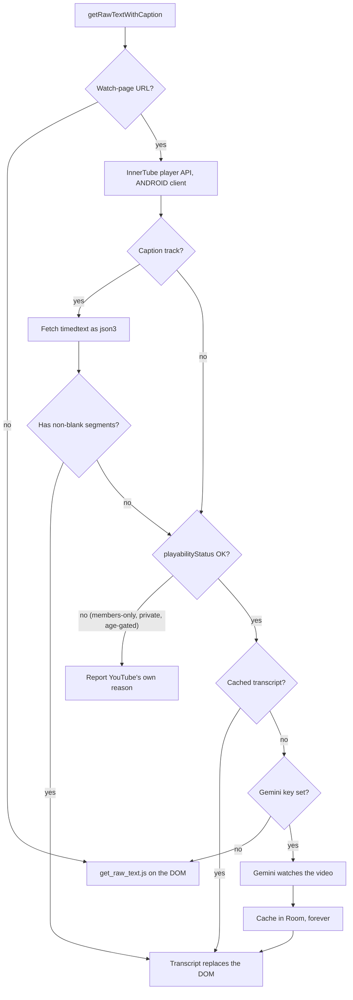

2026-08-01

# EinkBro iOS: AI and TTS on a YouTube video's transcript

## What it does

Ask EinkBro to summarize a YouTube watch page and, until now, it handed the
model the watch-page DOM: sidebar recommendations, comment fragments, the
subscribe button. The Android app solved this a while ago by fetching the
video's caption track and feeding *that* to the AI instead. This ports the
`caption` package to the iOS app, so Summarize, Chat-with-web, Page AI, the
task agent, and read-aloud all operate on what the video actually says.

Videos with no caption track at all fall back to asking Gemini to watch the
video — the API takes a public YouTube URL directly. Those transcripts are
cached in Room forever, because each one costs minutes of wall clock and real
API quota.

## Where the captions come from

The obvious source — the timedtext URL sitting in `ytInitialPlayerResponse` on
the watch page — does not work outside the player. Those URLs are gated by a
proof-of-origin token and return an empty body to anyone else. The Android
implementation goes through the InnerTube player API impersonating the ANDROID
client instead, whose timedtext URLs are served to anonymous callers. That
detail is load-bearing and was carried over verbatim.

The `playabilityStatus` check before the Gemini fallback matters: Gemini can
only watch what the anonymous YouTube API can play, so a members-only video
would come back as a bare 403. Checking first lets the user see YouTube's own
localized explanation instead of an opaque API error.

## Two deliberate divergences from Android

**No cookie jar on the timedtext fetch.** Android attaches `CookieManager` so
the CDN sees the same session it issued the URL to. On iOS that would mean an
async round trip through `WKHTTPCookieStore` — and it buys nothing, because the
ANDROID-client URLs need no session at all.

**The transcript is keyed by video id, not cleared on page load.** Android
resets `dualCaption` when a new document commits. YouTube is a single-page app,
so moving to the next video need not commit anything; keying on the id is both
simpler and more correct on this platform.

Also, `DualCaptionProcessor` arrives with only half its Android job. Rewriting
the *player's own* caption request stays in `dual_caption_shim.js`, since
WKWebView cannot intercept page subresources the way Android's `WebViewClient`
can. What ports is the transcript-for-AI path.

## The Gemini bug this started from

The original question was why Gemini fails to summarize YouTube captions on
*Android* while OpenAI succeeds, and while Gemini handles ordinary context-menu
actions fine. The answer is in `TranslationViewModel.queryLlm`: it checks
`enableOpenAiStream` **before** the Gemini branch, so with streaming on, Gemini
goes through `geminiStream` — a blocking OkHttp call on a client with a 30-second
read timeout.

That explains all three observations at once. A short selection has fast
time-to-first-chunk and fits. A full caption transcript pushes Gemini's TTFT past
30 seconds and the socket dies as a network error. OpenAI's SSE keeps the
connection fed the whole time, so it survives the same input.

The iOS port sidesteps this entirely — `chatStream` already routes Gemini to the
non-streaming `queryGemini` — but that call got a 300-second timeout here, since
it is one blocking response with no stream holding the connection open and it now
receives whole transcripts.

## Follow-up: speech was reading the markup

`convertToHtml` produces an HTML document, and Android keeps it that way because
the AI pipeline consumes the same string. Read-aloud, though, spoke it verbatim:
the first thing the user heard was "html head style body font-size 1.5 em",
followed by "br" between every caption line. Neither app's chunker stripped
anything — the Android one is character-identical — so this was inherited, not
introduced.

`processedTextToChunks` now flattens its input first: script and style elements
go with their contents (otherwise the CSS inside gets spelled out), comments and
tags are dropped, entities are decoded, and bare URLs are removed. Tags become a
space rather than nothing, so `one two` does not become `onetwo`. Tag matching
requires a letter, `/` or `!` after the `<`, which leaves prose like "a < b and
c > d" alone.

The chunker was the right seam: it covers all three engines (system, OpenAI,
Edge-TTS) in one place, and cleans up the "now reading" text in the dialog for
free. The caption HTML itself is untouched — only speech needs it flattened.

## Verification

No test suite exists, so this was driven in the simulator. The InnerTube and
timedtext calls were first checked standalone with curl (200, 286 caption events
for the test video), then the same video was opened in the app and read aloud:
the TTS queue showed the transcript prose, 73 chunks, down from 82 when a chunk
was still being spent on markup. A normal page reads unchanged.
