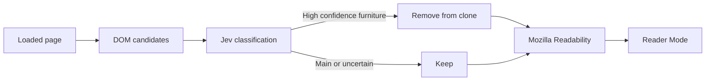

2026-09-20

EinkBro Jev Smart Reader extraction

EinkBro now offers an optional Smart Reader Mode powered by TypeSafe Jev. Users can save a Jev API key in the Gen AI settings and enable the extraction toggle under Behavior. Reader Mode collects a bounded set of visible DOM candidates, asks Jev to classify them, and removes only high-confidence navigation, advertising, related-content, comments, or other page furniture before Mozilla Readability runs.

The implementation keeps the existing Readability path as the fallback when the feature is disabled, no key is configured, the request fails, or confidence is low. Semantic article containers are protected as indivisible content so nested sections in news pages cannot be removed independently. Candidate markers are cleared when Reader Mode exits, and stale asynchronous Jev responses are ignored when the page or reader request changes.

