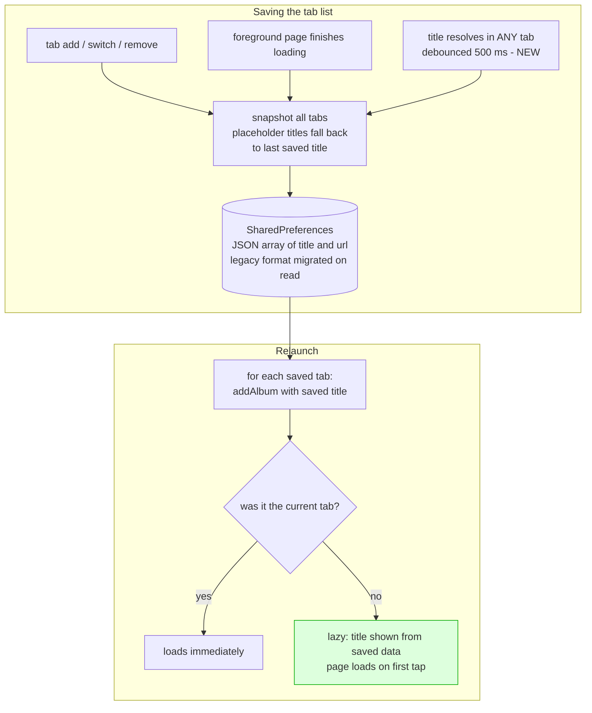

2026-07-05

# EinkBro: Lazy Tab Restore with Persisted Titles, JSON Tab Storage

EinkBro saves the open tab list so a relaunch can bring the session back. Until now that restore was expensive and lossy: every background tab immediately reloaded its page over the network (slow and wasteful on E-ink devices), and until each page finished loading its tab showed only the `"..."` placeholder — which could even get persisted back, permanently replacing the real title. This change makes relaunch instant and faithful: background tabs come back showing their saved page titles without loading anything, and each page loads only when its tab is first tapped.

## What changed

**Lazy session restore.** `initSavedTabs()` now adds background tabs with a new `lazyLoad` flag, threaded through `BrowserActivity.addAlbum` → `TabManager.addAlbum` → `loadUrlInWebView`. A lazy tab only records its URL in `initAlbumUrl`; the existing `EBWebView.activate()` mechanism loads the page on first activation. Only the previously-current tab loads at startup. URL intents now also match `initAlbumUrl`, so opening a URL that already sits in a lazy tab focuses that tab instead of duplicating it.

**Titles persist when they resolve.** Previously the saved list was only rewritten on tab add/switch/remove or `onDestroy` — so a title that resolved in a background tab was never persisted if the process was killed (swipe-away skips `onDestroy`). Now `onReceivedTitle` triggers a debounced (500 ms) save for any tab, foreground or background. The snapshot also refuses to store the `"..."` loading placeholder: it falls back to the last saved title for that URL, so killing the app mid-load can no longer erase a resolved title.

**JSON storage with legacy migration.** The tab list was stored as `title::url` entries joined by `::::`. Any page title containing `::` — Rust documentation pages are a common real-world case — corrupted the parse: the first `::` in the title was taken as the delimiter, garbling the URL. `AlbumInfo` is now `@Serializable` and the list is stored as a JSON array; reads fall back to the legacy parser once for migration, and the next save rewrites in JSON.

## Restore flow after the change

## Verification

Verified end-to-end on an emulator with a pre-existing install whose saved tabs were still in the legacy format:

- After browsing several pages, the preference had migrated to a JSON array holding all resolved titles, including one containing double colons, stored intact.
- After `force-stop` (process kill, no `onDestroy`) and relaunch, a local test server's access log showed only the foreground tab's page being fetched; the tab overview nevertheless listed every tab with its correct title.
- Tapping a background tab produced that page's first request at that moment — on-demand loading works.
- A second kill round-tripped all entries, including tabs that were never activated during the session.

Unit tests were extended with legacy-migration and double-colon round-trip cases (`TabConfigTest`, `SerializableDataTest`).

## Notes

Restore is now always lazy for background tabs, independent of the "background loading" setting, which still governs tabs opened in the background during normal browsing. The `"..."` placeholder became a named constant (`EBWebView.LOADING_TITLE`) since the save path needs to recognize it.
