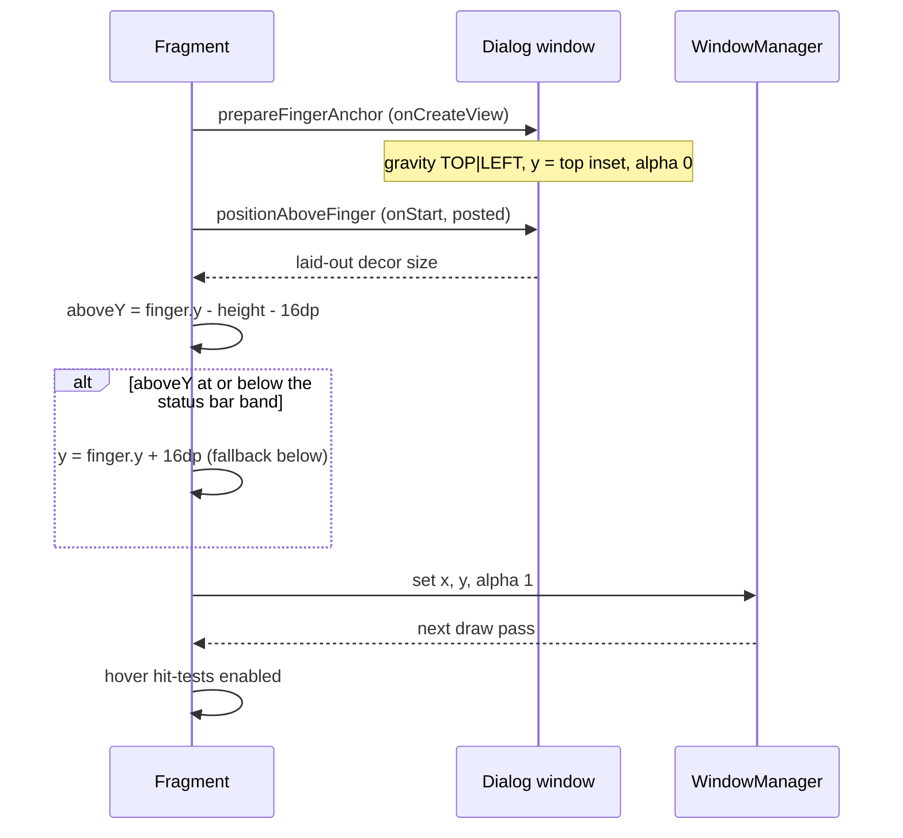

2026-08-29

# EinkBro: long-press menus open above the finger

Three menus in EinkBro appear while the user's finger is still on the screen:
the bookmark context menu (long-press an item in the bookmarks dialog), the
WebView link/image context menu (long-press a link), and the text-selection
action menu. All of them are also driven by that same finger: the user can
keep holding, drag onto an entry and lift to pick it. The two dialog menus
used to open with their top-left corner at the long-press point, and the
selection menu opened under the selection, so in every case the hand doing
the pressing covered the menu it was supposed to read.

The menus now sit with their bottom edge 16dp above the long-press point (or
above the top edge of the selection). Only when that would push the menu
under the status bar does it go below the finger instead.

## Placement

The dialog menus are separate windows whose size is only known after layout,
so placement is a two-step affair in `ComposeDialogFragment`, shared by the
bookmark and WebView context menus:

Two things bit during verification and shaped the final form:

**The window must not start behind the status bar.** A floating window that
is first laid out at y=0 overlaps the status bar / cutout band, and the decor
applies that inset as top padding. The padding inflates the measured height,
and it is not recomputed when the window is later moved, so the content ends
up shifted down inside a frame that is now too short and the last row is
clipped. Starting the window at the top inset means it is never padded, the
measured size is the real size, and window x/y are plain screen pixels.

**Hover must wait for the move to land.** During a long-press drag, touch
moves are hit-tested against the menu entries' on-screen positions. Those
positions describe where the (still invisible) window is, and for a frame or
two that is its pre-move position at the top-left of the screen. A finger
that never moved could therefore "hover" an entry there, and lifting opened
the link in a new tab. Hit-tests are ignored until the moved window has gone
through a draw pass.

## Selection menu

The selection action menu is a view in the activity layout, not a window. It
was placed at the selection's bottom-right plus 16dp. `ActionModeDelegate` now
keeps the selection's top edge as well and places the menu above it when the
menu fits, using the same fallback below otherwise. The 10dp offset that
`ViewUnit.updateViewPosition` adds is subtracted so the visible gap matches.

Dialogs that open after the finger has lifted (the translate panel, the
highlight style picker) keep their existing anchoring; there is no hand in
the way by then.
