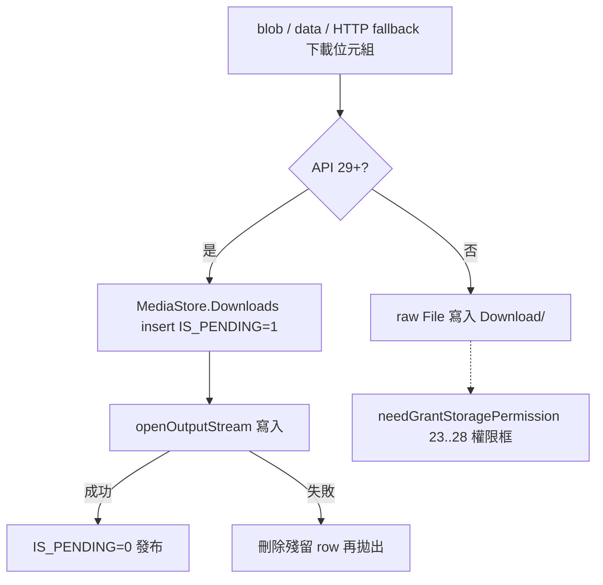

2026-08-16

# einkbro：公用下載改走 MediaStore（修 Android 10 全滅的 blob/data 下載）

Android 10 裝置（實例：Hisense A7 e-ink 手機）上，EinkBro 所有 blob／data URL
下載都以「Download link is not valid」收場。真兇不是連結：logcat 顯示位元組
早已完整送達，最後 `File.writeBytes()` 寫 `/sdcard/Download/` 時 EACCES。
根因是三個條件剛好在 API 29 交集（詳細偵查過程見
[ohmybias-skin-a7-compat-einkbro-storage](ohmybias-skin-a7-compat-einkbro-storage.md)）：

1. scoped storage 拒絕 raw `File` 寫共用 Download/；
2. manifest 的 WRITE_EXTERNAL_STORAGE 標 `maxSdkVersion="28"` — API 29 上
   權限根本不存在、要都要不到；
3. `needGrantStoragePermission` 只處理 `23..28` — API 29 直接說不用權限。

Android ≤9 有權限框可走、Android 11+ FUSE 允許免權限在 Download/ 建檔 —
**唯獨 Android 10 掉洞**，模擬器（API 34）因此一直測不出來。

## 修法：API 29+ 走 MediaStore.Downloads（commit 330e8a58b）

- 新 `writeToPublicDownloads()` 統一三個裸寫檔點：blob 完成寫入、
  `saveDataUrl`、direct HTTP fallback（後者維持串流，不整檔進記憶體）。
  MediaStore 免任何權限、免對話框；失敗時把 pending row 刪掉再拋出，
  不留殭屍項目。Pre-29 行為完全不變。
- **MediaStore 改名雷**：DISPLAY_NAME 副檔名與 MIME 對不上時會被強制補
  正規副檔名（`skin.cskin` + `application/zip` → `skin.cskin.zip`）。
  加 `mediaStoreMime()` 依副檔名反查 MIME、查不到用 octet-stream
  （無正規副檔名 → 名字原樣保留）。
- 錯誤訊息分家：blob 寫檔失敗改報新字串 `error_download_save_failed` —
  到那一步連結已把資料吐完，再喊「連結無效」是誤導（這誤導正是這次
  偵錯繞遠路的原因）。

## 驗證

`bri`（browser.keystore 簽章 release）建置安裝到 A7 → EinkBro 開
ohmybias-skin 正式站按「匯出 .cskin」→ 檔案以**原檔名**落在
`/sdcard/Download/`，pull 回本機通過 zip CRC 與內容驗證。

註：裝置上的 release 簽章是 `~/browser.keystore`（bri 用的那把），不是
`~/.secrets` 的 Play upload key — 換錯把會 INSTALL_FAILED_UPDATE_INCOMPATIBLE。
