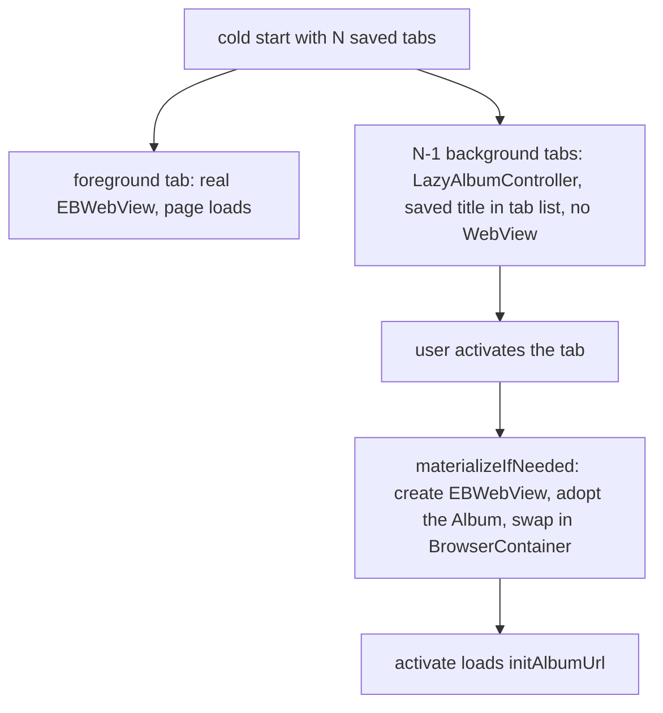
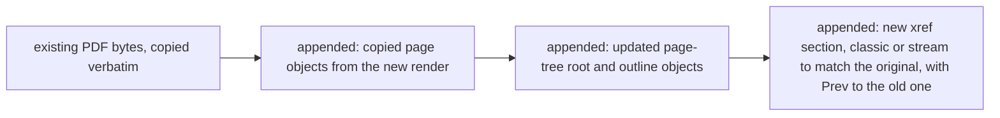

2026-09-03

# Memory, page-load speed, and APK size: implementation

Implements the plan from the same-day architecture study (see `einkbro-architecture-study-memory-speed-size`). One commit (`6f859dd39`) covering the selected items in all three areas. Result: arm64 release APK shrank from 4,475,058 to 4,086,256 bytes (down 8.7 percent), cold start no longer builds one WebView per saved tab or reads filter blobs on the main thread, and the largest unbounded memory holders (favicon blobs, backup JSON trees, the dead full-page screenshot path) are gone.

## Memory

**Screenshot task deleted.** `SaveScreenshotTask` — the deterministic-OOM path that allocated one bitmap the full height of the page — turned out to have no callers at all, so it and its `ViewUnit.capture` helper were removed outright.

**Backup streams instead of building trees.** Every JSON entry in the backup zip is now written through `android.util.JsonWriter` directly into the `ZipOutputStream`, so a large table exists once (the DAO rows) rather than three more times (JSON tree, its `toString`, its byte array). Favicon blobs are no longer exported at all — they are re-fetchable from the sites and used to dominate backup size with a Base64 penalty on top; restore still accepts a `favicons` array so old backups keep working.

**Favicons load per-host on demand.** `BookmarkManager` used to run `SELECT * FROM favicons` at startup into a list held for the process lifetime (10-40 MB on a mature install) and answer lookups with a linear scan. It now keeps only the domain-name set resident (a few KB); a lookup miss on a known domain does a single-row primary-key query, and the decoded bitmap lands in the existing bounded LRU. Unknown domains still answer without any I/O.

## Loading speed

**Startup.** `AdFilter.create` stays synchronous (cheap, and `AdFilter.get()` callers need it), but `setEnabled` — multi-MB blob reads plus native parsing — moved to a background dispatcher; until it finishes the detector simply has no clients and blocks nothing. Everything it touches (StateFlow, CopyOnWriteArrayList) was already thread-safe.

**Tab restore is instance-lazy.** Restoring N saved tabs used to construct N live Chromium WebViews before the first frame. Background tabs now restore as a `LazyAlbumController` — a title-and-url record that implements `AlbumController` but owns no view — and `TabManager.materializeIfNeeded` swaps in a real `EBWebView` on first activation. The tab keeps its identity in the Compose tab list because the lazy controller's `Album` is *adopted* by the WebView rather than replaced. All activation paths funnel through `TabManager.showAlbum`, so materialization has a single choke point; `BrowserContainer` learned to hold non-WebView controllers safely.

**Injection is gated and deduplicated.** The two big ad-filter payloads — `extended-css.min.js` (48 KB) and `scriptlets.min.js` (147 KB) — used to be parsed by the renderer on every page; now a cheap native lookup decides whether the site has any matching rules first, and most pages skip both. Style CSS moves up to `onPageStarted`, so the first layout already uses the configured fonts instead of a web-font `@import` arriving after layout and forcing a second one. `onPageFinished` can fire 4-5 times per page on some sites; the listener-installing and prefetching scripts now run once per document via a guard that resets on every document commit — the reset point matters, because keying it on URL change alone would have skipped re-installation after a plain reload (a fresh document with the same URL). `invertColor` also stopped rebuilding the hardware layer when the inversion state had not changed.

**The per-request path got cheaper.** The merged per-site config (`getEffectiveConfig`) — previously a scan-sort-merge over every rule, twice per subresource — is memoized per host+path and invalidated on any rule write. `setAcceptCookie` (a process-global native call) fires only when the policy actually flips, with the one other caller keeping the cached value in sync. A discarded `getCookie` call and a debug dump that deep-copied the whole back/forward list per navigation were deleted. In the adblock engine, the JNI entry no longer runs `FindClass`/`GetMethodID` per call (cached in `JNI_OnLoad` as global refs), and the document-host `Uri.parse` no longer repeats per filter list.

**Tab switching** flips visibility instead of re-parenting the WebView (a full Chromium detach/attach cycle); z-order is irrelevant since every sibling is GONE.

**DEEP e-ink image mode** downloads through one shared pooled OkHttp client — restoring connection reuse and HTTP/2 that a cold `HttpURLConnection` per image threw away — computes cache keys without 32 `String.format` calls, and trims its disk cache from a running byte counter instead of listing and stat-ing the whole directory on every store.

## APK size

The headline change is replacing pdfbox-android (about 370 KB of dex serving two call sites) with an in-repo COS-level engine under `unit/pdf/`. The design choice that makes this safe is **incremental updates**: instead of parsing a whole document into a model and re-serializing it, the original file's bytes are copied verbatim and only new or updated objects plus a fresh cross-reference section are appended — anything the parser does not understand in a user-picked PDF is preserved untouched.

The parser handles classic xref tables, xref streams, object streams, hybrid files, and FlateDecode with PNG predictors; encrypted PDFs fail gracefully (same behavior as before, where BouncyCastle was excluded). Stream payloads are never fully materialized — copied page content streams go chunk-wise from a memory-mapped source straight to the output. Desktop Apache pdfbox remains as a *test-only* dependency: six unit tests generate fixtures with it and validate the engine's output through it, including a hand-built xref-stream-plus-object-stream document and a double append that re-parses the engine's own update output.

The other size items: epub4j's bundled W3C/OEB/DAISY DTDs are excluded from packaging (86 KB; Android's parser never fetches external DTDs unless validating); the ad-filter module's injected JS moved from Mezzanine-inlined dex string constants — stored uncompressed in the APK and on device — to deflated assets, which also removed the project's last kapt dependency; the TTS notification was rewritten from `MediaSessionCompat`/androidx-media onto the framework `MediaSession` and `Notification.MediaStyle` (both present since well before minSdk 24); and `--pack-dyn-relocs=android` (valid from API 23, but only auto-enabled by the NDK at API 30+) shrank `libadblock-client.so` from 267 KB to 238 KB per ABI. Hygiene fixes rode along: a dead `viewBinding` flag, a `releaseDebuggable` proguard reference to a file that does not exist, an empty `res/menu` directory, redundant keep rules, and `HighlightsActivity` simplified from a `NavHost` to a plain state switch with a `BackHandler`.

Two items from the study did not survive contact with the code and were dropped deliberately: navigation-compose is also the backbone of the whole Settings UI, and ConstraintLayout turned out to be load-bearing across the entire browser chrome (main layout, touch-area graph, input bar, statusbar, FAB positioning) — removing either would be a large regression-prone rewrite for 25-90 KB. The material-icons conversion was rejected by the maintainer as a maintainability trade-off.

## Verification

Unit tests and lint pass (the CI gate). Emulator smoke test: a restart with five saved tabs showed exactly one live WebView with all five saved titles visible in the tab list; activating a lazy tab materialized and loaded it; switching back and forth and closing tabs worked; the rebuilt native library loaded cleanly (a `JNI_OnLoad` mistake would crash on load); zero fatal exceptions throughout. Deferred to pre-release verification on a real device: DEEP e-ink image mode and userscript-heavy sites, whose code paths changed mechanically but were not exercised in the smoke test.
