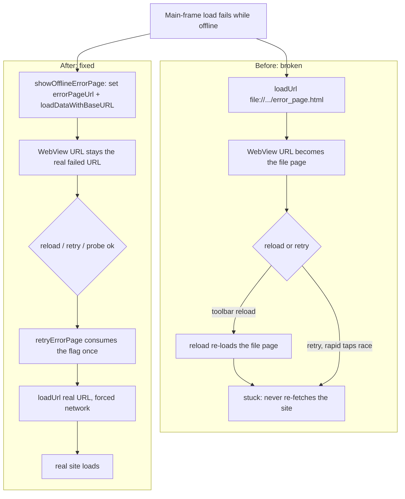
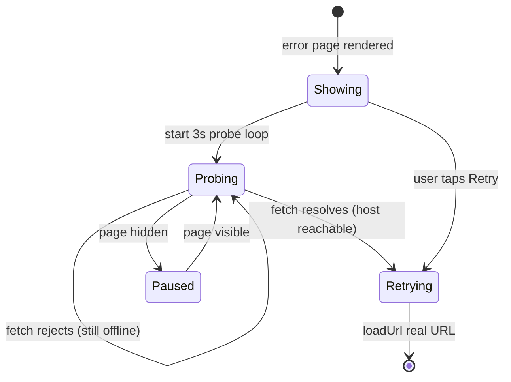

2026-06-21

# EinkBro: offline error page reload, retry, and auto-recovery

## What was broken

When a page failed to load offline, EinkBro showed a custom error page (with a
friendly reason and a little horse mini-game). Two things didn't work:

- **The toolbar reload button never recovered.** Pressing reload just re-showed
  the error page forever, even after the network came back.
- **Retry was unreliable.** Tapping Retry several times — especially around the
  moment connectivity returned — could leave the user stuck on the error page.

## Root cause

The error page was displayed with a real navigation:

```kotlin
ebWebView.loadUrl("file:///android_asset/error_page.html?url=...&reason=...")
```

That makes the *asset file* the WebView's current document, so `getUrl()` returns
`file:///android_asset/error_page.html`. Everything downstream then operated on
the wrong URL: the toolbar's `reload()` reloaded the static error page instead of
the failed site, and the address bar reflected the file URL. Retry worked off a
*separately* tracked `lastFailedUrl` in the presenter, and because each tap posted
its own `loadUrl`, rapid taps could race each other.

## The fix

Stop navigating to the asset. Render the error page with `loadDataWithBaseURL`
(reading the asset HTML directly), and introduce a single `errorPageUrl` flag on
`EBWebView` as the one source of truth for "an error page is currently showing for
URL X". Every recovery path consults that flag:

- `reload()` — if `errorPageUrl` is set, re-fetch the **real** URL with a forced
  network load instead of reloading the error document.
- `retryErrorPage()` — consumes the flag atomically, so repeated Retry taps
  collapse into a single reload (the second tap finds the flag already cleared).
- `albumUrl` returns `errorPageUrl` while the error page is up, so the address
  bar, bookmarks, and share all see the real failed URL.
- the error page is no longer recorded in history.

The flag is set in `showOfflineErrorPage()` and cleared in `resetState()` (which
every genuine navigation already runs), so the lifecycle stays self-correcting.



## Auto-recovery, and why polling

The headline enhancement is that the page now recovers on its own: when the
network comes back, it reloads without any tap.

The obvious implementation — listen for the JS `online` event — turned out not to
work. On-device testing confirmed that Android's WebView does **not** reliably
fire `online`/`offline` or update `navigator.onLine` from system connectivity
changes; toggling airplane mode back off left the page sitting on the error
screen indefinitely.

So instead the page *actively probes* the failed URL: a `fetch(url, {mode:
'no-cors', cache: 'no-store'})` every 3 seconds. While offline it rejects almost
immediately; the instant the host is reachable it resolves (an opaque response is
enough — we never read the body), and the page triggers a retry. The probe pauses
when the page is hidden so it doesn't wake an idle E-ink device, and the
short-lived `online` listener is kept too in case some WebView build does deliver
it.

Two smaller touches round it out: the Retry button shows "Reconnecting…" and
disables on tap, and the title adapts — "You're offline" only for an actual
connectivity drop, otherwise "Can't reach this page" (DNS, refused, cert).



## Verified on device

Tested on a physical API 32 device by toggling airplane mode: manual Retry after
reconnect loads the page; the toolbar reload re-fetches the real URL rather than
the error document; and with no interaction at all, the page reloads itself once
connectivity is restored.
