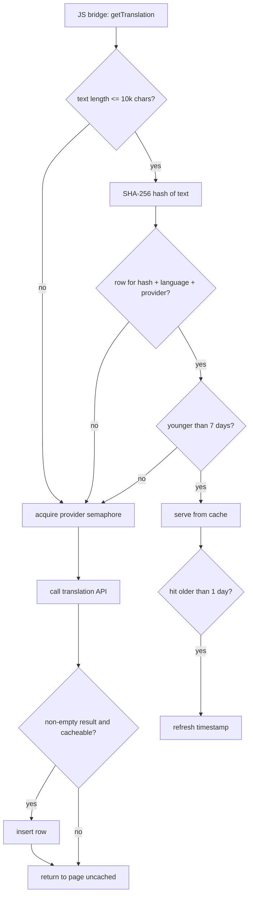

2026-07-27

# EinkBro: Persistent Cache for Paragraph Translations

Translate-by-paragraph now caches its results in the Room database, so revisiting a translated page — after a reload, a tab restore, or an app restart — serves translations instantly from disk instead of re-fetching every paragraph over the network. This matters more in EinkBro than in a typical browser: Gemini and DeepL are throttled to one request per 1.5 seconds, so re-translating a 60-paragraph article that was already translated yesterday costs a minute-plus of wall time and real API quota for output the app already had.

The infrastructure mostly existed. A `translation_cache` table had been in the schema since v7 and was read/written by the JS bridge's `getTranslation` — but only for strings shorter than 15 characters, so it effectively cached UI labels and never paragraphs. The eviction DAO method existed but was never called from anywhere, meaning entries also never left. This change is less "build a cache" than "let the existing cache do its job, and fix its lifecycle."

## Design

Three decisions shaped the new table:

**Key by hash, not raw text.** The old primary key was `(originalText, targetLanguage)`. With multi-kilobyte paragraphs, SQLite would store the full text twice — once in the row, once in the index b-tree — roughly doubling storage. The key is now a SHA-256 hash of the source text, and the source text is no longer stored at all: lookup is exact-match by hash, so the original is dead weight.

**The provider is part of the key.** A cached Google translation must not be served after the user switches to Gemini or DeepL — users switch providers precisely because output quality differs, and for paragraph-length text the difference is visible. `(textHash, targetLanguage, translateApi)` is the full primary key.

**Size is the real limit; time is secondary.** Translations don't rot — a cached result never becomes wrong — so the TTL is a storage-management knob, not a freshness one. The cache keeps entries 7 days, but a hit older than a day refreshes the entry's timestamp, giving sliding expiration: a serialized novel or docs site read daily stays cached indefinitely instead of expiring mid-habit. The hard bound is a 5000-row cap trimmed oldest-first. Both the TTL purge and the cap trim run once at app startup on the IO dispatcher — wiring up the eviction call that had been dead code.

Texts up to 10,000 characters are cacheable (the old 15-character gate is gone). The translation APIs themselves cap around 5,000 characters, so anything larger never produces a reusable result anyway.

A cache hit bypasses the provider semaphore entirely — reloading a fully-cached page applies every paragraph in milliseconds with zero network traffic, where the first pass was gated at up to 1.5s per request.

## Migration

Database v10 → v11 drops and recreates `translation_cache` with the new shape. The old rows were disposable short-string cache data keyed incompatibly, so converting them bought nothing. The migration SQL was checked byte-for-byte against Room's exported `11.json` schema, and the upgrade path was exercised against a live v10 database with existing cache rows before shipping.

Storage stayed in the database rather than moving to files or memory: an in-memory-only cache dies with the process (defeating the point for a rate-limited API), a file-based store would hand-roll the keyed lookup and eviction SQLite provides for free, and the Room plumbing already existed. A memory tier in front of the DB was considered and skipped — the lookup runs on the IO dispatcher in microseconds against a network path gated in seconds, so it would not be measurable.

One deployment note: once a device's database has migrated to v11, sideloading an older build without the migration will crash on open — Room refuses schema downgrades. The change should ride the next release rather than sit unreleased.
