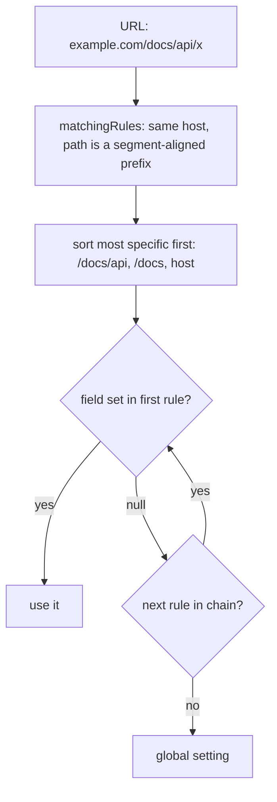
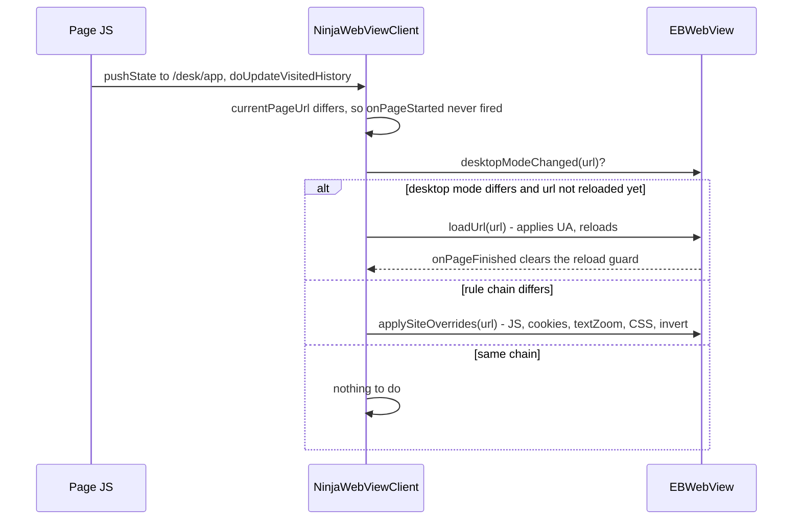

2026-08-23

# Path-scoped site settings and a "Configured sites" list

Site settings used to be keyed by host only: one `DomainConfigurationData` per
`example.com`, looked up by `Uri.parse(url).host`. This change lets a rule be
scoped to a path prefix as well (`example.com/docs`, `example.com/docs/api`),
resolves each setting through the chain of matching rules, and adds a
management screen under Settings > Site Settings so rules can be reviewed and
removed without visiting every site.

Decisions taken up front: hosts match exactly (no subdomain wildcards), a
desktop-mode change on a same-document navigation reloads the page, and the
menu's quick toggles keep targeting the whole site unless a path rule already
sets that field.

## Data model: same table, new key shape

The `domain_configuration` table and its JSON blob are untouched. The primary
key `domain` now holds either a bare host or `host/path/prefix` (lower-case
host, no scheme, no query, no trailing slash). `SiteRuleKey` owns the parsing,
matching and specificity rules; it is hand-rolled rather than built on
`android.net.Uri` so the resolver is unit-testable on the plain JVM.

Every field of `DomainConfigurationData` is now nullable. The four legacy
booleans (white background, invert colours, translate site, fix scroll) were
plain `Boolean` before, which cannot express "not set here" -- a path rule
could never switch white background *off* for a sub-tree when the host had it
on. Old rows stored those as `false`; on a host rule `false` and `null`
resolve identically, so they are normalised to `null` at load time
(`normalizedLegacyFlags`). Without that, every pre-existing row would show all
four flags as explicit overrides in the editor.

No Room migration, and backup/restore and Drive sync serialise the row as-is,
so they carry the new keys through unchanged.

## Resolution

`DomainConfigManager` exposes the same getters as before (`getFontSize(url)`,
`getDesktopMode(url)`, ...) so call sites did not change; each one is now
`resolve(url) { it.field } ?: global`. Two views exist on top of that:

- `getEffectiveConfig(url)` -- the merged, read-only view consumers use
  (`enableCookies`, `enableAdBlock`, `enableJavascript` in the WebView client).
  It must never be saved back: its `domain` is the most specific key and
  saving would freeze inherited values into that rule.
- `getInheritedConfig(url, excludingKey)` -- what the editor shows as the
  fallback for the rule being edited: the chain for the rule's *own* scope
  minus the rule itself, so deeper rules are not mistaken for parents.

The old `getDomainConfig(url)` was removed rather than kept as an alias, so
the compiler flagged every place that used to mutate-and-save a looked-up
rule (the translation-mode dialog, the AI tools' CSS/JS setters). Those now go
through `writeTargetFor`, which implements the quick-toggle rule: write into
the most specific matching rule that already sets the field, otherwise into
the host rule (created on demand). A rule that ends up with nothing set is
deleted instead of persisted, so "Reset All to Global" and toggles switched
back off no longer leave empty rows behind.

## Same-document navigations

With host-level rules, a pushState from `/docs` to `/blog` could not change
anything. With path rules it can, and nothing re-applied settings on that
transition: `loadUrl` and `shouldOverrideUrlLoading` already handled real
navigations, but client-side routing and server redirects only surface in
`doUpdateVisitedHistory`.

`currentPageUrl` is updated there too; it feeds the per-request cookie and
ad-block lookups, which now depend on the path. Desktop mode needs a new UA
string and viewport, which only a reload delivers -- the same reason
`shouldOverrideUrlLoading` takes over link clicks. A site that redirects
desktop UAs to one path and mobile UAs back to the other would bounce
forever, so each URL gets at most one desktop reload until a page finishes
loading. Post-load JavaScript is deliberately not re-run on route changes.

## Editor

`SiteSettingsContent` (shared by the phone activity and the tablet dialog)
gained an "Apply to" dropdown: the host, each path prefix of the current URL,
and -- under "Other rules on this site" -- rules for this host that are not on
the current path. Existing rules carry their override badge so the user can
see which scopes are in play. The editor opens on the rule actually in effect
for the page.

Each row's fallback is the inherited value with a hint saying where it comes
from ("from example.com/docs") instead of a flat "default". The four legacy
flags use the same tri-state row as everything else now. Path rules show
"Remove Rule" in place of the reset button. Switching scope discards unsaved
edits on the previous scope; that is a known rough edge, not a goal.

## Configured sites list

Settings > Site Settings starts with "Configured sites" (`SiteRuleListActivity`):
all rules grouped by host, host rule in bold with its path rules indented
beneath, an override-count badge and a summary of which settings each rule
touches. Tapping a row opens the regular editor for that rule; the list
reloads in `onResume`. The row's x and the top-bar trash both ask for
confirmation before removing. Rules with no overrides are hidden; the list is
how the leftovers from earlier quick toggles were noticed in the first place,
which led to the delete-when-empty behaviour above.

Path rules can only be created from a page, since the list has no way of
knowing which paths a site has; the list is for review and removal.

## Verification

Unit tests cover the key parser, precedence, field-level cascading, explicit
`false` on a path rule overriding `true` on the host, inherited-config
exclusion, quick-toggle write targets, empty-rule deletion and list grouping.
On the emulator, a path rule applied on load and via link click, pushState
between paths resized text without a reload, a desktop-mode path rule reloaded
with the desktop UA in both directions, the inherited hint and Remove Rule
behaved as designed, and the list showed, opened and removed rules.
